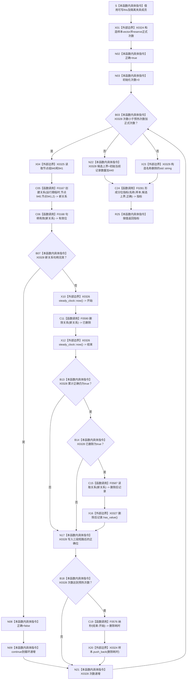

# CF-L5-0163 `隔离关系夹具::测量删除` 现状流程图

图类型：现状流程图
代码版本：`a48a70b2d678dea64dd8228adb4f26f0badd9506`
覆盖文件：`海中鱼巣/核心/自检.关系仓库性能基线.ixx:357-375`
唯一根函数：F0287
完整签名：`海中鱼巣::关系仓库性能基线内部::分位指标 海中鱼巣::关系仓库性能基线内部::隔离关系夹具::测量删除()`
参数：无显式参数；隐式可写 `this` 是非拥有借用，读取节点组和初始数量并写隔离关系仓库
返回结果：按值返回名称为“删除”的 `分位指标`；样本只计成功创建后的删除入口耗时，候选上界硬编码为 `初始当前记录数量_ + 440`
非法值 / 拒绝：无普通拒绝；固定成功夹具中的创建、删除或删除后可见异常均属追根因
已登记调用方：F0097 `运行单规模基线`
直接项目函数：F0167 `创建关系`、F0168 `句柄有效`、F0590 `删除关系`、F0587 `读取关系`、F0576 `纳秒`、F0281 `形成分位指标`
调用图：`流程图/代码流程图/00_调用知识图谱.md`
逐行映射表：`流程图/代码流程图/L5/CF-L5-0163_隔离关系夹具测量删除_逐行代码映射表.md`
输入契约 / 调用语境表：本文“输入契约与非成功语境”
非成功返回二分审查表：本文“输入契约与非成功语境”
偏差清单：`流程图/代码流程图/00_规范偏差审计.md` 的 F0287 切片
依据提交 / 结构化消息：冻结源码提交 `a48a70b2d678dea64dd8228adb4f26f0badd9506`；只读子智能体分析，主智能体统一编号和写入
入口前置：F0097 已取得成功构建的 1024 节点隔离夹具，节点 940/941 当前有效且无并发写；此前三类写测量已返回但不保证结果一致
结构读取与写入：每轮创建一条隔离 `运行期临时` 关系；创建成功后调用普通删除入口推进为已删除，权威记录仍留在隔离关系表
逻辑内返回：无；创建失败使用 `continue`，但在固定成功前置中仍是追根因
内部错误：任一项目调用或分配异常直接传播；创建成功后、删除完成前没有 RAII 清理
生命周期与资源释放：样本由函数拥有；关系句柄、删除位和 optional 为逐轮局部值；正常成功轮删除当前关系，局部材料在退出时逆序释放
异常：未声明 `noexcept` 且无 `catch`
验证入口：冻结源码、E1397—E1402、X0324—X0329、创建失败继续、删除后短路、循环初始化、实参求值未指定顺序、逐行映射和候选上界机械核对；未运行性能专项
验证输出：PASS；冻结源码 blob `34c34bffcd80f78e28345292deb69aca2eabf38d`、逐行覆盖、E1397—E1402、X0324—X0329、聚合统计、Mermaid 结构、独立只读复核、`git diff --check` 与 strict 100/100 均通过；未运行性能专项
依据：`规范/0050_项目通用机器逻辑与禁止性规则总纲_20260721.md`、`规范/0600_代码函数流程图应用与维护规范.md`、`规范/4010_子规范_统一仓库稳定句柄与通用关系索引边界.md`、`规范/详细设计/数据仓库关系查询二级索引与性能治理详细设计.md`
不得作为施工许可：是
不得宣称：每轮均有 200 个正式样本、失败删除不进入样本、已删除审计和全部索引均已读回、候选上界是真实计量、性能验收通过或生产删除闭环完成

## 流程图

N22 与 X23 是同一调用表达式的两项实参求值前置；双前驱只表示两者都在 C24 调用前完成，不表示并行，也不冻结二者的相对求值顺序。

## 节点合同

| 节点 | 类型 | 参数 / 输入绑定 | 结果 / 输出绑定 | 事实读写 | 后继条件 | 验证 |
| --- | --- | --- | --- | --- | --- | --- |
| S—N02 | 指令 / 外部边界 | `this`、正式次数 | 样本、正确位 | 无机器事实 | 局部构造成功 | 357—360 行 |
| N03—N09 | 指令 / 外部边界 / 函数调用 | 次数、固定节点 | 新关系或创建失败继续 | 创建隔离关系 | 句柄有效 | 361—367 行 |
| X10—N17 | 外部边界 / 函数调用 / 指令 | 新关系、累计正确 | 删除位和普通读不可见位 | 逻辑删除隔离关系 | 左到右短路 | 368—371 行 |
| B18—N21 | 指令 / 函数调用 / 外部边界 | 次数、时间点 | 正式样本或跳过 | 无新增机器事实 | 回到循环 | 372—373 行 |
| N22—R25 | 指令 / 外部边界 / 函数调用 | 样本、正确位、硬编码上界 | 两项实参以未指定相对顺序求值后形成删除分位指标 | 非权威性能材料 | 返回构造成功 | 374—375 行 |

## 输入契约与非成功语境

| 入口 / 节点 | 输入来源 | 上游是否保证有效 | 非成功结果 | 二分口径 | 结构变化与后续归属 |
| --- | --- | --- | --- | --- | --- |
| C05—B07 | 固定有效节点 | 是 | 创建失败并 continue | 追根因解决 | 创建入口或固定夹具；正式样本可能不足 |
| C11—N17 | 新建有效关系 | 是 | 删除失败或删除后仍可见 | 追根因解决 | 删除生命周期、普通读取或遗留有效关系 |
| B18—X20 | 已执行删除的正式轮 | 部分 | 删除失败仍采样 | 设计证据不足 | 成功 / 失败样本准入分账 |
| 任一异常 | 隔离仓库和局部材料 | 是 | 异常传播 | 内部错误 | 失败清理与夹具封存 |
| C24 | 已收集报告材料 | 部分 | `结果一致=false` 或样本不足 | 人读材料返回 | 不转成业务成功 |

## 调用与边界汇总

E1397—E1402 是六条直接项目边。X0324—X0329 覆盖样本容器、固定节点下标、稳定时钟、optional、循环 / 布尔短路及字符串 / 返回生命周期。新关系句柄有效后，删除入口不受累计正确位影响而执行；句柄无效时跳过删除。累计正确已为 false 或本轮删除失败时，371 行会跳过删除后普通读取；374 行的候选加法和字符串构造都在 F0281 调用前完成，彼此相对顺序未指定。
