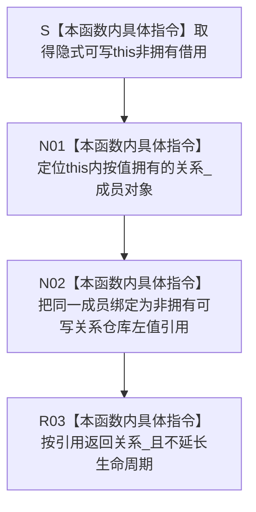

# CF-L5-0164 `隔离关系夹具::读取关系仓库` 现状流程图

图类型：现状流程图
代码版本：`a48a70b2d678dea64dd8228adb4f26f0badd9506`
覆盖文件：`海中鱼巣/核心/自检.关系仓库性能基线.ixx:328`
唯一根函数：F0288
完整签名：`海中鱼巣::关系仓库& 海中鱼巣::关系仓库性能基线内部::隔离关系夹具::读取关系仓库()`
参数：无显式参数；隐式可写 `this` 是非拥有借用
返回结果：按可写左值引用返回夹具按值拥有的同一个 `关系_` 成员；不复制、移动、转移或延长仓库生命周期
非法值 / 拒绝：无普通拒绝；悬空 `this`、引用越过夹具生命周期或并发析构属于调用契约破坏
已登记调用方：F0097 `运行单规模基线`、F0584 `运行并发基线` 的工作线程 lambda
直接项目函数：无
调用图：`流程图/代码流程图/00_调用知识图谱.md`
逐行映射表：`流程图/代码流程图/L5/CF-L5-0164_隔离关系夹具读取关系仓库_逐行代码映射表.md`
输入契约 / 调用语境表：本文“输入契约与非成功语境”
非成功返回二分审查表：本文“输入契约与非成功语境”
偏差清单：`流程图/代码流程图/00_规范偏差审计.md` 的 F0288 切片
依据提交 / 结构化消息：冻结源码提交 `a48a70b2d678dea64dd8228adb4f26f0badd9506`；只读子智能体分析，主智能体统一编号和写入
入口前置：`this` 指向存活的隔离夹具；当前两个调用点都位于构建成功之后，工作线程也在夹具析构前完成汇合
结构读取与写入：本函数只形成隔离关系仓库成员的临时可写别名，不直接读写仓库结构；后继操作经该引用作用于同一成员
逻辑内返回：无
内部错误：合法对象下没有函数内失败分支；无效对象或悬空引用属于调用方生命周期根因
生命周期与资源释放：夹具拥有 `关系_`；返回引用非拥有且不延长生命周期，夹具析构后立即失效
异常：未声明 `noexcept`；函数体没有显式抛出点
验证入口：冻结源码、既有入边 E0530 / E1366、逐行映射、引用同一性和两个实际调用语境机械核对
验证输出：PASS；冻结源码 blob `34c34bffcd80f78e28345292deb69aca2eabf38d`、328 行覆盖、E0530 / E1366、零出向调用、聚合统计、Mermaid 结构、独立只读复核、`git diff --check` 与 strict 100/100 均通过
依据：`规范/0050_项目通用机器逻辑与禁止性规则总纲_20260721.md`、`规范/0600_代码函数流程图应用与维护规范.md`、`规范/详细设计/数据仓库关系查询二级索引与性能治理详细设计.md`
不得作为施工许可：是
不得宣称：返回只读引用、转移仓库所有权、延长成员生命周期、自动同步参考模型、访问器自身提供线程安全或生产仓库可以公开可写引用

## 流程图

## 节点合同

| 节点 | 类型 | 参数 / 输入绑定 | 结果 / 输出绑定 | 事实读写 | 后继条件 | 验证 |
| --- | --- | --- | --- | --- | --- | --- |
| S | 本函数内具体指令 | 合法、存活的可写 `this` | 非拥有夹具借用 | 无 | 对象有效 | 328 行 |
| N01—N02 | 本函数内具体指令 | `this->关系_` | 同一成员的可写左值引用 | 只形成临时别名 | 成员生命周期有效 | 328 行 |
| R03 | 本函数内具体指令 | 可写左值引用 | 返回引用 | 无直接机器事实变化 | 调用方接收 | 328 行 |

## 输入契约与非成功语境

| 入口 / 节点 | 输入来源 | 上游是否保证有效 | 非成功结果 | 二分口径 | 结构变化与后续归属 |
| --- | --- | --- | --- | --- | --- |
| S—R03 | F0097 / F0584 的存活夹具 | 是 | 无普通非成功 | 不适用 | 本函数无结构变化 |
| 返回引用后使用 | 完整表达式短借用 | 是 | 引用逃逸或越过生命周期 | 追调用方根因 | 生命周期与并发汇合合同 |
| 后继仓库操作 | 同一隔离仓库 | 部分 | 仓库拒绝或异常 | 归属被调仓库函数 | 不归入本访问器 |

## 调用与边界汇总

本函数没有直接项目调用、标准库调用或独立外部边界身份。E0530 和 E1366 已记录两个项目调用方；329 行的 const 重载是不同函数身份，当前可达调用没有选择它。
