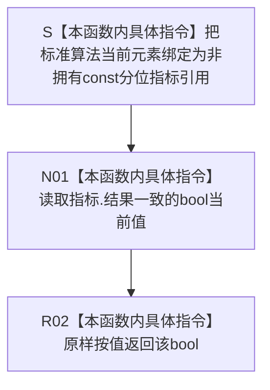

# CF-L5-0165 `查询指标结果一致谓词 lambda` 现状流程图

图类型：现状流程图
代码版本：`a48a70b2d678dea64dd8228adb4f26f0badd9506`
覆盖文件：`海中鱼巣/核心/自检.关系仓库性能基线.ixx:904-906`
唯一根函数：F0289
完整签名：`bool 海中鱼巣::运行关系仓库性能基线自检()::<lambda@自检.关系仓库性能基线.ixx:902>::operator()<海中鱼巣::关系仓库性能基线内部::规模报告>(const 海中鱼巣::关系仓库性能基线内部::规模报告& 报告) const::<lambda@自检.关系仓库性能基线.ixx:904>::operator()<海中鱼巣::关系仓库性能基线内部::分位指标>(const 海中鱼巣::关系仓库性能基线内部::分位指标& 指标) const`
参数：标准算法当前元素的非拥有 `const 分位指标& 指标`；只在本次谓词调用期间有效
返回结果：按值原样返回 `指标.结果一致`
非法值 / 拒绝：无普通拒绝；悬空引用或遍历期间修改底层向量属于调用契约破坏
已登记调用方：F0098 `运行关系仓库性能基线自检` 的外层报告谓词 lambda，经 E0532 回调调用
直接项目函数：无
调用图：`流程图/代码流程图/00_调用知识图谱.md`
逐行映射表：`流程图/代码流程图/L5/CF-L5-0165_查询指标结果一致谓词lambda_逐行代码映射表.md`
输入契约 / 调用语境表：本文“输入契约与非成功语境”
非成功返回二分审查表：本文“输入契约与非成功语境”
偏差清单：`流程图/代码流程图/00_规范偏差审计.md` 的 F0289 切片
依据提交 / 结构化消息：冻结源码提交 `a48a70b2d678dea64dd8228adb4f26f0badd9506`；只读子智能体分析，主智能体统一编号和写入
稳定局部身份：冻结源码 blob + F0098 + 外层 lambda 起点 902 + 本 lambda 起点 904 + `分位指标` 实例化签名
入口前置：仅在 `HY_EGO_ENABLE_STRUCTURE_COMMIT_FAULT_SELF_TEST` 开启时存在；F0098 的 `std::all_of` 从仍存活且遍历期间不变的查询指标组提供当前元素
结构读取与写入：只读取非权威性能报告材料中的一个 bool；不写节点、关系、索引或领域记录
逻辑内返回：无；返回 false 表示当前固定验收语境中的内部结果不一致材料，不是外部输入拒绝
内部错误：函数本身不定位失败原因；悬空参数属于调用方生命周期根因
生命周期与资源释放：无捕获、不保存参数、不分配资源、不取得锁
异常：未声明 `noexcept`；合法引用语境下函数体没有显式抛出点
并发 / 幂等：纯只读、可重入；不提供对参数来源的跨线程同步
验证入口：冻结源码、既有 E0532、三行逐行映射、无捕获和调用方短路归属机械核对
验证输出：PASS；冻结源码 blob `34c34bffcd80f78e28345292deb69aca2eabf38d`、904—906 行覆盖、E0532、零出向调用、聚合统计、Mermaid 结构、独立只读复核、`git diff --check` 与 strict 100/100 均通过
依据：`规范/0050_项目通用机器逻辑与禁止性规则总纲_20260721.md`、`规范/0600_代码函数流程图应用与维护规范.md`、`规范/详细设计/数据仓库关系查询二级索引与性能治理详细设计.md`
不得作为施工许可：是
不得宣称：指标材料完整、空组不会真空通过、全部失败指标已收集、裸一致位能定位根因、性能正确性或性能验收已经通过

## 流程图

## 节点合同

| 节点 | 类型 | 参数 / 输入绑定 | 结果 / 输出绑定 | 事实读写 | 后继条件 | 验证 |
| --- | --- | --- | --- | --- | --- | --- |
| S | 本函数内具体指令 | 当前 `const 分位指标&` 元素 | 非拥有参数借用 | 无 | 引用有效 | 904 行 |
| N01 | 本函数内具体指令 | `指标.结果一致` | bool 当前值 | 只读非权威报告材料 | 字段读取完成 | 905 行 |
| R02 | 本函数内具体指令 | bool 当前值 | 谓词返回值 | 无 | 返回调用方 | 905—906 行 |

## 输入契约与非成功语境

| 入口 / 节点 | 输入来源 | 上游是否保证有效 | 非成功结果 | 二分口径 | 结构变化与后续归属 |
| --- | --- | --- | --- | --- | --- |
| S | F0098 中查询指标组的有效遍历元素 | 是 | 悬空引用或遍历期间修改 | 追调用方根因 | 无结构变化 |
| N01—R02 | 预计算的 `结果一致` | 部分 | 返回 false | 追根因解决 | 查询测量、参考比较或报告形成路径 |
| 外层 `all_of` | 标准算法调用方 | 部分 | 空组真空为 true、首败短路 | 归属 F0098 | 不归入本函数内部节点 |

## 调用与边界汇总

F0289 内部没有项目函数调用、外部函数调用、分支或递归，也不新增 E / X 身份。`begin`、`end` 和 `std::all_of` 属于 F0098 的既有 X0086；标准算法对本函数的回调由既有 E0532 表达。
