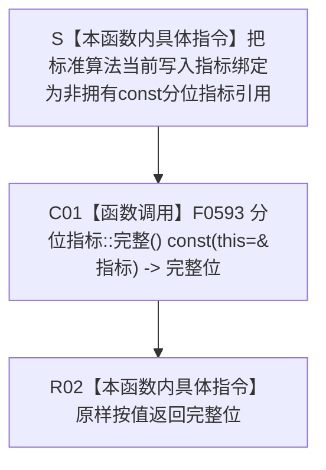

# CF-L5-0168 `写入指标完整谓词 lambda` 现状流程图

图类型：现状流程图
代码版本：`a48a70b2d678dea64dd8228adb4f26f0badd9506`
覆盖文件：`海中鱼巣/核心/自检.关系仓库性能基线.ixx:744-746`
唯一根函数：F0292
完整签名：`bool 海中鱼巣::关系仓库性能基线内部::规模报告::完整() const::<lambda@自检.关系仓库性能基线.ixx:744>::operator()<海中鱼巣::关系仓库性能基线内部::分位指标>(const 海中鱼巣::关系仓库性能基线内部::分位指标& 指标) const`
参数：标准算法当前写入指标元素的非拥有 `const 分位指标& 指标`
返回结果：按值原样返回 F0593 `分位指标::完整() const` 的 bool
非法值 / 拒绝：无普通拒绝；悬空引用或遍历期间修改写入指标组属于调用契约破坏
已登记调用方：F0099 `规模报告::完整() const`，经 E0535 回调调用
直接项目函数：F0593 `分位指标::完整() const`
调用图：`流程图/代码流程图/00_调用知识图谱.md`
逐行映射表：`流程图/代码流程图/L5/CF-L5-0168_写入指标完整谓词lambda_逐行代码映射表.md`
输入契约 / 调用语境表：本文“输入契约与非成功语境”
非成功返回二分审查表：本文“输入契约与非成功语境”
偏差清单：`流程图/代码流程图/00_规范偏差审计.md` 的 F0292 切片
依据提交 / 结构化消息：冻结源码提交 `a48a70b2d678dea64dd8228adb4f26f0badd9506`；只读子智能体分析，主智能体统一编号和写入
稳定局部身份：冻结源码 blob + F0099 + lambda 起点 744 + `分位指标` 实例化签名
入口前置：F0099 已通过基础字段、查询指标数 10、写入指标数 4，且 F0291 对全部查询指标返回 true；写入 `all_of` 尚未首败
结构读取与写入：通过 F0593 只读当前指标七项非权威性能材料；无机器事实写入
逻辑内返回：无；返回 false 表示固定性能报告语境中的写入指标材料或结果不完整
内部错误：被调异常原样传播；本函数不定位七项中的失败字段
生命周期与资源释放：无捕获、不保存参数、不分配资源、不取得锁
异常：未声明 `noexcept`
并发 / 幂等：纯只读、可重入；不提供对写入指标组的跨线程同步
验证入口：冻结源码、E1404、修正后的 E0535、三行逐行映射、共享 F0593 身份和调用方短路归属机械核对
验证输出：PASS；冻结源码 blob `34c34bffcd80f78e28345292deb69aca2eabf38d`、744—746 行覆盖、E0535 / E1404、共享 F0593、聚合统计、Mermaid 结构、独立只读复核、`git diff --check` 与 strict 100/100 均通过
依据：`规范/0050_项目通用机器逻辑与禁止性规则总纲_20260721.md`、`规范/0600_代码函数流程图应用与维护规范.md`、`规范/详细设计/数据仓库关系查询二级索引与性能治理详细设计.md`
不得作为施工许可：是
不得宣称：四类写入指标名称 / 唯一性 / 顺序正确、候选上界真实、全部失败字段已收集、写后结构互证或性能验收通过

## 流程图

## 节点合同

| 节点 | 类型 | 参数 / 输入绑定 | 结果 / 输出绑定 | 事实读写 | 后继条件 | 验证 |
| --- | --- | --- | --- | --- | --- | --- |
| S | 本函数内具体指令 | 当前写入 `const 分位指标&` 元素 | 非拥有参数借用 | 无 | 引用有效 | 744 行 |
| C01 | 函数调用 | `this=&指标` | 完整位 | 只读非权威性能材料 | F0593 返回 | 745 行 |
| R02 | 本函数内具体指令 | 完整位 | 谓词返回值 | 无 | 返回调用方 | 745—746 行 |

## 输入契约与非成功语境

| 入口 / 节点 | 输入来源 | 上游是否保证有效 | 非成功结果 | 二分口径 | 结构变化与后续归属 |
| --- | --- | --- | --- | --- | --- |
| S | F0099 中写入指标组的有效遍历元素 | 是 | 悬空引用或遍历期间修改 | 追调用方根因 | 无结构变化 |
| C01—R02 | 当前写入指标 | 部分 | F0593 返回 false | 追根因解决 | 指标材料形成、候选计量、统计或写入结果一致性 |
| 外层 `all_of` | 数量已为 4 的写入指标组 | 是 | 首败短路 | 归属 F0099 | 不归入本函数内部节点 |

## 调用与边界汇总

E1404 是唯一出向项目边，目标为 F0291 / F0292 共用的 F0593。F0292 内没有独立外部边界；写入指标组的 `begin`、`end` 和 `std::all_of` 属于 F0099 的既有 X0087。
