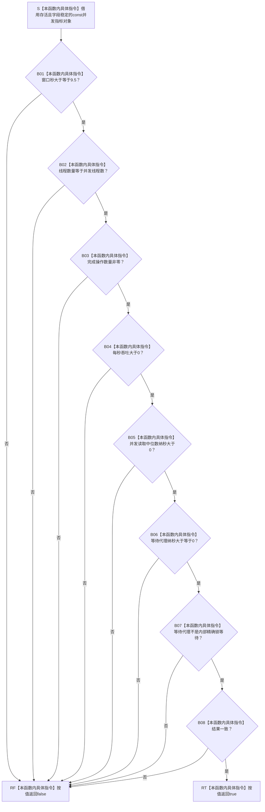

# CF-L5-0169 `并发指标::完整` 现状流程图

图类型：现状流程图
代码版本：`a48a70b2d678dea64dd8228adb4f26f0badd9506`
覆盖文件：`海中鱼巣/核心/自检.关系仓库性能基线.ixx:628-637`
唯一根函数：F0293
完整签名：`bool 海中鱼巣::关系仓库性能基线内部::并发指标::完整() const`
参数：无显式参数；隐式 `const this` 是调用期间存活且字段稳定的非拥有借用
返回结果：按值返回八项字段条件的左到右短路合取结果
非法值 / 拒绝：没有普通业务拒绝；数值条件不成立返回 false；悬空 `this` 或字段并发写属于调用契约破坏
已登记调用方：F0099 `规模报告::完整() const`，经 E0536 直接调用
直接项目函数：无
调用图：`流程图/代码流程图/00_调用知识图谱.md`
逐行映射表：`流程图/代码流程图/L5/CF-L5-0169_并发指标完整_逐行代码映射表.md`
输入契约 / 调用语境表：本文“输入契约与非成功语境”
非成功返回二分审查表：本文“输入契约与非成功语境”
偏差清单：`流程图/代码流程图/00_规范偏差审计.md` 的 F0293 切片
依据提交 / 结构化消息：冻结源码提交 `a48a70b2d678dea64dd8228adb4f26f0badd9506`；独立只读分析，主智能体统一复核和写入
入口前置：F0099 已通过报告基础字段、查询 / 写入指标数量和两组逐项 `完整()`；这些前置不保证并发指标自身有效
结构读取与写入：只读取非权威性能报告材料；不写节点、关系、索引或领域记录
逻辑内返回：无；false 表示固定性能报告验收语境中的并发材料不完整
内部错误：函数不保存首个失败字段；数值来源或并发参与证据不成立时只能由调用方追根因
生命周期与资源释放：无局部资源、无锁、无分配，不保存 `this`
异常：未声明 `noexcept`；合法对象语境下函数体没有显式抛出点
并发 / 幂等：字段稳定时纯只读、可重入、重复调用确定；不提供与并发写字段的同步
验证入口：冻结源码 blob、628—637 行逐行映射、E0536、零出向项目调用和 Mermaid 短路结构
验证输出：机械门禁 PASS；JSON 统计为函数 598 / 已完成 289 / 待处理 309 / 项目调用边 1477 / 外部边界 331 / 未解析调用 7；函数、调用边和外部边界无悬空；本图与映射唯一配对且 Mermaid fenced block 存在；冻结源码 blob 命中 `34c34bffcd80f78e28345292deb69aca2eabf38d`；HTML 零变化；`git diff --check` PASS；`python .\tools\check_specs.py --strict` 100 项 PASS
依据：`规范/0050_项目通用机器逻辑与禁止性规则总纲_20260721.md`、`规范/0600_代码函数流程图应用与维护规范.md`、`规范/详细设计/数据仓库关系查询二级索引与性能治理详细设计.md`
不得作为施工许可：是
不得宣称：固定十秒窗口、四线程真实参与、90% / 10% 比例、吞吐计算一致、锁等待来源或并发性能验收已经成立

## 流程图

## 节点合同

| 节点 | 类型 | 参数 / 输入绑定 | 结果 / 输出绑定 | 事实读写 | 后继条件 | 验证 |
| --- | --- | --- | --- | --- | --- | --- |
| S | 本函数内具体指令 | 隐式 `const this` | 非拥有对象借用 | 无 | 对象存活且字段稳定 | 628 行 |
| B01—B06 | 本函数内具体指令 | 六个数值字段和固定阈值 | 当前比较 bool | 只读非权威性能材料 | true 才读取下一字段 | 629—634 行 |
| B07—B08 | 本函数内具体指令 | 两个 bool 字段 | 当前字段 bool | 只读非权威性能材料 | true 才进入下一节点 | 635—636 行 |
| RF | 本函数内具体指令 | 首个不成立条件 | false | 无 | 立即返回调用方 | 629—636 行短路 |
| RT | 本函数内具体指令 | 八项均成立 | true | 无 | 返回调用方 | 636—637 行 |

## 输入契约与非成功语境

| 入口 / 节点 | 输入来源 | 上游是否保证有效 | 非成功结果 | 二分口径 | 结构变化与后续归属 |
| --- | --- | --- | --- | --- | --- |
| S | F0099 内嵌并发指标 | 部分 | 悬空对象或并发写字段 | 追调用方根因 | 无结构变化 |
| B01—B08 | F0282 预计算的并发报告字段 | 否 | 任一项 false | 追根因解决 | 并发计量、参与线程、正确性或口径来源 |
| 数值边界 | `double` 字段 | 否 | NaN 比较为 false；正无穷可能通过 | 追根因解决 | 有限数值准入合同 |
| RF | 固定性能验收 | 是 | 首败短路，后续字段不再读取 | 追根因解决 | 结构化保存失败字段 |

## 调用与边界汇总

F0293 没有出向项目函数、外部函数调用、递归或资源操作。六次数值比较、七次 `&&` 短路和两个 bool 字段读取均作为本函数内具体指令表达，不新增 E / X 身份。
