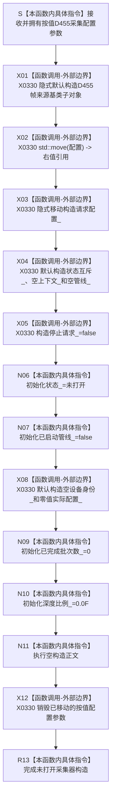

# CF-L5-0170 `D455相机采集器::D455相机采集器` 现状流程图

图类型：现状流程图
代码版本：`a48a70b2d678dea64dd8228adb4f26f0badd9506`
覆盖文件：`海中鱼巣/适配/采集器.D455相机.ixx:427-429`；初始化顺序证据为同文件 `425,733-743` 与 `海中鱼巣/适配/协议.D455采样材料.ixx:73-87,160-166`
唯一根函数：F0294
完整签名：`海中鱼巣::D455相机采集器::D455相机采集器(海中鱼巣::D455采集配置 配置)`
参数：按值拥有 `配置`；F0101 以 `std::move(配置)` 传入，本函数再把参数内容移动到 `请求配置_`
返回结果：构造函数无显式返回值；成功后形成一个尚未打开且仍由 F0101 局部 `unique_ptr` 独占的具体采集器
非法值 / 拒绝：不校验配置且没有普通拒绝；无效配置由紧随其后的 F0295 `打开()` 在创建 SDK 资源前拒绝
已登记调用方：F0101 `创建并打开D455相机采集器`，经 E0537 构造
直接项目函数：无；基类和各成员构造均为编译器 / 标准库边界
调用图：`流程图/代码流程图/00_调用知识图谱.md`
逐行映射表：`流程图/代码流程图/L5/CF-L5-0170_D455相机采集器构造_逐行代码映射表.md`
输入契约 / 调用语境表：本文“输入契约与非成功语境”
非成功返回二分审查表：本文“输入契约与非成功语境”
偏差清单：`流程图/代码流程图/00_规范偏差审计.md` 的 F0294 切片
依据提交 / 结构化消息：冻结源码提交 `a48a70b2d678dea64dd8228adb4f26f0badd9506`；独立只读分析，主智能体统一复核和写入
入口前置：F0101 已成功分配具体对象存储；按值参数生命周期覆盖构造函数
结构读取与写入：只初始化未发布适配器对象；不枚举设备、不创建 context / pipeline、不写项目机器事实
逻辑内返回：无
内部错误：标准 / 编译器构造异常传播给 F0101；本函数没有结构化异常结果
生命周期与资源释放：构造完成后 `请求配置_` 拥有请求值；其余资源槽为空；按值参数退出时销毁已移动内容
异常：未声明 `noexcept`，无 `try/catch` 或显式 `throw`
并发 / 幂等：对象尚未发布；构造函数自身无并发入口
验证入口：冻结源码 blob、声明顺序、E0537、X0330 和初始化后状态机械核对
验证输出：机械门禁 PASS；JSON 统计为函数 598 / 已完成 289 / 待处理 309 / 项目调用边 1477 / 外部边界 331 / 未解析调用 7；函数、调用边和外部边界无悬空；本图与映射唯一配对且 Mermaid fenced block 存在；冻结源码 blob 命中 `9009c0c875af65020d4e2edef14a5e33aa7cc948`；HTML 零变化；`git diff --check` PASS；`python .\tools\check_specs.py --strict` 100 项 PASS
依据：`规范/0050_项目通用机器逻辑与禁止性规则总纲_20260721.md`、`规范/0600_代码函数流程图应用与维护规范.md`、`规范/6350_子规范_双目相机外设独占观察线程_20260720.md`、`规范/详细设计/D455相机采样材料入口详细设计.md`
不得作为施工许可：是
不得宣称：配置有效、设备存在、实际 profile 成立、pipeline 已启动、真实样本通过或 D455 已接入生产

## 流程图

## 节点合同

| 节点 | 类型 | 参数 / 输入绑定 | 结果 / 输出绑定 | 事实读写 | 后继条件 | 验证 |
| --- | --- | --- | --- | --- | --- | --- |
| S—X03 | 指令 / 外部边界 | 按值 `配置` | `请求配置_` 拥有移动后内容 | 写未发布对象 | 分配与移动构造成功 | 427—428 行 |
| X04—X08 | 外部边界 / 指令 | 成员声明和默认成员初始化器 | 锁、空 SDK 槽、停止位、状态与空材料 | 写未发布对象 | 各成员构造成功 | 733—741 行 |
| N09—N10 | 本函数内具体指令 | 固定零值 | 批次数零、深度比例零 | 写未发布对象 | 初始化完成 | 742—743 行 |
| N11—R13 | 指令 / 外部边界 | 空正文和已移动参数 | 参数销毁、对象构造完成 | 无项目机器事实 | 正常离开构造函数 | 429 行 |

## 输入契约与非成功语境

| 入口 / 节点 | 输入来源 | 上游是否保证有效 | 非成功结果 | 二分口径 | 结构变化与后续归属 |
| --- | --- | --- | --- | --- | --- |
| S | F0101 按值配置 | 否 | 配置内容无效仍可构造暂态对象 | 非本函数拒绝；交给 F0295 | 未发布对象 |
| X01—X12 | 编译器与标准库构造边界 | 部分 | 分配后的成员构造异常 | 追根因解决并向 F0101 传播 | 未完成对象按语言规则销毁已构造成员 |
| R13 | 当前唯一工厂语境 | 是 | 构造成功但尚未打开 | 正常暂态结果 | F0101 立即调用 F0295，不公开半开对象 |

## 调用与边界汇总

F0294 不新增项目调用边，保留既有 E0537。X0330 汇总基类默认构造、配置移动 / 参数析构、mutex / unique_ptr / atomic 和值式材料默认构造；F0101 的 `make_unique` 分配仍属于既有 X0089。
