# CF-L5-0171 `D455相机采集器::打开` 现状流程图

图类型：现状流程图
代码版本：`a48a70b2d678dea64dd8228adb4f26f0badd9506`
覆盖文件：`海中鱼巣/适配/采集器.D455相机.ixx:440-588`；F0599 内部正文 `539-546` 作为独立 lambda 函数登记，不内联为 F0295 指令
唯一根函数：F0295
完整签名：`海中鱼巣::D455操作结果 海中鱼巣::D455相机采集器::打开()`
参数：无显式参数；隐式可写 `this` 是 F0101 所持 `unique_ptr<D455相机采集器>` 的非拥有借用，不转移对象所有权
返回结果：按值返回 `{成功, 追根因, 拒绝原因}`；成功包括首次打开和已运行幂等结果；其余分支返回结构化失败
非法值 / 拒绝：配置无效、已停止、无设备、多设备歧义、指定设备不存在 / 不是 D455、配置不支持为普通结构化结果；内部 SDK / 读回矛盾和异常要求追根因
已登记调用方：F0101 `创建并打开D455相机采集器`，经 E0538 直接调用
直接项目函数：F0103、F0104、F0307—F0309、F0316—F0318、F0594—F0604；F0599 内部被调函数待展开其独立图时登记
调用图：`流程图/代码流程图/00_调用知识图谱.md`
逐行映射表：`流程图/代码流程图/L5/CF-L5-0171_D455相机采集器打开_逐行代码映射表.md`
输入契约 / 调用语境表：本文“输入契约与非成功语境”
非成功返回二分审查表：本文“输入契约与非成功语境”
偏差清单：`流程图/代码流程图/00_规范偏差审计.md` 的 F0295 切片
依据提交 / 结构化消息：冻结源码提交 `a48a70b2d678dea64dd8228adb4f26f0badd9506`；冻结源码 blob `9009c0c875af65020d4e2edef14a5e33aa7cc948`
入口前置：F0294 已完成暂态对象构造；唯一当前工厂调用立即调用本函数，但该成员函数自身没有唯一调用者或单线程断言
结构读取与写入：读取请求配置和 SDK 外部材料；成功时发布设备身份、实际配置、深度比例、停止位和运行状态；不写节点、关系、索引或领域事实
逻辑内返回：配置 / 状态入口拒绝、真实设备缺失或歧义、指定设备不匹配以及 SDK 明确不支持请求 profile
内部错误：设备枚举 / 身份 / 深度比例 / 实际 profile 读回不一致、异常和失败清理 stop 错误
生命周期与资源释放：局部 SDK 对象由专用 `unique_ptr` 释放器和 `SDK错误槽` 逆序清理；成功保留成员 context / pipeline；普通失败由 F0594 停止并清空成员资源
异常：try 内任意异常被 catch-all 收口为 F0594 `内部不一致,true`；异常细节不保留
并发 / 幂等：已运行时直接返回成功；SDK 打开阶段不持状态锁，成功发布前没有二次状态 / 代次复核
验证入口：冻结源码、逐调用点 E 边、X0331—X0332、逐行映射、19 个 F0594 返回点、四路短路顺序和路径相关逆序资源清理机械核对
验证输出：机械门禁 PASS；JSON 统计为函数 598 / 已完成 289 / 待处理 309 / 项目调用边 1477 / 外部边界 331 / 未解析调用 7；E1405—E1480 逐调用点闭合且函数、调用边和外部边界无悬空；本图与映射唯一配对且 Mermaid fenced block 存在；冻结源码 blob 命中 `9009c0c875af65020d4e2edef14a5e33aa7cc948`；HTML 零变化；`git diff --check` PASS；`python .\tools\check_specs.py --strict` 100 项 PASS
依据：`规范/0050_项目通用机器逻辑与禁止性规则总纲_20260721.md`、`规范/0600_代码函数流程图应用与维护规范.md`、`规范/6350_子规范_双目相机外设独占观察线程_20260720.md`、`规范/详细设计/D455相机采样材料入口详细设计.md`
不得作为施工许可：是
不得宣称：精确产品 ID 复核、打开并发安全、SDK 错误可审计、真实 D455 样本通过、后续 L1—L3 或生产观察闭环完成

## 流程图

```mermaid
flowchart TD
    C01["C01【函数调用】F0104 D455采集配置有效(请求配置_) -> 配置有效"]
    B02{"B02【本函数内具体指令】配置有效？"}
    R03["R03【本函数内具体指令】返回配置无效"]
    X04["X04【函数调用-外部边界】X0331 scoped_lock取得状态互斥锁"]
    B05{"B05【本函数内具体指令】状态为运行中？"}
    R06["R06【本函数内具体指令】返回已运行幂等成功"]
    B07{"B07【本函数内具体指令】状态不是未打开？"}
    R08["R08【本函数内具体指令】返回已停止"]
    N09["N09【本函数内具体指令】解锁并进入try"]

    C10["C10【函数调用】F0316 构造上下文错误槽"]
    C11["C11【函数调用】F0307 上下文错误.接收() -> SDK错误输出槽"]
    X12["X12【函数调用-外部边界】X0332 rs2_create_context -> 原上下文"]
    C13["C13【函数调用】若旧上下文非空则F0318释放旧上下文"]
    N14["N14【本函数内具体指令】把原上下文绑定到成员上下文_"]
    C15["C15【函数调用】F0308 上下文错误.失败() -> 失败位"]
    B16{"B16【本函数内具体指令】失败位为true或上下文为空？"}

    C17["C17【函数调用】F0316 构造列表错误槽"]
    C18["C18【函数调用】F0307 列表错误.接收() -> SDK错误输出槽"]
    X19["X19【函数调用-外部边界】X0332 rs2_query_devices -> 原设备列表"]
    N20["N20【本函数内具体指令】把原列表绑定到设备列表指针"]
    C21["C21【函数调用】F0308 列表错误.失败() -> 失败位"]
    B22{"B22【本函数内具体指令】失败位为true或设备列表为空？"}

    C23["C23【函数调用】F0316 构造数量错误槽"]
    C24["C24【函数调用】F0307 数量错误.接收() -> SDK错误输出槽"]
    X25["X25【函数调用-外部边界】X0332 rs2_get_device_count -> 设备数量"]
    C26["C26【函数调用】F0308 数量错误.失败() -> 失败位"]
    B27{"B27【本函数内具体指令】数量读取失败？"}
    N28["N28【本函数内具体指令】构造空选中设备并令索引=0"]
    B29{"B29【本函数内具体指令】索引小于设备数量？"}
    C30["C30【函数调用】F0316 构造创建设备错误槽"]
    C31["C31【函数调用】F0307 创建设备错误.接收() -> SDK错误输出槽"]
    X32["X32【函数调用-外部边界】X0332 rs2_create_device -> 原当前设备"]
    N33["N33【本函数内具体指令】把原设备绑定到当前设备指针"]
    C34["C34【函数调用】F0308 创建设备错误.失败() -> 失败位"]
    B35{"B35【本函数内具体指令】失败位为true或当前设备为空？"}
    N36["N36【本函数内具体指令】令调用成功=true"]
    C37["C37【函数调用】F0595 读取设备信息(当前设备,序列号,调用成功) -> 当前序列号"]
    B38{"B38【本函数内具体指令】调用成功？"}
    B39{"B39【本函数内具体指令】已指定序列号且当前序列号相等？"}
    C40["C40【函数调用】F0596 是D455设备(当前设备,调用成功) -> 是D455"]
    B41{"B41【本函数内具体指令】是D455？"}
    B42{"B42【本函数内具体指令】调用成功？"}
    N43["N43【本函数内具体指令】移动当前设备到选中设备并标记跳出循环"]
    B44{"B44【本函数内具体指令】已指定序列号？"}
    C45["C45【函数调用】F0596 是D455设备(当前设备,调用成功) -> 是D455"]
    B46{"B46【本函数内具体指令】是D455？"}
    B47{"B47【本函数内具体指令】调用成功？"}
    B48{"B48【本函数内具体指令】已经选中过另一台D455？"}
    N49["N49【本函数内具体指令】移动当前设备到选中设备"]
    L50["L50【函数调用】若当前设备仍非空则F0602释放当前设备"]
    L51["L51【函数调用】F0309 析构本轮创建设备错误槽"]
    N52["N52【本函数内具体指令】若未跳出则索引递增并继续循环"]
    B53{"B53【本函数内具体指令】循环结束后选中设备为空？"}
    N54["N54【本函数内具体指令】按是否指定序列号选择无设备或指定设备不存在原因"]

    N55["N55【本函数内具体指令】令身份读取成功=true"]
    C56["C56【函数调用】F0597 转换设备身份(选中设备,身份读取成功) -> 身份"]
    C57["C57【函数调用】F0103 D455设备身份有效(身份) -> 身份有效"]
    B58{"B58【本函数内具体指令】身份读取成功且身份有效？"}
    N59["N59【本函数内具体指令】初始化深度比例=0"]
    C60["C60【函数调用】F0598 读取深度比例(选中设备,深度比例) -> 成功位"]
    B61{"B61【本函数内具体指令】深度比例读取成功？"}

    C62["C62【函数调用】F0316 构造管线错误槽"]
    C63["C63【函数调用】F0307 管线错误.接收() -> SDK错误输出槽"]
    X64["X64【函数调用-外部边界】X0332 rs2_create_pipeline -> 原管线"]
    C65["C65【函数调用】若旧管线非空则F0317释放旧管线"]
    N66["N66【本函数内具体指令】把原管线绑定到成员管线_"]
    C67["C67【函数调用】F0316 构造配置错误槽"]
    C68["C68【函数调用】F0307 配置错误.接收() -> SDK错误输出槽"]
    X69["X69【函数调用-外部边界】X0332 rs2_create_config -> 原配置"]
    N70["N70【本函数内具体指令】把原配置绑定到局部配置指针"]
    C71["C71【函数调用】F0308 读取管线错误和配置错误失败位"]
    B72{"B72【本函数内具体指令】任一失败或管线/配置为空？"}
    C73["C73【函数调用】F0316 构造设备配置错误槽"]
    C74["C74【函数调用】F0307 设备配置错误.接收() -> SDK错误输出槽"]
    X75["X75【函数调用-外部边界】X0332 rs2_config_enable_device(配置,身份序列号)"]
    C76["C76【函数调用】F0308 设备配置错误.失败() -> 失败位"]
    B77{"B77【本函数内具体指令】设备绑定失败？"}
    N78["N78【本函数内具体指令】构造按引用捕获局部配置的F0599启用流闭包"]
    C79["C79【函数调用】F0599 启用流(请求配置_.彩色) -> 成功位"]
    B80{"B80【本函数内具体指令】彩色启用成功？"}
    C81["C81【函数调用】F0599 启用流(请求配置_.深度) -> 成功位"]
    B82{"B82【本函数内具体指令】深度启用成功？"}
    C83["C83【函数调用】F0599 启用流(请求配置_.左红外) -> 成功位"]
    B84{"B84【本函数内具体指令】左红外启用成功？"}
    C85["C85【函数调用】F0599 启用流(请求配置_.右红外) -> 成功位"]
    B86{"B86【本函数内具体指令】右红外启用成功？"}

    C87["C87【函数调用】F0316 构造启动错误槽"]
    C88["C88【函数调用】F0307 启动错误.接收() -> SDK错误输出槽"]
    X89["X89【函数调用-外部边界】X0332 rs2_pipeline_start_with_config -> 原管线配置"]
    N90["N90【本函数内具体指令】把原管线配置绑定到局部管线配置指针"]
    C91["C91【函数调用】F0308 启动错误.失败() -> 失败位"]
    B92{"B92【本函数内具体指令】启动失败或管线配置为空？"}
    N93["N93【本函数内具体指令】设置已启动管线_=true"]
    C94["C94【函数调用】F0600 复核实际流配置(管线配置,请求配置_) -> 匹配位"]
    B95{"B95【本函数内具体指令】实际四路配置匹配？"}
    C96["C96【函数调用】F0316 构造实际设备错误槽"]
    C97["C97【函数调用】F0307 实际设备错误.接收() -> SDK错误输出槽"]
    X98["X98【函数调用-外部边界】X0332 rs2_pipeline_profile_get_device -> 原实际设备"]
    N99["N99【本函数内具体指令】把原实际设备绑定到设备指针"]
    C100["C100【函数调用】F0308 实际设备错误.失败() -> 失败位"]
    B101{"B101【本函数内具体指令】失败位为true或实际设备为空？"}
    N102["N102【本函数内具体指令】令实际身份成功=true"]
    C103["C103【函数调用】F0597 转换设备身份(实际设备,实际身份成功) -> 实际身份"]
    B104{"B104【本函数内具体指令】实际身份成功且序列号等于枚举身份？"}
    X105["X105【函数调用-外部边界】X0331 scoped_lock取得状态互斥锁"]
    N106["N106【本函数内具体指令】设备身份_=实际身份"]
    N107["N107【本函数内具体指令】实际配置_=请求配置_并用实际序列号覆盖"]
    N108["N108【本函数内具体指令】深度比例_=已读深度比例"]
    X109["X109【函数调用-外部边界】X0331 停止请求_.store(false)"]
    N110["N110【本函数内具体指令】状态_=运行中"]
    N111["N111【本函数内具体指令】形成首次打开成功结果"]

    C120["C120【函数调用】F0594 打开失败(具名原因,追根因位) -> 失败结果"]
    N121["N121【本函数内具体指令】按实际返回点建立已构造自动对象的逆序析构游标"]
    B122{"B122【本函数内具体指令】逆序游标是否仍有对象？"}
    C123["C123【函数调用】若当前对象是SDK错误槽则F0309析构"]
    C124["C124【函数调用】若当前对象是管线配置指针则F0604释放非空profile"]
    C125["C125【函数调用】若当前对象是配置指针则F0603释放非空config"]
    C126["C126【函数调用】若当前对象是设备指针则F0602释放非空device"]
    C127["C127【函数调用】若当前对象是设备列表指针则F0601释放非空列表"]
    X128["X128【函数调用-外部边界】X0331 析构当前其它标准库或值式局部对象"]
    N129["N129【本函数内具体指令】逆序游标前移"]
    B130{"B130【本函数内具体指令】待返回结果是首次打开成功？"}
    R131["R131【本函数内具体指令】按值返回首次打开成功结果"]
    R132["R132【本函数内具体指令】按值返回F0594失败结果"]

    E140["E140【本函数内具体指令】try内异常先逆序展开局部对象再进入catch"]
    C141["C141【函数调用】F0594 打开失败(内部不一致,true) -> 异常失败结果"]
    R142["R142【本函数内具体指令】按值返回异常失败结果"]

    C01 --> B02
    B02 -- "否" --> R03
    B02 -- "是" --> X04 --> B05
    B05 -- "是" --> R06
    B05 -- "否" --> B07
    B07 -- "是" --> R08
    B07 -- "否，解锁" --> N09 --> C10 --> C11 --> X12 --> C13 --> N14 --> C15 --> B16
    B16 -- "是：无设备,false" --> C120
    B16 -- "否" --> C17 --> C18 --> X19 --> N20 --> C21 --> B22
    B22 -- "是：无设备,false" --> C120
    B22 -- "否" --> C23 --> C24 --> X25 --> C26 --> B27
    B27 -- "是：内部不一致,true" --> C120
    B27 -- "否" --> N28 --> B29
    B29 -- "是" --> C30 --> C31 --> X32 --> N33 --> C34 --> B35
    B35 -- "是：内部不一致,true" --> C120
    B35 -- "否" --> N36 --> C37 --> B38
    B38 -- "否：内部不一致,true" --> C120
    B38 -- "是" --> B39
    B39 -- "是" --> C40 --> B41
    B41 -- "是" --> N43 --> L50
    B41 -- "否" --> B42
    B42 -- "否：内部不一致,true" --> C120
    B42 -- "是：指定设备不是D455,false" --> C120
    B39 -- "否" --> B44
    B44 -- "是" --> L50
    B44 -- "否" --> C45 --> B46
    B46 -- "否" --> B47
    B47 -- "否：内部不一致,true" --> C120
    B47 -- "是，非D455" --> L50
    B46 -- "是" --> B48
    B48 -- "是：多设备歧义,false" --> C120
    B48 -- "否" --> N49 --> L50
    L50 --> L51 --> N52
    N52 -- "继续" --> B29
    N52 -- "跳出" --> B53
    B29 -- "否" --> B53
    B53 -- "是" --> N54 --> C120
    B53 -- "否" --> N55 --> C56 --> C57 --> B58
    B58 -- "否：内部不一致,true" --> C120
    B58 -- "是" --> N59 --> C60 --> B61
    B61 -- "否：内部不一致,true" --> C120
    B61 -- "是" --> C62 --> C63 --> X64 --> C65 --> N66 --> C67 --> C68 --> X69 --> N70 --> C71 --> B72
    B72 -- "是：内部不一致,true" --> C120
    B72 -- "否" --> C73 --> C74 --> X75 --> C76 --> B77
    B77 -- "是：配置不支持,false" --> C120
    B77 -- "否" --> N78 --> C79 --> B80
    B80 -- "否：配置不支持,false" --> C120
    B80 -- "是" --> C81 --> B82
    B82 -- "否：配置不支持,false" --> C120
    B82 -- "是" --> C83 --> B84
    B84 -- "否：配置不支持,false" --> C120
    B84 -- "是" --> C85 --> B86
    B86 -- "否：配置不支持,false" --> C120
    B86 -- "是" --> C87 --> C88 --> X89 --> N90 --> C91 --> B92
    B92 -- "是：配置不支持,false" --> C120
    B92 -- "否" --> N93 --> C94 --> B95
    B95 -- "否：内部不一致,true" --> C120
    B95 -- "是" --> C96 --> C97 --> X98 --> N99 --> C100 --> B101
    B101 -- "是：内部不一致,true" --> C120
    B101 -- "否" --> N102 --> C103 --> B104
    B104 -- "否：内部不一致,true" --> C120
    B104 -- "是" --> X105 --> N106 --> N107 --> N108 --> X109 --> N110 --> N111 --> N121
    C120 --> N121
    N121 --> B122
    B122 -- "SDK错误槽" --> C123 --> N129
    B122 -- "管线配置指针" --> C124 --> N129
    B122 -- "配置指针" --> C125 --> N129
    B122 -- "设备指针" --> C126 --> N129
    B122 -- "设备列表指针" --> C127 --> N129
    B122 -- "其它自动对象" --> X128 --> N129
    N129 --> B122
    B122 -- "无" --> B130
    B130 -- "是" --> R131
    B130 -- "否" --> R132
    X12 -. "异常" .-> E140
    X98 -. "任一try步骤异常" .-> E140
    E140 --> C141 --> R142
```

## 节点合同

| 节点 | 类型 | 参数 / 输入绑定 | 结果 / 输出绑定 | 事实读写 | 后继条件 | 验证 |
| --- | --- | --- | --- | --- | --- | --- |
| C01—R08 | 函数调用 / 指令 / 外部边界 | `this->请求配置_`、状态互斥和状态 | 配置 / 状态结构化结果或进入 SDK 阶段 | 只读暂态采集器状态 | 配置有效且状态为未打开 | 440—452 行 |
| C10—B27 | 函数调用 / 指令 / 外部边界 | SDK 版本、成员上下文 | context、设备列表和数量 | 写成员上下文，读取外部设备材料 | 三个 SDK 阶段均无错误 | 454—469 行 |
| N28—B53 | 指令 / 函数调用 / 外部边界 | 可选序列号和枚举设备 | 唯一选中设备或具名拒绝 | 只读外部设备身份 | 指定设备唯一匹配或未指定且唯一 D455 | 471—515 行 |
| N55—B61 | 指令 / 函数调用 | 选中设备 | 完整身份和正深度比例 | 只读外部设备材料 | 身份与比例读取成功 | 517—525 行 |
| C62—B86 | 函数调用 / 指令 / 外部边界 | context、身份序列号、四路请求配置 | pipeline、config 与四路启用结果 | 写成员 pipeline 候选 | 四路严格按彩色→深度→左红外→右红外成功 | 527—552 行 |
| C87—B104 | 函数调用 / 指令 / 外部边界 | pipeline、config、请求配置与枚举身份 | 已启动 profile、实际设备和实际身份 | 启动成员 pipeline 候选 | profile 和身份读回一致 | 554—574 行 |
| X105—N111 | 外部边界 / 指令 | 实际身份、请求配置、比例 | 运行状态和首次打开成功结果 | 发布适配器运行状态；仍非项目机器事实 | 锁内写入全部完成 | 576—583 行 |
| C120—R132 | 函数调用 / 生命周期 / 返回 | 具名原因、追根因位和当前路径已构造对象集合 | F0594 失败结果或首次成功结果 | F0594 先清成员资源；随后只按实际构造顺序逆序清理局部对象 | 逆序游标耗尽 | 458—584 行各返回点 |
| E140—R142 | 指令 / 函数调用 / 返回 | 任意 try 内异常 | 内部不一致且追根因 | try 局部对象先展开，随后 F0594 清理成员资源 | catch-all 完成 | 585—587 行 |

## 输入契约与非成功语境

| 入口 / 节点 | 输入来源 | 上游是否保证有效 | 非成功结果 | 二分口径 | 结构变化与后续归属 |
| --- | --- | --- | --- | --- | --- |
| C01—B02 | F0294 保存的外部请求配置 | 否 | 配置无效 | 逻辑内返回 | SDK 资源尚未创建 |
| B05—B07 | 采集器暂态状态 | 部分 | 已运行幂等成功或已停止拒绝 | 逻辑内返回 | 无新结构 |
| B16、B22 | SDK context / 设备列表调用 | 否 | SDK 报错或空指针统一为无设备 | 当前代码按逻辑内返回；存在错误折叠偏差 | F0594 清空成员资源 |
| B27、B35、B38 | 设备数量 / 创建设备 / 序列号读取 | SDK 前一步已通过 | 内部不一致 | 追根因解决 | F0594 清空成员资源 |
| B41—B53 | 可选序列号和 D455 分类 | 否 | 指定设备不是 D455、无设备、指定设备不存在、多设备歧义 | 逻辑内返回 | F0594 清空成员资源 |
| B58—B61 | 已选设备身份和深度比例 | 选中设备已成立 | 内部不一致 | 追根因解决 | F0594 清空成员资源 |
| B72 | pipeline / config 创建 | SDK 前置已通过 | 内部不一致 | 追根因解决 | F0594 清空成员资源 |
| B77、B80—B92 | 设备绑定、四流启用或 pipeline 启动 | 请求配置值式合法 | 配置不支持 | 逻辑内返回；SDK 内部错误可能被折叠 | 已启动后 F0594 尝试 stop |
| B95—B104 | SDK 已确认启动后的实际 profile / 身份读回 | 是 | 内部不一致 | 追根因解决 | F0594 stop / reset |
| E140—R142 | try 内任意异常 | 不适用 | 内部不一致且追根因 | 追根因解决 | 局部 RAII 展开后 F0594 清理成员资源 |
| F0594 清理 | 失败路径 | 是 | pipeline stop 再失败 | 追根因解决 | 状态置故障；不得继续依赖 |

## 独立启用流 lambda

F0599 的完整身份为：

`bool 海中鱼巣::D455相机采集器::打开()::<lambda@采集器.D455相机.ixx:539>::operator()(const 海中鱼巣::D455流配置& 流) const`

它按引用捕获局部 `配置` 所有权槽，对参数 `流` 作调用期只读借用；其内部正文 540—545 不属于 F0295 指令。F0295 只构造闭包并按彩色、深度、左红外、右红外严格短路调用；内部的 `转换流类型`、`转换像素格式`、错误槽和 `rs2_config_enable_stream` 在 F0599 独立展开时登记。

## 调用与边界汇总

- F0295 的每个静态项目调用点各有独立 E 身份；同一函数的重复调用不合并为位置集合。
- X0331 汇总 F0295 的锁、原子、字符串、智能指针、移动、返回物化、循环和异常生命周期边界。
- X0332 汇总 F0295 直接发起的 RealSense context / 设备 / pipeline C API；F0599 内部 SDK 调用不计入本边界。
- 新增 F0594—F0604 十一个 L6 身份，均等待各自独立展开。
