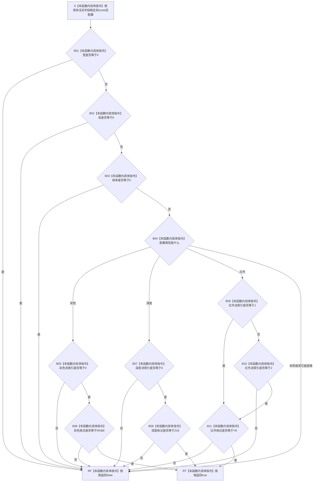

# CF-L5-0172 `D455流配置有效` 现状流程图

图类型：现状流程图
代码版本：`a48a70b2d678dea64dd8228adb4f26f0badd9506`
覆盖文件：`海中鱼巣/适配/协议.D455采样材料.ixx:179-194`
唯一根函数：F0296
完整签名：`bool 海中鱼巣::D455流配置有效(const 海中鱼巣::D455流配置& 配置) noexcept`
参数：调用期间存活且字段稳定的非拥有 `const D455流配置& 配置`
返回结果：按值返回静态流形状有效位；true 只表示非零尺寸 / 帧率以及当前类型—索引—格式组合被函数接受
非法值 / 拒绝：宽、高或帧率为零；彩色不是索引 0 / RGB8；深度不是索引 0 / Z16；红外不是索引 1 或 2 / Y8；未知类型均返回 false
已登记调用方：F0104 `D455采集配置有效`，经 E0540—E0543 依次检查彩色、深度、左红外和右红外
直接项目函数：无
调用图：`流程图/代码流程图/00_调用知识图谱.md`
逐行映射表：`流程图/代码流程图/L5/CF-L5-0172_D455流配置有效_逐行代码映射表.md`
输入契约 / 调用语境表：本文“输入契约与非成功语境”
非成功返回二分审查表：本文“输入契约与非成功语境”
偏差清单：`流程图/代码流程图/00_规范偏差审计.md` 的 F0296 切片
依据提交 / 结构化消息：冻结源码提交 `a48a70b2d678dea64dd8228adb4f26f0badd9506`；只读子智能体分析，主智能体统一复核和写入
入口前置：F0104 已确认采样超时非零；每次调用只传入四路配置中的一路，左右红外角色约束由 F0104 在四次调用后另行核对
结构读取与写入：只读取配置值式材料；不访问 SDK、设备、仓库、关系、索引或领域事实
逻辑内返回：任一静态形状条件不成立时返回 false，零结构变化
内部错误：悬空参数或与无同步并发写配置属于调用方生命周期 / 并发根因；函数自身没有内部错误结果
生命周期与资源释放：不复制、不保存参数；无资源、无锁、无分配
异常：声明 `noexcept`；函数体只有字段读取、比较、短路和 switch
并发 / 幂等：稳定配置上纯只读、可重入、重复调用确定；不为其它别名的并发写提供同步
验证入口：冻结源码 blob `f110508fd4e607469d69db1068bd1b15ee010d60`、179—194 行逐行映射、E0540—E0543、零出向项目函数和 Mermaid 分支机械核对
验证输出：PASS；JSON / Markdown 表 / Mermaid 调用边正反闭合，图和映射唯一，统计为函数 600 / 已完成 291 / 待处理 309 / 项目调用边 1481 / 外部边界 336 / 未解析调用 7；HTML 零变化，`git diff --check` 与 strict 100 项通过；未构建或运行程序
依据：`规范/0050_项目通用机器逻辑与禁止性规则总纲_20260721.md`、`规范/0600_代码函数流程图应用与维护规范.md`、`规范/6350_子规范_双目相机外设独占观察线程_20260720.md`、`规范/详细设计/D455相机采样材料入口详细设计.md`
不得作为施工许可：是
不得宣称：默认 profile 精确匹配、四流组合兼容、设备支持、真实打开成功、同步帧有效或 D455 已进入生产闭环

## 流程图

## 节点合同

| 节点 | 类型 | 参数 / 输入绑定 | 结果 / 输出绑定 | 事实读写 | 后继条件 | 验证 |
| --- | --- | --- | --- | --- | --- | --- |
| S—B03 | 本函数内具体指令 | `配置` 的宽、高、帧率 | 三项非零判定位 | 只读外部请求材料 | 三项均非零 | 179—182 行 |
| B04 | 本函数内具体指令 | `配置.类型` | 彩色 / 深度 / 红外 / 其它分支 | 只读请求材料 | 进入对应分支 | 183—184、186、188、191 行 |
| B05—B11 | 本函数内具体指令 | 流索引和格式 | 当前组合判定位 | 只读请求材料 | 组合完整成立 | 185、187、189—190 行 |
| RF | 本函数内具体指令 | 首个不成立条件 | false | 无 | 立即返回调用方 | 180—192 行 |
| RT | 本函数内具体指令 | 对应类型全部条件成立 | true | 无 | 返回调用方 | 185、187、189—190 行 |

## 输入契约与非成功语境

| 入口 / 节点 | 输入来源 | 上游是否保证有效 | 非成功结果 | 二分口径 | 结构变化与后续归属 |
| --- | --- | --- | --- | --- | --- |
| S | F0104 按引用传入的单路配置 | 否 | 生命周期失效或并发写 | 追调用方根因 | 无 |
| B01—B03 | 外部 / 默认配置材料 | 否 | 任一尺寸或帧率为零 | 逻辑内返回 | F0104 折叠为配置无效 |
| B04—B11 | 类型、索引和格式材料 | 否 | 未登记组合 | 逻辑内返回 | F0104 折叠为配置无效 |
| 彩色 / 深度 true | 静态字段 | 部分 | 设备实际不支持 | 不由本函数裁决 | F0295 打开及实际 profile 读回 |
| 红外 true | 静态字段 | 部分 | 左右角色颠倒 | 不由本函数裁决 | F0104 的左 1 / 右 2 后置条件 |

## 调用与边界汇总

F0296 保留 E0540—E0543 四条既有入边，没有出向项目函数、递归、标准库、SDK 或系统函数调用。17 项字段比较和短路均作为本函数内具体指令表达，不新增 E / X 身份。
