# CF-L5-0173 `D455帧材料缓存::准备帧材料候选` 现状流程图

图类型：现状流程图
代码版本：`a48a70b2d678dea64dd8228adb4f26f0badd9506`
覆盖文件：`海中鱼巣/线程/缓存.D455帧材料.ixx:131-180`；候选构造证据为同文件 `82-86,100-105,301-312`
唯一根函数：F0298
完整签名：`海中鱼巣::D455帧材料缓存::D455候选准备结果 海中鱼巣::D455帧材料缓存::准备帧材料候选(std::shared_ptr<const 海中鱼巣::D455同步帧材料> 材料, std::uint64_t 当前单调时间戳)`
参数：按值取得一份 `shared_ptr<const D455同步帧材料>` 共享所有权；按值取得当前单调时间戳；隐式可写 `this` 为调用期间存活的缓存借用
返回结果：成功时返回不透明 `D455帧材料候选`；普通拒绝或内部错误时返回具名原因和空 optional
非法值 / 拒绝：缓存配置无效、材料 / 时间无效、过期、单帧超限、停止接收、条数已满、总字节已满；编号异常和插入冲突标为追根因
已登记调用方：F0107 `D455采样材料上行桥::上行一次`，经 E0547 传入采集材料和宿主时间
直接项目函数：F0108 `D455同步帧材料有效`、F0301 `计算D455同步帧字节数`、F0605 `已过期`、F0606 候选私有构造、F0607 候选移动构造
调用图：`流程图/代码流程图/00_调用知识图谱.md`
逐行映射表：`流程图/代码流程图/L5/CF-L5-0173_D455帧材料缓存准备候选_逐行代码映射表.md`
输入契约 / 调用语境表：本文“输入契约与非成功语境”
非成功返回二分审查表：本文“输入契约与非成功语境”
偏差清单：`流程图/代码流程图/00_规范偏差审计.md` 的 F0298 切片
依据提交 / 结构化消息：冻结源码提交 `a48a70b2d678dea64dd8228adb4f26f0badd9506`；只读子智能体分析，主智能体统一复核和写入
入口前置：F0107 已检查材料非空、F0108 有效、宿主时间非零和批次匹配；本函数仍可被其它直接调用方用任意材料调用
结构读取与写入：锁外校验材料；锁内读取接收 / 容量 / 编号状态，成功时增加材料编号和能力编号、插入未发布候选条目并增加总字节数；不发布普通读取可见材料
逻辑内返回：外部材料、生命周期和容量前置不成立且未破坏内部不变量时的具名拒绝
内部错误：编号为零、emplace 返回未插入、锁 / 分配异常；部分路径已经消耗编号，当前代码不回滚
生命周期与资源释放：成功时材料共享所有权移入缓存条目；候选仅持缓存裸指针、句柄和能力编号；候选析构不自动撤销
异常：未声明 `noexcept`；mutex 加锁和 `unordered_map::emplace` 异常直接外抛
并发 / 幂等：缓存状态和条目写入由同一 mutex 串行；同一材料重复调用可建立多个候选，不幂等
验证入口：冻结源码 blob `ec93dd07f8647cdc1a88a5343312c087e5d4c9b8`、131—180 行、E0547 / E1481—E1485、F0605—F0607、X0333—X0337 和未发布读回边界机械核对
验证输出：PASS；JSON / Markdown 表 / Mermaid 调用边正反闭合，图和映射唯一，统计为函数 600 / 已完成 291 / 待处理 309 / 项目调用边 1481 / 外部边界 336 / 未解析调用 7；HTML 零变化，`git diff --check` 与 strict 100 项通过；未构建或运行程序
依据：`规范/0050_项目通用机器逻辑与禁止性规则总纲_20260721.md`、`规范/0600_代码函数流程图应用与维护规范.md`、`规范/6350_子规范_双目相机外设独占观察线程_20260720.md`、`规范/详细设计/D455相机采样材料入口详细设计.md`
不得作为施工许可：是
不得宣称：完整缓存事务、异常零变化、候选自动撤销、跨缓存能力安全、真实 D455 样本、生产接线或 D455 闭环已经成立

## 流程图

```mermaid
flowchart TD
    S["S【本函数内具体指令】按值取得材料共享所有权和当前单调时间戳"]
    B01{"B01【本函数内具体指令】配置有效_是否为true"}
    R02["R02【本函数内具体指令】返回配置无效"]
    B03{"B03【本函数内具体指令】材料共享指针是否非空"}
    C04["C04【函数调用】F0108 D455同步帧材料有效(*材料) -> 材料有效位"]
    B05{"B05【本函数内具体指令】材料有效位是否为true"}
    B06{"B06【本函数内具体指令】当前单调时间戳是否非零"}
    R07["R07【本函数内具体指令】返回材料无效"]
    C08["C08【函数调用】F0605 已过期(*材料,当前单调时间戳) -> 过期位"]
    B09{"B09【本函数内具体指令】材料是否已过期"}
    R10["R10【本函数内具体指令】返回材料已过期"]
    C11["C11【函数调用】F0301 计算D455同步帧字节数(*材料) -> 字节数"]
    B12{"B12【本函数内具体指令】字节数是否等于0"}
    B13{"B13【本函数内具体指令】字节数是否超过单帧上限"}
    R14["R14【本函数内具体指令】返回单帧超限"]
    X15["X15【函数调用-外部边界】X0334 scoped_lock锁定互斥_"]
    B16{"B16【本函数内具体指令】正在接收_是否为true"}
    R17["R17【本函数内具体指令】返回已停止接收并解锁"]
    X18["X18【函数调用-外部边界】X0335 条目组_.size() -> 当前条目数"]
    B19{"B19【本函数内具体指令】条目数是否达到或超过上限"}
    R20["R20【本函数内具体指令】返回条数已满并解锁"]
    B21{"B21【本函数内具体指令】当前总字节数是否已超过上限"}
    B22{"B22【本函数内具体指令】新材料是否超过剩余容量"}
    R23["R23【本函数内具体指令】返回总字节已满并解锁"]
    B24{"B24【本函数内具体指令】下一材料编号或能力编号是否为0"}
    R25["R25【本函数内具体指令】返回内部计数不一致并解锁"]
    N26["N26【本函数内具体指令】形成版本1句柄并后增材料编号"]
    N27["N27【本函数内具体指令】取得并后增能力编号"]
    N28["N28【本函数内具体指令】构造未发布条目并写句柄、状态和能力编号"]
    X29["X29【函数调用-外部边界】X0333 std::move(材料) -> 条目材料共享所有权"]
    N30["N30【本函数内具体指令】写入条目字节数"]
    X31["X31【函数调用-外部边界】X0335 条目组_.emplace(材料编号,std::move(新条目)) -> 插入结果"]
    B32{"B32【本函数内具体指令】已插入是否为true"}
    R33["R33【本函数内具体指令】保留已消耗编号并返回内部计数不一致"]
    N34["N34【本函数内具体指令】当前总字节数增加字节数"]
    N35["N35【本函数内具体指令】默认构造结果并设置成功=true"]
    C36["C36【函数调用】F0606 构造候选(this,句柄,能力编号) -> 临时候选"]
    C37["C37【函数调用】F0607 移动构造optional内候选"]
    X38["X38【函数调用-外部边界】X0336 形成optional和返回结果生命周期"]
    R39["R39【本函数内具体指令】按值返回成功结果并解锁"]
    E40["E40【本函数内具体指令】锁定异常直接外抛且缓存未变化"]
    E41["E41【本函数内具体指令】emplace异常直接外抛且两个编号已消耗"]

    S --> B01
    B01 -- "否" --> R02
    B01 -- "是" --> B03
    B03 -- "否" --> R07
    B03 -- "是" --> C04 --> B05
    B05 -- "否" --> R07
    B05 -- "是" --> B06
    B06 -- "否" --> R07
    B06 -- "是" --> C08 --> B09
    B09 -- "是" --> R10
    B09 -- "否" --> C11 --> B12
    B12 -- "是" --> R14
    B12 -- "否" --> B13
    B13 -- "是" --> R14
    B13 -- "否" --> X15
    X15 -. "异常" .-> E40
    X15 --> B16
    B16 -- "否" --> R17
    B16 -- "是" --> X18 --> B19
    B19 -- "是" --> R20
    B19 -- "否" --> B21
    B21 -- "是" --> R23
    B21 -- "否" --> B22
    B22 -- "是" --> R23
    B22 -- "否" --> B24
    B24 -- "是" --> R25
    B24 -- "否" --> N26 --> N27 --> N28 --> X29 --> N30 --> X31
    X31 -. "分配或容器异常" .-> E41
    X31 --> B32
    B32 -- "否" --> R33
    B32 -- "是" --> N34 --> N35 --> C36 --> C37 --> X38 --> R39
```

## 节点合同

| 节点 | 类型 | 参数 / 输入绑定 | 结果 / 输出绑定 | 事实读写 | 后继条件 | 验证 |
| --- | --- | --- | --- | --- | --- | --- |
| S—R14 | 指令 / 函数调用 | 配置、材料、当前时间、年龄和字节上限 | 进入临界区或具名拒绝 | 锁外只读材料 | 全部材料前置成立 | 131—146 行 |
| X15—R25 | 外部边界 / 指令 | mutex、接收位、条目数、总量和下一编号 | 容量准入或具名拒绝 | 锁内只读缓存状态 | 接收、容量和编号均成立 | 148—161 行 |
| N26—X31 | 指令 / 外部边界 | 两个编号、材料、字节数 | 未发布条目候选 | 锁内消耗编号并移动材料所有权 | emplace 完成 | 163—171 行 |
| B32—R33 | 指令 | 插入位 | 继续或追根因结果 | 插入失败仍保留编号消耗 | 已插入 | 172—174 行 |
| N34—R39 | 指令 / 函数调用 / 外部边界 | 条目、句柄、能力编号 | 总量更新和不透明候选 | 锁内完成候选状态 | 候选构造和返回成功 | 175—180 行 |
| E40—E41 | 指令 | 锁 / 分配异常 | 异常外抛 | 锁异常零变化；emplace 异常已消耗编号 | 调用方追根因 | 148、171 行 |

## 输入契约与非成功语境

| 入口 / 节点 | 输入来源 | 上游是否保证有效 | 非成功结果 | 二分口径 | 结构变化与后续归属 |
| --- | --- | --- | --- | --- | --- |
| B01 | 构造时缓存配置 | 否 | 配置无效 | 逻辑内返回 | 无 |
| B03—B06 | 外部材料 / F0107 正式上行材料 | F0107 保证，直接调用不保证 | 材料无效 | 直接入口为逻辑内返回；F0107 语境命中为追根因 | 无 |
| B09—B13 | 年龄和字节值 | 部分 | 已过期 / 单帧超限 | 逻辑内返回；F0108 已通过后字节为零属于内部矛盾 | 无 |
| B16—B22 | 缓存生命周期 / 容量 | 否 | 停止、满载 | 正常边界为逻辑内返回；条目数或总量已越界为内部计数根因 | 无 |
| B24—R25 | 内部编号 | 是 | 编号为零 | 追根因解决 | 无新条目 |
| B32—R33 | 唯一材料编号插入 | 是 | emplace 返回 false | 追根因解决 | 两个编号已消耗 |
| E40—E41 | 标准库异常 | 不适用 | 异常外抛 | 追根因解决 | E41 已产生编号变化 |
| R39 | 成功候选 | 是 | 调用方遗弃候选 | 候选生命周期缺口 | 未发布条目继续占容量 |

## 调用与边界汇总

- E1481：F0298 → F0108，材料内容有效性。
- E1482：F0298 → F0605，按输入当前时间裁决过期。
- E1483：F0298 → F0301，计算四平面总字节。
- E1484：F0298 → F0606，构造不透明候选临时值。
- E1485：F0298 → F0607，把候选移动构造进 optional。
- X0333—X0337 分别记录共享所有权、锁、哈希容器、optional / 返回生命周期和无符号算术 / 结果物化边界。
- 自检文件的十个源码调用点位于当前不可达 `运行D455采样材料自检`，不登记为当前根模式调用边。
