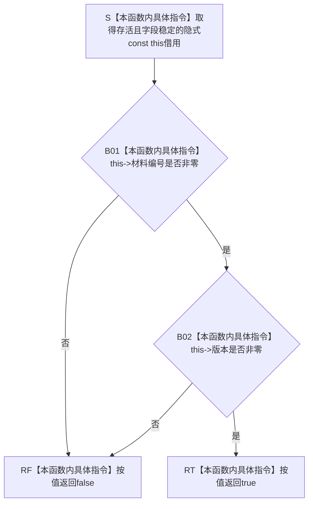

# CF-L5-0174 `D455帧材料句柄::有效` 现状流程图

图类型：现状流程图
代码版本：`a48a70b2d678dea64dd8228adb4f26f0badd9506`
覆盖文件：`海中鱼巣/线程/缓存.D455帧材料.ixx:45-47`
唯一根函数：F0299
完整签名：`bool 海中鱼巣::D455帧材料句柄::有效() const noexcept`
参数：无显式参数；隐式 `this` 是调用期间存活且字段稳定的非拥有只读借用
返回结果：材料编号和版本均非零时按值返回 true，否则返回 false
非法值 / 拒绝：材料编号为零，或材料编号非零但版本为零，均返回 false
已登记调用方：F0107 `D455采样材料上行桥::上行一次`、F0111 `D455帧材料缓存::按编号版本读取`；本批追加 F0303 `D455采样材料上行桥::撤销后返回`
直接项目函数：无
调用图：`流程图/代码流程图/00_调用知识图谱.md`
逐行映射表：`流程图/代码流程图/L5/CF-L5-0174_D455帧材料句柄有效_逐行代码映射表.md`
输入契约 / 调用语境表：本文“输入契约与非成功语境”
非成功返回二分审查表：本文“输入契约与非成功语境”
偏差清单：`流程图/代码流程图/00_规范偏差审计.md` 的 F0299 切片
依据提交 / 结构化消息：冻结源码提交 `a48a70b2d678dea64dd8228adb4f26f0badd9506`；只读子智能体分析，主智能体统一复核和写入
入口前置：调用方保证 `this` 存活；函数不要求句柄已经属于当前缓存或对应条目存在
结构读取与写入：只读取两个 `uint64_t` 字段；不读取缓存，不写节点、关系、索引、材料或领域事实
逻辑内返回：普通入口传入零编号或零版本句柄时返回 false
内部错误：F0107 成功候选读回或不透明候选能力已经匹配后仍得到无效句柄时，属于调用链内部读回不一致
生命周期与资源释放：不复制、不保存 `this`；无资源、锁、分配或所有权变化
异常：声明 `noexcept`；函数体只有两个无符号整数比较和短路
并发 / 幂等：字段稳定时纯只读、可重入、重复调用确定；不为其它别名并发写同一句柄提供同步
验证入口：冻结源码 blob `ec93dd07f8647cdc1a88a5343312c087e5d4c9b8`、45—47 行、E0549 / E0568 / E1486 / E1488、零出向项目函数和 Mermaid 分支机械核对
验证输出：PASS；源码 blob、逐行映射、单根 Mermaid、调用边正反闭合、聚合计数、`git diff --check`、strict 100 项与技能自检均通过
依据：`规范/0050_项目通用机器逻辑与禁止性规则总纲_20260721.md`、`规范/0600_代码函数流程图应用与维护规范.md`、`规范/6350_子规范_双目相机外设独占观察线程_20260720.md`、`规范/详细设计/D455相机采样材料入口详细设计.md`
不得作为施工许可：是
不得宣称：句柄对应条目存在、版本当前、材料已发布或未过期、候选能力匹配、句柄属于某个缓存、真实 D455 样本或生产闭环成立

## 流程图

## 节点合同

| 节点 | 类型 | 参数 / 输入绑定 | 结果 / 输出绑定 | 事实读写 | 后继条件 | 验证 |
| --- | --- | --- | --- | --- | --- | --- |
| S | 本函数内具体指令 | 隐式 `const this` | 非拥有只读句柄借用 | 无 | 对象存活 | 45 行 |
| B01 | 本函数内具体指令 | `材料编号` | 编号非零判定位 | 只读值式句柄字段 | 非零时继续 | 46 行左操作数 |
| B02 | 本函数内具体指令 | `版本` | 版本非零判定位 | 只读值式句柄字段 | 非零时成功 | 46 行右操作数 |
| RF / RT | 本函数内具体指令 | 短路比较结果 | false / true | 无结构变化 | 返回调用方 | 46—47 行 |

## 输入契约与非成功语境

| 入口 / 节点 | 输入来源 | 上游是否保证有效 | 非成功结果 | 二分口径 | 结构变化与后续归属 |
| --- | --- | --- | --- | --- | --- |
| F0111 调用语境 | 任意按值句柄 | 否 | false | 写前逻辑内返回 | F0111 返回版本不匹配 |
| F0107 调用语境 | 成功候选读回句柄 | 是 | false | 追根因解决 | F0107 进入显式撤销失败路径 |
| F0303 调用语境 | 待撤销句柄 | 否 | false | 逻辑内返回 | 不调用缓存撤销 |
| 后续候选查找语境 | 不透明候选内部句柄 | 是 | false | 追根因解决 | 归属候选能力与缓存生命周期 |
| RT | 普通值式句柄 | 部分 | 后继条目不存在或版本过期 | 不由本函数裁决 | 缓存读取、撤销或候选查找继续准入 |

## 调用与边界汇总

- 保留 E0549：F0107 → F0299。
- 保留 E0568：F0111 → F0299。
- 新增 E1486：F0303 → F0299。
- 新增 E1488：F0608 const `查找候选条目` → F0299，用于候选内部句柄形态准入。
- `精确撤销帧材料` 仍未形成自身可达函数身份；F0608 已登记为 L6 待展开函数，其内部判断留待自身单函数图展开。
- 本函数没有出向项目函数、递归、标准库、SDK 或系统函数调用；两个整数比较和短路属于本函数内具体指令，不新增 X 身份。
