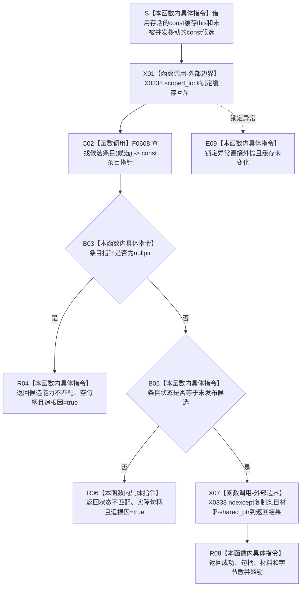

# CF-L5-0175 `D455帧材料缓存::读取候选` 现状流程图

图类型：现状流程图
代码版本：`a48a70b2d678dea64dd8228adb4f26f0badd9506`
覆盖文件：`海中鱼巣/线程/缓存.D455帧材料.ixx:182-193`；私有查找函数身份来源为同文件 `314-325`
唯一根函数：F0300
完整签名：`海中鱼巣::D455缓存读取结果 海中鱼巣::D455帧材料缓存::读取候选(const 海中鱼巣::D455帧材料缓存::D455帧材料候选& 候选) const`
参数：调用期间存活且不被并发移动的非拥有 `const D455帧材料候选& 候选`；隐式 `this` 是调用期间存活的缓存只读借用
返回结果：候选能力与未发布条目匹配时，按值返回成功位、句柄、材料共享所有权副本和登记字节数；否则返回具名追根因结果
非法值 / 拒绝：候选缓存地址、句柄或能力编号不匹配时返回候选能力不匹配；条目状态不是未发布候选时返回状态不匹配
已登记调用方：F0107 `D455采样材料上行桥::上行一次`，经 E0548 在准备成功且 optional 候选存在后读回
直接项目函数：F0608 `D455帧材料缓存::查找候选条目(const D455帧材料候选&) const noexcept`
调用图：`流程图/代码流程图/00_调用知识图谱.md`
逐行映射表：`流程图/代码流程图/L5/CF-L5-0175_D455帧材料缓存读取候选_逐行代码映射表.md`
输入契约 / 调用语境表：本文“输入契约与非成功语境”
非成功返回二分审查表：本文“输入契约与非成功语境”
偏差清单：`流程图/代码流程图/00_规范偏差审计.md` 的 F0300 切片
依据提交 / 结构化消息：冻结源码提交 `a48a70b2d678dea64dd8228adb4f26f0badd9506`；只读子智能体分析，主智能体统一复核和写入
入口前置：候选只能由缓存准备入口构造；当前 F0107 在同一缓存上立即读回，且没有先确认、撤销或丢弃
结构读取与写入：锁内经不透明能力查找条目并读取状态、句柄、材料和字节数；不改变条目状态、计数、总量或普通读取可见性
逻辑内返回：无；当前不透明候选协议把能力或状态不匹配均标为追根因
内部错误：候选能力不匹配、状态不匹配，以及锁异常；成功前置成立后任一不匹配都停止 F0107 依赖路径
生命周期与资源释放：成功结果复制一份 `shared_ptr<const D455同步帧材料>`，解锁后仍保持材料存活；候选与缓存引用均不被保存
异常：未声明 `noexcept`；mutex 加锁异常直接外抛；`shared_ptr` 复制由标准保证 `noexcept` 且不分配新控制块
并发 / 幂等：同一 mutex 串行缓存内候选读回、确认、撤销、过期清理和停止，但不保护调用方候选对象；条目保持未发布且候选未移动时重复读取确定。读回与后续确认分别加锁，不构成跨函数原子临界区
验证入口：冻结源码 blob `ec93dd07f8647cdc1a88a5343312c087e5d4c9b8`、182—193 行、E0548 / E1487、F0608、X0338、成功材料生命周期和 Mermaid 分支机械核对
验证输出：PASS；源码 blob、逐行映射、单根 Mermaid、调用边正反闭合、聚合计数、`git diff --check`、strict 100 项与技能自检均通过
依据：`规范/0050_项目通用机器逻辑与禁止性规则总纲_20260721.md`、`规范/0600_代码函数流程图应用与维护规范.md`、`规范/6350_子规范_双目相机外设独占观察线程_20260720.md`、`规范/详细设计/D455相机采样材料入口详细设计.md`
不得作为施工许可：是
不得宣称：候选已经发布、普通读者可见、材料仍未过期、登记字节数与容器再次互证、缓存完整事务、真实 D455 样本或生产闭环成立

## 流程图

## 节点合同

| 节点 | 类型 | 参数 / 输入绑定 | 结果 / 输出绑定 | 事实读写 | 后继条件 | 验证 |
| --- | --- | --- | --- | --- | --- | --- |
| S—X01 | 指令 / 外部边界 | `this`、`候选`、缓存 mutex | 锁内稳定读取窗口 | 只改变互斥锁状态 | 加锁成功 | 182—183 行 |
| C02—R04 | 函数调用 / 指令 | 当前缓存与不透明候选 | const 条目指针或能力不匹配结果 | 锁内只读候选和条目索引 | 指针非空 | 184—187 行 |
| B05—R06 | 本函数内具体指令 | 条目状态、实际句柄 | 继续或状态不匹配结果 | 锁内只读条目 | 状态为未发布候选 | 188—190 行 |
| X07—R08 | 外部边界 / 指令 | 条目句柄、材料共享指针、登记字节数 | 值式成功读取结果 | 复制材料共享所有权，不改缓存 | 返回调用方 | 191—193 行 |
| E09 | 本函数内具体指令 | mutex 锁定异常 | 异常外抛 | 缓存结构未变化 | 调用方追根因 | 183 行 |

## 输入契约与非成功语境

| 入口 / 节点 | 输入来源 | 上游是否保证有效 | 非成功结果 | 二分口径 | 结构变化与后续归属 |
| --- | --- | --- | --- | --- | --- |
| F0107 → S | 本缓存刚准备成功的 optional 候选 | 是 | 生命周期失效或并发移动 | 追调用方根因 | 无缓存结构变化 |
| C02—R04 | 不透明候选能力 | 是 | 候选能力不匹配并返回空句柄 | 追根因解决 | F0107 把空句柄交给 F0303；F0303 改报精确撤销失败且不调用缓存撤销，原未发布条目可能遗留并占用容量 |
| B05—R06 | 刚准备的未发布条目 | 是 | 状态不匹配 | 追根因解决 | 返回实际句柄但不暴露材料 |
| X07—R08 | 匹配且未发布的条目 | 是 | 无 shared_ptr 复制异常分支 | 标准保证复制 `noexcept` 且不分配新控制块 | 成功结果持有材料生命周期 |
| 成功结果后 | F0107 继续互证 | 部分 | 字节数、句柄或材料不一致 | 由 F0107 追根因并显式撤销 | 本函数不发布条目 |
| 读回后确认 | F0107 在后继语句调用确认发布 | 部分 | 两次独立锁定之间候选状态变化 | 由确认入口重新准入 | 本函数不提供跨函数原子读回—确认 |

## 调用与边界汇总

- 保留 E0548：F0107 → F0300。
- 新增 E1487：F0300 → F0608 const `查找候选条目`。
- 新增 F0608，作为 L6 待展开函数；其内部句柄准入、哈希查找和能力比较留待自身单函数图展开。
- X0338 聚合 mutex 加锁 / 解锁、标准保证 `noexcept` 且不分配新控制块的共享所有权复制、聚合返回物化和异常展开边界。
- 本函数没有递归、SDK、系统调用或机器事实写入；成功只读回未发布候选，不是确认发布。
