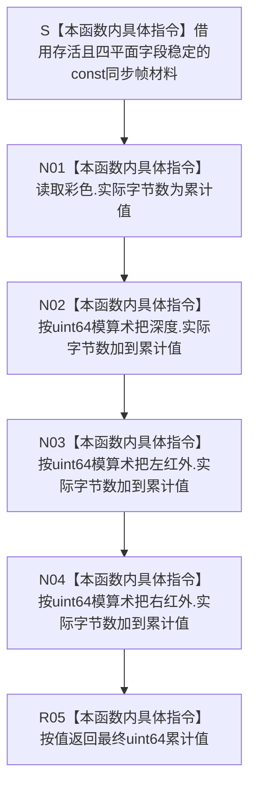

# CF-L5-0176 `计算D455同步帧字节数` 现状流程图

图类型：现状流程图
代码版本：`a48a70b2d678dea64dd8228adb4f26f0badd9506`
覆盖文件：`海中鱼巣/适配/协议.D455采样材料.ixx:291-296`
唯一根函数：F0301
完整签名：`std::uint64_t 海中鱼巣::计算D455同步帧字节数(const 海中鱼巣::D455同步帧材料& 材料) noexcept`
参数：调用期间存活且四个平面字段稳定的非拥有 `const D455同步帧材料& 材料`
返回结果：按 C++ `uint64_t` 模算术依次相加彩色、深度、左红外和右红外的实际字节数并按值返回
非法值 / 拒绝：无准入与具名拒绝；任一字段均可取 0..`UINT64_MAX`，总和溢出时按 2^64 取模
已登记调用方：F0107 `上行一次`、F0108 `D455同步帧材料有效`、F0298 `准备帧材料候选`；本批追加 F0302 两个调用点和 F0304 一个调用点
直接项目函数：无
调用图：`流程图/代码流程图/00_调用知识图谱.md`
逐行映射表：`流程图/代码流程图/L5/CF-L5-0176_计算D455同步帧字节数_逐行代码映射表.md`
输入契约 / 调用语境表：本文“输入契约与非成功语境”
非成功返回二分审查表：本文“输入契约与非成功语境”
偏差清单：`流程图/代码流程图/00_规范偏差审计.md` 的 F0301 切片
依据提交 / 结构化消息：冻结源码提交 `a48a70b2d678dea64dd8228adb4f26f0badd9506`；只读子智能体分析，主智能体统一复核和写入
入口前置：函数自身不要求材料有效；当前 F0107 / F0298 语境已先验证材料，F0108 正在形成完整有效位
结构读取与写入：只读取四个平面的 `实际字节数`；不读取字节容器，不写缓存、仓库、关系、索引或领域事实
逻辑内返回：无；包括 0 在内的每个 `uint64_t` 结果都直接返回
内部错误：调用方已保证四个平面字节数可安全求和时仍发生回绕，属于上游范围合同缺失或结构数值不一致
生命周期与资源释放：不复制、不保存参数；无资源、锁、分配或所有权变化
异常：声明 `noexcept`；无符号整数加法不会因溢出抛出
并发 / 幂等：字段稳定时纯只读、可重入、重复调用确定；不为其它别名并发写材料提供同步
验证入口：冻结源码 blob `f110508fd4e607469d69db1068bd1b15ee010d60`、291—296 行、E0550 / E0567 / E1483 / E1489—E1491、X0339 和 Mermaid 左结合加法顺序机械核对
验证输出：PASS；源码 blob、逐行映射、单根 Mermaid、调用边正反闭合、聚合计数、`git diff --check`、strict 100 项与技能自检均通过
依据：`规范/0050_项目通用机器逻辑与禁止性规则总纲_20260721.md`、`规范/0600_代码函数流程图应用与维护规范.md`、`规范/6350_子规范_双目相机外设独占观察线程_20260720.md`、`规范/详细设计/D455相机采样材料入口详细设计.md`
不得作为施工许可：是
不得宣称：返回值无溢出、材料有效、容器长度一致、缓存容量可接受、摘要唯一、真实 D455 样本或生产闭环成立

## 流程图

## 节点合同

| 节点 | 类型 | 参数 / 输入绑定 | 结果 / 输出绑定 | 事实读写 | 后继条件 | 验证 |
| --- | --- | --- | --- | --- | --- | --- |
| S | 本函数内具体指令 | `const D455同步帧材料&` | 非拥有只读材料借用 | 无 | 对象存活 | 291 行 |
| N01 | 本函数内具体指令 | `材料.彩色.实际字节数` | 第一个累计值 | 只读外设材料字段 | 无 | 292 行 |
| N02 | 本函数内具体指令 | 当前累计值、深度字节数 | 第二个模 2^64 累计值 | 只读外设材料字段 | 无 | 293 行 |
| N03 | 本函数内具体指令 | 当前累计值、左红外字节数 | 第三个模 2^64 累计值 | 只读外设材料字段 | 无 | 294 行 |
| N04 | 本函数内具体指令 | 当前累计值、右红外字节数 | 最终模 2^64 累计值 | 只读外设材料字段 | 无 | 295 行 |
| R05 | 本函数内具体指令 | 最终累计值 | `uint64_t` 返回值 | 无结构变化 | 返回调用方 | 291—296 行 |

## 输入契约与非成功语境

| 入口 / 节点 | 输入来源 | 上游是否保证有效 | 非成功结果 | 二分口径 | 结构变化与后续归属 |
| --- | --- | --- | --- | --- | --- |
| F0108 调用语境 | 正在准入的四平面材料 | 每个平面已分别检查，尚未证明总和无溢出 | 返回 0 或小于真实和的回绕值 | 当前无结构化失败；应追范围合同 | F0108 仅比较结果非零 |
| F0107 / F0298 调用语境 | 已通过 F0108 的材料 | 部分 | 回绕后与读回值偶然一致或容量低估 | 追根因解决 | 上行读回和缓存容量准入 |
| F0302 调用语境 | 左右两个材料 | 部分 | 两个不同真实总量产生同一模结果 | 证据不足 | 只作为同一材料谓词的一项 |
| F0304 调用语境 | 待形成摘要的材料 | 部分 | 回绕总量进入摘要混合 | 证据不足 | 摘要碰撞与完整性合同 |
| R05 | 任意四个 `uint64_t` | 否 | 模结果 0..`UINT64_MAX` | 函数无拒绝 | 调用方不得把结果升级为无溢出事实 |

## 调用与边界汇总

- 保留 E0550：F0107 → F0301。
- 保留 E0567：F0108 → F0301。
- 保留 E1483：F0298 → F0301。
- 新增 E1489 / E1490：F0302 分别计算左、右材料总字节数。
- 新增 E1491：F0304 把材料总字节数送入摘要混合。
- X0339 记录三次 `uint64_t` 左结合加法、模 2^64 回绕和返回值物化边界。
- 本函数没有出向项目函数、递归、标准库、SDK 或系统函数调用。
