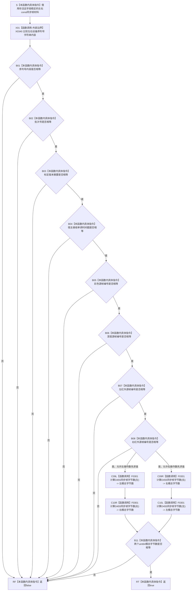

# CF-L5-0177 `D455采样材料上行桥::同一材料` 现状流程图

图类型：现状流程图
代码版本：`a48a70b2d678dea64dd8228adb4f26f0badd9506`
覆盖文件：`海中鱼巣/线程/上行桥.D455采样材料.ixx:154-166`
唯一根函数：F0302
完整签名：`bool 海中鱼巣::D455采样材料上行桥::同一材料(const 海中鱼巣::D455同步帧材料& 左, const 海中鱼巣::D455同步帧材料& 右) noexcept`
参数：调用期间存活且字段稳定的非拥有 `const D455同步帧材料& 左` 与 `右`；当前调用方以局部 `shared_ptr<const D455同步帧材料>` 保持两侧材料存活
返回结果：依次比较设备序列号、批次、标定摘要、宿主时间、四路帧号和四平面模总字节数；全部相等返回 true，首个不等按 `&&` 短路返回 false
非法值 / 拒绝：函数自身不准入材料；当前两个 F0107 调用语境均在候选已准备后进入，false 表示内部读回矛盾并由 F0303 追根因撤销
已登记调用方：F0107 `D455采样材料上行桥::上行一次` 的 E0551 与 E0557
直接项目函数：F0301 `计算D455同步帧字节数`
调用图：`流程图/代码流程图/00_调用知识图谱.md`
逐行映射表：`流程图/代码流程图/L5/CF-L5-0177_D455采样材料上行桥同一材料_逐行代码映射表.md`
输入契约 / 调用语境表：本文“输入契约与非成功语境”
非成功返回二分审查表：本文“输入契约与非成功语境”
偏差清单：`流程图/代码流程图/00_规范偏差审计.md` 的 F0302 切片
依据提交 / 结构化消息：冻结源码提交 `a48a70b2d678dea64dd8228adb4f26f0badd9506`；只读子智能体分析，主智能体统一复核和写入
入口前置：当前调用方已取得存活的候选或普通读回材料；本函数不保证材料完整、容器不可变来源、总字节无回绕或标定摘要无碰撞
结构读取与写入：只读两侧材料字段并调用纯读 F0301；不写缓存、消息、节点、关系、索引或领域事实
逻辑内返回：无当前根调用语境；作为私有谓词的 false 由 F0107 解释为内部读回不一致
内部错误：当前两次调用比较的是同一缓存条目持有的不可变共享材料，任一比较为 false 都属于前置通过后的内部矛盾
生命周期与资源释放：不保存引用、不复制材料、不改变共享所有权；没有锁、分配或资源释放
异常：声明 `noexcept`；标准字符串内容比较、标量比较和 F0301 当前均无抛出点
并发 / 幂等：材料字段稳定时纯只读、可重入、重复调用确定；不为非法可写别名的并发修改提供同步
验证入口：冻结源码 blob `6ae1d94137620993a8e18ae84257bb4e8d21d044`、154—166 行、E0551 / E0557 / E1489 / E1490、X0340、短路顺序和最终两个操作数求值顺序机械核对
验证输出：PASS；603 函数 / 297 已完成 / 306 待处理、1496 项目边、340 外部边界、7 未解析调用在 JSON / Mermaid / 表格间闭合；`git diff --check`、`python .\tools\check_specs.py --strict`、`python .\tools\check_flowchart_correction.py --self-test` 通过
依据：`规范/0050_项目通用机器逻辑与禁止性规则总纲_20260721.md`、`规范/0600_代码函数流程图应用与维护规范.md`、`规范/6350_子规范_双目相机外设独占观察线程_20260720.md`、`规范/详细设计/D455相机采样材料入口详细设计.md`
不得作为施工许可：是
不得宣称：像素内容、逐平面布局、完整设备身份、完整标定材料或真实字节总量相等，也不得宣称摘要唯一、缓存事务或 D455 生产闭环成立

## 流程图

## 节点合同

| 节点 | 类型 | 参数 / 输入绑定 | 结果 / 输出绑定 | 事实读写 | 后继条件 | 验证 |
| --- | --- | --- | --- | --- | --- | --- |
| S | 本函数内具体指令 | `左`、`右` const 引用 | 两个非拥有材料借用 | 无 | 对象存活 | 154—156 行 |
| X01—B01 | 外部调用 / 指令 | 两侧序列号字符串 | 内容相等位 | 只读设备材料 | 相等才继续 | 157 行 |
| B02—B08 | 本函数内具体指令 | 批次、标定摘要、宿主时间和四路帧号 | 每项相等位 | 只读材料字段 | 首个不等短路 | 158—164 行 |
| C09L—C10R / C09R—C10L | 函数调用 | 左右完整材料 | 两个 F0301 模总字节数 | 只读四平面字节字段 | 两次调用均完成 | 165 行；`==` 两操作数相对求值顺序未固定 |
| B11 | 本函数内具体指令 | 左右模总字节数 | 相等位 | 无 | true 到 RT，false 到 RF | 165 行 |
| RF / RT | 本函数内具体指令 | 首个不等或全部相等 | false / true | 无结构变化 | 返回 F0107 | 157—166 行 |

## 输入契约与非成功语境

| 入口 / 节点 | 输入来源 | 上游是否保证有效 | 非成功结果 | 二分口径 | 结构变化与后续归属 |
| --- | --- | --- | --- | --- | --- |
| E0551 → S | 候选读回材料与本轮采集材料 | 是；候选准备和读回已成功 | 任一比较 false | 追根因解决 | F0107 调用 F0303 撤销未发布候选 |
| E0557 → S | 已发布普通读回材料与候选读回材料 | 是；确认和普通读取已成功 | 任一比较 false | 追根因解决 | F0107 调用 F0303 删除已发布条目 |
| B01—B08 | 八项定位投影 | 部分 | false | 当前语境追根因 | 不写结构；不得扩为通用完整材料谓词 |
| B11 | 两个模总字节数 | 否；F0301 无溢出证明 | 不同真实总量仍可能相等 | 证据不足 | 复用 F0301 安全求和偏差 |
| RT | 当前有限字段相等 | 部分 | 像素、布局或标定细节仍可不同 | 不由本函数裁决 | D455 完整读回合同继续治理 |

## 调用与边界汇总

- 保留 E0551 / E0557：F0107 → F0302。
- 保留 E1489 / E1490：F0302 分别调用 F0301 计算左、右模总字节数；两次调用的相对求值先后未由源码固定。
- 新增 X0340：标准字符串内容等值比较；不分配、不修改材料。
- 本函数不比较四路字节容器、逐平面布局、设备名称 / 固件 / 产品编号、设备时间戳域、内参、深度比例或三组原始外参。
