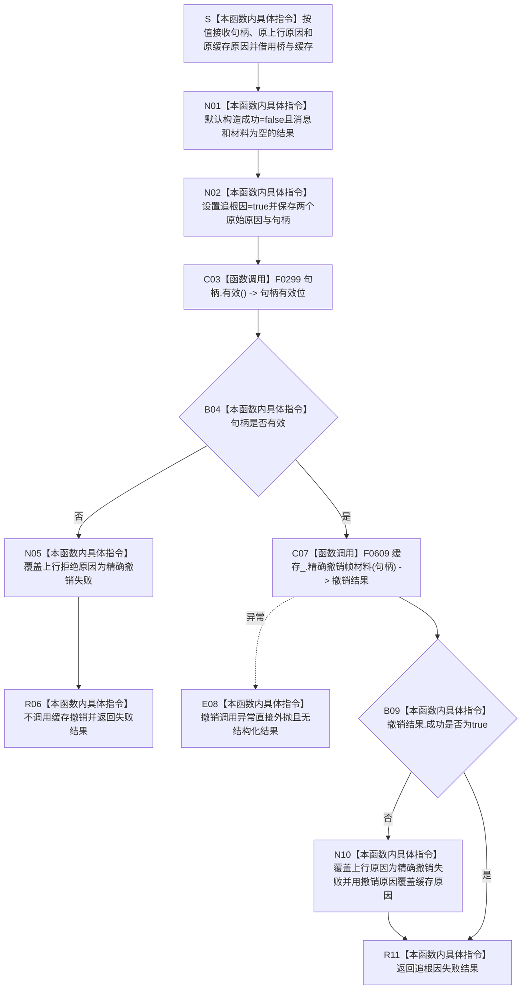

# CF-L5-0178 `D455采样材料上行桥::撤销后返回` 现状流程图

图类型：现状流程图
代码版本：`a48a70b2d678dea64dd8228adb4f26f0badd9506`
覆盖文件：`海中鱼巣/线程/上行桥.D455采样材料.ixx:168-187`；直接撤销函数身份来源为 `海中鱼巣/线程/缓存.D455帧材料.ixx:208-226`
唯一根函数：F0303
完整签名：`海中鱼巣::D455材料上行结果 海中鱼巣::D455采样材料上行桥::撤销后返回(海中鱼巣::D455帧材料句柄 句柄, 海中鱼巣::D455上行拒绝原因 原因, 海中鱼巣::D455缓存拒绝原因 缓存原因)`
参数：句柄和两个拒绝原因按值传入；隐式 `this` 是调用期间存活的上行桥借用，桥通过非拥有成员引用借用缓存
返回结果：始终返回 `成功=false / 追根因=true`；句柄无效或缓存精确撤销失败时把上行拒绝原因覆盖为精确撤销失败
非法值 / 拒绝：无效句柄不调用缓存；枚举参数不校验，当前私有调用点均传入具名原因
已登记调用方：F0107 的 E0552 / E0555 / E0558
直接项目函数：F0299 `D455帧材料句柄::有效`；F0609 `D455帧材料缓存::精确撤销帧材料`
调用图：`流程图/代码流程图/00_调用知识图谱.md`
逐行映射表：`流程图/代码流程图/L5/CF-L5-0178_D455采样材料上行桥撤销后返回_逐行代码映射表.md`
输入契约 / 调用语境表：本文“输入契约与非成功语境”
非成功返回二分审查表：本文“输入契约与非成功语境”
偏差清单：`流程图/代码流程图/00_规范偏差审计.md` 的 F0303 切片
依据提交 / 结构化消息：冻结源码提交 `a48a70b2d678dea64dd8228adb4f26f0badd9506`；只读子智能体分析，主智能体统一复核和写入
入口前置：三个当前调用点都位于候选已经成功准备之后的内部不一致路径；函数不接受外部普通拒绝材料
结构读取与写入：无效句柄路径只写局部结果；有效句柄路径调用 F0609，成功时会在缓存锁内扣减总字节并擦除条目
逻辑内返回：无当前根语境；全部当前返回均为追根因失败
内部错误：无效句柄、撤销目标不存在、版本漂移、内部计数不一致和撤销调用异常
生命周期与资源释放：不保存参数；缓存擦除只释放缓存持有的共享所有权，既有普通读者的共享材料仍可存活
异常：未声明 `noexcept`；F0609 的 mutex 获取异常可直接外抛，F0303 不形成结构化结果
并发 / 幂等：F0303 不持跨函数写权；确认 / 普通读回与撤销分别加锁，发布后撤销前存在普通可见窗口
验证入口：冻结上行桥 blob `6ae1d94137620993a8e18ae84257bb4e8d21d044`、168—187 行、E0552 / E0555 / E0558 / E1486 / E1492、F0609 和三种失败语境机械核对
验证输出：PASS；603 函数 / 297 已完成 / 306 待处理、1496 项目边、340 外部边界、7 未解析调用在 JSON / Mermaid / 表格间闭合；`git diff --check`、`python .\tools\check_specs.py --strict`、`python .\tools\check_flowchart_correction.py --self-test` 通过
依据：`规范/0050_项目通用机器逻辑与禁止性规则总纲_20260721.md`、`规范/4040_子规范_不透明结构事务候选确认撤销与最后发布.md`、`规范/0600_代码函数流程图应用与维护规范.md`、`规范/详细设计/D455相机采样材料入口详细设计.md`
不得作为施工许可：是
不得宣称：候选一定已撤销、已发布结构可以复用候选撤销语义、普通读者未见过材料、原始根因完整保留或缓存域已经隔离

## 流程图

## 节点合同

| 节点 | 类型 | 参数 / 输入绑定 | 结果 / 输出绑定 | 事实读写 | 后继条件 | 验证 |
| --- | --- | --- | --- | --- | --- | --- |
| S—N02 | 本函数内具体指令 | `句柄`、`原因`、`缓存原因` | 初始追根因结果 | 只写局部 DTO | 字段保存完成 | 168—176 行 |
| C03—B04 | 函数调用 / 指令 | 句柄隐式 `this` | 有效位 | 只读句柄 | 有效才尝试撤销 | 177 行；E1486 |
| N05—R06 | 本函数内具体指令 | 无效句柄 | 精确撤销失败结果 | 缓存零变化 | 立即返回 | 178—179 行 |
| C07 | 函数调用 | 缓存、句柄 | F0609 撤销结果 | 成功时扣减容量并擦除条目 | 调用返回 | 181 行；E1492 |
| E08 | 本函数内具体指令 | F0609 异常 | 异常外抛 | 取决于 F0609 异常点 | 调用路径停止 | 181 行 |
| B09—N10 | 本函数内具体指令 | 撤销成功位和拒绝原因 | 保留原原因或覆盖为精确撤销失败 | 只写局部 DTO | 进入返回 | 182—185 行 |
| R11 | 本函数内具体指令 | 完成的失败 DTO | `D455材料上行结果` | 无新增结构变化 | 返回 F0107 | 186—187 行 |

## 输入契约与非成功语境

| 入口 / 节点 | 输入来源 | 上游是否保证有效 | 非成功结果 | 二分口径 | 结构变化与后续归属 |
| --- | --- | --- | --- | --- | --- |
| E0552 → S | 候选读回不一致 | 候选已准备；句柄可能因 F0300 能力失败而为空 | 空句柄改报精确撤销失败 | 追根因解决 | 不调用撤销；原未发布条目可能遗留并占用容量 |
| E0555 → S | 确认失败或返回句柄漂移 | 候选读回句柄有效 | 以确认前句柄撤销 | 追根因解决 | 不能证明漂移后的真实发布身份已收口 |
| E0558 → S | 发布后普通读回不一致 | 发布句柄有效 | 删除已发布条目 | 追根因解决 | 确认到删除之间普通读者可能取得共享材料 |
| B09 否 | F0609 结构化失败 | 是 | 覆盖两个原始原因 | 追根因解决 | 第一违反点与清理失败点不能同时保留 |
| B09 是 | F0609 已删除目标 | 是 | 仍返回原追根因失败 | 追根因解决 | 无显式“清理成功”字段，句柄已经不可再解析 |

## 调用与边界汇总

- 保留 E1486：F0303 → F0299。
- 新增 E1492：F0303 → F0609 `D455帧材料缓存::精确撤销帧材料`。
- 新增 F0609 为 L6 待展开函数；它以普通句柄同时删除未发布候选或已发布条目，不接收候选能力。
- 当前没有标准库、SDK 或系统直接调用身份；被调 F0609 的锁、容器和撤销正文留待其自身单函数图展开。
- `4040` 要求统一可见点前用精确候选能力撤销，发布后改用正式删除 / 失效 / 补偿；当前同一缓存入口混用两种阶段。
