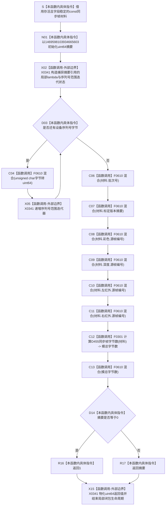

# CF-L5-0179 `计算D455材料摘要` 现状流程图

图类型：现状流程图
代码版本：`a48a70b2d678dea64dd8228adb4f26f0badd9506`
覆盖文件：`海中鱼巣/适配/协议.D455采样材料.ixx:337-354`；局部混合 lambda 身份来源为同文件 `339-342`
唯一根函数：F0304
完整签名：`std::uint64_t 海中鱼巣::计算D455材料摘要(const 海中鱼巣::D455同步帧材料& 材料) noexcept`
参数：调用期间存活且字段稳定的非拥有 `const D455同步帧材料& 材料`
返回结果：按固定顺序形成模 2^64 自定义派生摘要；原累计值为 0 时返回 1，因此结果范围为 `1..UINT64_MAX`
非法值 / 拒绝：无准入和结构化拒绝；任意可读取材料都会形成非零摘要
已登记调用方：F0107 `D455采样材料上行桥::上行一次` 的 E0553
直接项目函数：F0301 `计算D455同步帧字节数`；F0610 `计算D455材料摘要` 局部混合 lambda
调用图：`流程图/代码流程图/00_调用知识图谱.md`
逐行映射表：`流程图/代码流程图/L5/CF-L5-0179_计算D455材料摘要_逐行代码映射表.md`
输入契约 / 调用语境表：本文“输入契约与非成功语境”
非成功返回二分审查表：本文“输入契约与非成功语境”
偏差清单：`流程图/代码流程图/00_规范偏差审计.md` 的 F0304 切片
依据提交 / 结构化消息：冻结源码提交 `a48a70b2d678dea64dd8228adb4f26f0badd9506`；只读子智能体分析，主智能体统一复核和写入
入口前置：当前 F0107 已通过有限材料准入和候选读回比较；仍未证明总字节无回绕、摘要覆盖完整布局或标定摘要无碰撞
结构读取与写入：只读设备序列号、批次、标定摘要、四路帧号和 F0301 派生总字节；只写局部摘要，不写机器结构
逻辑内返回：无；摘要 0 被映射成 1，不是拒绝
内部错误：调用方若把碰撞、回绕或摘要相等升级为材料身份、幂等相同或完整性事实
生命周期与资源释放：局部 lambda 只捕获栈内摘要引用且不逃逸；不复制、不保存材料
异常：函数声明 `noexcept`；当前范围迭代、无符号运算、F0301 和 F0610 正文没有实际抛出点
并发 / 幂等：字段稳定时纯只读、可重入、重复调用确定；不为非法可写别名并发修改提供同步
验证入口：冻结源码 blob `f110508fd4e607469d69db1068bd1b15ee010d60`、337—354 行、E0553 / E1491 / E1493—E1500、F0610、X0341 和固定混合顺序机械核对
验证输出：PASS；603 函数 / 297 已完成 / 306 待处理、1496 项目边、340 外部边界、7 未解析调用在 JSON / Mermaid / 表格间闭合；`git diff --check`、`python .\tools\check_specs.py --strict`、`python .\tools\check_flowchart_correction.py --self-test` 通过
依据：`规范/0050_项目通用机器逻辑与禁止性规则总纲_20260721.md`、`规范/0600_代码函数流程图应用与维护规范.md`、`规范/6350_子规范_双目相机外设独占观察线程_20260720.md`、`规范/详细设计/D455相机采样材料入口详细设计.md`
不得作为施工许可：是
不得宣称：标准 FNV、密码学摘要、无碰撞身份、完整布局 / 像素 / 标定摘要、稳定跨版本编码、材料相同或 D455 生产闭环成立

## 流程图

## 节点合同

| 节点 | 类型 | 参数 / 输入绑定 | 结果 / 输出绑定 | 事实读写 | 后继条件 | 验证 |
| --- | --- | --- | --- | --- | --- | --- |
| S—N01 | 本函数内具体指令 | 材料 const 引用、固定初值 | 栈内 `uint64_t 摘要` | 只写局部值 | 初值形成 | 337—338 行 |
| X02—D03 | 外部调用 / 指令 | 摘要引用、设备序列号字符串 | 闭包和范围迭代状态 | 不改材料 | 有字节则进入 C04 | 339、343 行 |
| C04—X05 | 函数调用 / 外部边界 | 当前字符经 unsigned char / uint64 转换 | 更新后的局部摘要 | F0610 写捕获摘要 | 递增后继续循环 | 344—345 行；E1493 |
| C06—C11 | 函数调用 | 批次、标定摘要、四路帧号 | 逐项更新的摘要 | 只写局部摘要 | 固定顺序继续 | 346—351 行；E1494—E1499 |
| C12 | 函数调用 | 完整材料 | F0301 模总字节数 | 只读四平面字节字段 | 调用完成 | 352 行；E1491 |
| C13 | 函数调用 | 模总字节数 | 最终混合摘要 | 只写局部摘要 | 进入 D14 | 352 行；E1500 |
| D14—R17 | 本函数内具体指令 | 最终摘要 | 1 或原摘要 | 无结构变化 | 进入 X15 返回 | 353 行 |
| X15 | 外部边界 | 选定的 `uint64_t` | 返回值 | 结束局部闭包和迭代状态生命周期 | 返回 F0107 | 353—354 行 |

## 输入契约与非成功语境

| 入口 / 节点 | 输入来源 | 上游是否保证有效 | 非成功结果 | 二分口径 | 结构变化与后续归属 |
| --- | --- | --- | --- | --- | --- |
| E0553 → S | 候选读回材料 | 部分；有限字段已互证 | 任意输入都生成摘要 | 无拒绝 | 消息仍标记 `承载机器事实=false` |
| D03 | 设备序列号 | 当前语境已通过设备身份准入 | 空字符串零次循环 | 本函数不拒绝 | 公共调用方不得靠摘要补做身份准入 |
| C07 | 标定版本摘要 | 部分 | 原始标定差异可能已被压缩 | 证据不足 | F0315 后续独立展开 |
| C12—C13 | F0301 模总字节数 | 否；没有无溢出证明 | 回绕值进入摘要 | 证据不足 | 双向引用 F0301 / E1491 偏差 |
| D14—R16 | 原摘要为 0 | 否 | 强制返回 1 | 不是拒绝 | 原摘要 0 与原摘要 1 显式碰撞 |
| 返回后 | 运行消息材料摘要 | 否 | 摘要碰撞 | 只允许非权威材料 | 不得替代句柄版本和缓存读回 |

## 调用与边界汇总

- 保留 E0553：F0107 → F0304。
- 保留 E1491：F0304 → F0301。
- 新增 E1493—E1500：F0304 在循环体和七个固定调用点调用 F0610。
- 新增 F0610 为 L6 待展开局部函数；其 XOR、模乘法和 void 返回不内联到本图。
- 新增 X0341：局部闭包生命周期、字符串范围迭代、字符无符号转换、等零 / 三元返回和返回值物化边界。
- 当前摘要没有逐平面布局域标签、算法版本或稳定编码合同；种子也不得在无正式依据时称为标准 FNV 偏移基。
