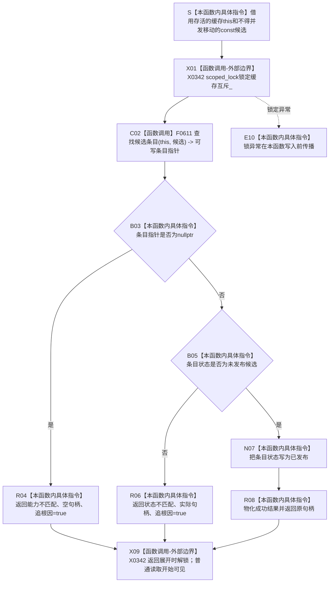

# CF-L5-0180 `D455帧材料缓存::确认发布帧材料` 现状流程图

图类型：现状流程图
代码版本：`a48a70b2d678dea64dd8228adb4f26f0badd9506`
覆盖文件：`海中鱼巣/线程/缓存.D455帧材料.ixx:195-206`
唯一根函数：F0305
完整签名：`海中鱼巣::D455缓存变更结果 海中鱼巣::D455帧材料缓存::确认发布帧材料(const 海中鱼巣::D455帧材料缓存::D455帧材料候选& 候选)`
参数：非拥有 `this` 与调用期间存活且不得被并发移动的 `const D455帧材料候选& 候选`；函数不保存候选
返回结果：能力或状态不匹配时返回 `成功=false / 追根因=true`；匹配时把条目状态改为 `已发布` 并返回成功和原句柄
非法值 / 拒绝：当前唯一根调用 F0107 已由同一缓存准备并读回候选；能力或状态不匹配不是普通外部拒绝，而是内部结构或竞争错误
已登记调用方：F0107 `D455采样材料上行桥::上行一次` 的 E0554
直接项目函数：F0611 非 const `D455帧材料缓存::查找候选条目`
调用图：`流程图/代码流程图/00_调用知识图谱.md`
逐行映射表：`流程图/代码流程图/L5/CF-L5-0180_D455帧材料缓存确认发布帧材料_逐行代码映射表.md`
输入契约 / 调用语境表：本文“输入契约与非成功语境”
非成功返回二分审查表：本文“输入契约与非成功语境”
偏差清单：`流程图/代码流程图/00_规范偏差审计.md` 的 F0305 切片
依据提交 / 结构化消息：冻结源码提交 `a48a70b2d678dea64dd8228adb4f26f0badd9506`；只读子智能体分析，主智能体统一复核和写入
入口前置：当前 F0107 已完成材料准入、候选准备、候选读回、字节互证、有限同一材料比较和运行消息局部构造
结构读取与写入：锁内读取候选能力、句柄、条目状态；成功时唯一写入 `条目值->状态 = 已发布`，不改材料、编号、版本、能力号、条目数或字节数
逻辑内返回：无当前根调用语境；两个结构化失败均标记追根因
内部错误：锁异常、已准备候选能力失配、候选状态漂移、发布后读回不一致或使用旧候选撤销已发布条目
生命周期与资源释放：可写条目指针只在缓存 mutex 临界区内使用且不逃逸；返回展开时 `scoped_lock` 解锁
异常：函数未声明 `noexcept`；锁获取异常在本函数写入前外抛，F0107 此前形成的未发布候选没有本函数级 RAII 清理
并发 / 幂等：同一缓存操作由同一 mutex 串行；读回与确认之间没有持续写权；重复确认同一候选返回状态不匹配而非幂等成功
验证入口：冻结源码 blob `ec93dd07f8647cdc1a88a5343312c087e5d4c9b8`、195—206 行、E0554 / E1501、F0611、X0342 和唯一状态写入机械核对
验证输出：本批按 606 函数 / 300 已完成 / 306 待处理、1531 项目边、343 外部边界、7 未解析调用执行 JSON / Mermaid / 表格闭合验证
依据：`规范/0050_项目通用机器逻辑与禁止性规则总纲_20260721.md`、`规范/0600_代码函数流程图应用与维护规范.md`、`规范/4040_子规范_不透明结构事务候选确认撤销与最后发布.md`、`规范/6350_子规范_双目相机外设独占观察线程_20260720.md`、`规范/详细设计/D455相机采样材料入口详细设计.md`
不得作为施工许可：是
不得宣称：4040 的可逆确认阶段、统一最后发布、发布后候选能力关闭、发布后审计、完整缓存事务、真实 D455 样本或生产闭环成立

## 流程图

## 节点合同

| 节点 | 类型 | 参数 / 输入绑定 | 结果 / 输出绑定 | 事实读写 | 后继条件 | 验证 |
| --- | --- | --- | --- | --- | --- | --- |
| S—X01 | 指令 / 外部调用 | `this`、`候选` | 独占缓存临界区 | 只改变锁状态 | 成功加锁才继续 | 195—196 行 |
| C02 | 函数调用 | `this`、`候选` | F0611 返回可写条目指针或空 | 只读候选与条目索引 | 调用完成 | 197 行；E1501 |
| B03—R04 | 指令 | 条目指针 | 能力不匹配追根因结果 | 无结构写入 | 空指针返回 | 198—199 行 |
| B05—R06 | 指令 | 条目当前状态 | 状态不匹配追根因结果 | 只读条目状态 | 非未发布候选返回 | 201—202 行 |
| N07 | 指令 | 已定位的可写条目 | `状态=已发布` | 写缓存条目状态 | 写入完成 | 204 行 |
| R08—X09 | 指令 / 外部调用 | 原句柄、结果常量 | 成功结果；解锁后普通可见 | 不再写条目 | 返回 F0107 | 205—206 行 |
| E10 | 指令 | 锁异常 | 异常传播 | 本函数零写；先前候选仍可能存在 | 退出函数 | X0342 |

## 输入契约与非成功语境

| 入口 / 节点 | 输入来源 | 上游是否保证有效 | 非成功结果 | 二分口径 | 结构变化与后续归属 |
| --- | --- | --- | --- | --- | --- |
| E0554 → S | F0107 本轮候选能力 | 是；同一缓存刚准备并读回成功 | 锁异常 | 追根因解决 | 未发布候选可能遗留；缓存异常与候选 RAII 收口 |
| B03 | 已读回成功的候选 | 是 | 能力不匹配 | 追根因解决 | 本函数零写；候选身份或并发清理冲突 |
| B05 | F0300 刚读回为未发布的条目 | 是，但读回与确认之间无持续锁 | 状态不匹配 | 追根因解决 | 乐观重验与并发撤销 / 过期清理合同 |
| N07—X09 | 有效未发布候选 | 是 | 直接改为已发布并解锁 | 成功但与 4040 阶段不一致 | D455 候选确认、最后发布与普通可见点治理 |
| F0107 发布后读回 | 已普通可见条目 | 是 | 读回矛盾后调用 F0303 精确撤销 | 追根因解决 | 发布后不得重开候选撤销；需正式删除 / 补偿合同 |

## 调用与边界汇总

- 保留 E0554：F0107 → F0305。
- 新增 E1501：F0305 → F0611；非 const 重载在锁内返回可写条目指针。
- 新增 F0611 为 L6 待展开函数；其内部转调 const 重载 F0608 的行为不内联到本图。
- 新增 X0342：`scoped_lock` 加锁、解锁、异常展开和聚合结果物化边界。
- 当前实现只有 `未发布候选 -> 已发布`，没有 4040 的 `已确认待发布` 阶段。
