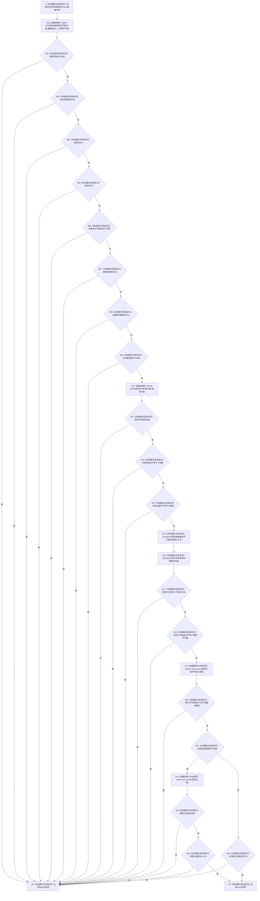

# CF-L5-0181 `D455图像平面有效` 现状流程图

图类型：现状流程图
代码版本：`a48a70b2d678dea64dd8228adb4f26f0badd9506`
覆盖文件：`海中鱼巣/适配/协议.D455采样材料.ixx:264-289`
唯一根函数：F0306
完整签名：`bool 海中鱼巣::D455图像平面有效(const 海中鱼巣::D455图像平面材料& 平面) noexcept`
参数：调用期间存活且字段与字节容器不得被并发修改的非拥有 `const D455图像平面材料& 平面`
返回结果：按源码左到右短路检查最低结构形状、布局、容器长度和深度比例；全部成立返回 true，首个不成立返回 false
非法值 / 拒绝：未知流类型、未知格式映射、零尺寸 / 帧号 / 时间、内参无效或尺寸错配、布局 / 容器不一致、深度比例不合法
已登记调用方：F0108 的 E0560—E0563；F0313 的 E1502
直接项目函数：F0612 `D455格式每像素字节数`；F0109 `D455相机内参有效`
调用图：`流程图/代码流程图/00_调用知识图谱.md`
逐行映射表：`流程图/代码流程图/L5/CF-L5-0181_D455图像平面有效_逐行代码映射表.md`
输入契约 / 调用语境表：本文“输入契约与非成功语境”
非成功返回二分审查表：本文“输入契约与非成功语境”
偏差清单：`流程图/代码流程图/00_规范偏差审计.md` 的 F0306 切片
依据提交 / 结构化消息：冻结源码提交 `a48a70b2d678dea64dd8228adb4f26f0badd9506`；只读子智能体分析，主智能体统一复核和写入
入口前置：F0313 语境是刚复制的外部 SDK 平面候选；F0108 语境是同一同步帧材料的二次完整性复核
结构读取与写入：只读平面标量、内参和字节容器长度，不读像素内容，不写材料、缓存或机器事实
逻辑内返回：F0313 首次验证外部 SDK 平面时的 false；局部材料随上层失败销毁
内部错误：同一材料已经通过 F0313 后，F0108 二次调用仍返回 false；调用方把局部 true 升级为完整来源、同步、时效或成熟度事实
生命周期与资源释放：不保存引用、不复制容器、不取得字节所有权；没有锁、分配或资源释放
异常：声明 `noexcept`；F0612、F0109、`vector::size`、无符号计算和 `isfinite` 当前均无实际抛出点
并发 / 幂等：字段稳定时纯只读、可重入、重复调用确定；不为同一材料的非法并发写提供同步
验证入口：冻结源码 blob `f110508fd4e607469d69db1068bd1b15ee010d60`、264—289 行、E0560—E0563 / E1502—E1504、F0612 / F0109、X0343 和短路顺序机械核对
验证输出：本批按 606 函数 / 300 已完成 / 306 待处理、1531 项目边、343 外部边界、7 未解析调用执行 JSON / Mermaid / 表格闭合验证
依据：`规范/0050_项目通用机器逻辑与禁止性规则总纲_20260721.md`、`规范/0600_代码函数流程图应用与维护规范.md`、`规范/6350_子规范_双目相机外设独占观察线程_20260720.md`、`规范/详细设计/D455相机采样材料入口详细设计.md`
不得作为施工许可：是
不得宣称：像素内容可信、流类型 / 格式组合完整、设备 profile、四路同步、标定物理合理、材料时效、L1—L3 成熟度或 D455 生产闭环成立

## 流程图

## 节点合同

| 节点 | 类型 | 参数 / 输入绑定 | 结果 / 输出绑定 | 事实读写 | 后继条件 | 验证 |
| --- | --- | --- | --- | --- | --- | --- |
| S—C01 | 指令 / 函数调用 | 平面 const 引用、像素格式 | F0612 映射字节数 | 只读 | 调用完成 | 264—265 行；E1503 |
| B02—B09 | 指令 | 类型、格式映射、尺寸、字节、帧号和时间 | 首个不合法位 | 只读 | 全部通过才调 F0109 | 266—273 行 |
| C10—B13 | 函数调用 / 指令 | 相机内参与平面尺寸 | 内参有效和尺寸一致位 | 只读 | 全部通过才计算布局 | 274—276 行；E1504 |
| N15—N16 | 指令 | 宽、每像素字节数、步长、高 | 两个 `uint64_t` 布局量 | 只写局部值 | 计算完成 | 279—280 行 |
| B17—X19—B20 | 指令 / 外部调用 | 布局量、实际字节数、容器长度 | 布局一致位 | 只读容器长度 | 全部一致才检查比例 | 281—283 行 |
| B21—B25 | 指令 / 外部调用 | 流类型、深度比例 | 深度或非深度比例有效位 | 无结构变化 | 对应分支成立到 RT | 286—288 行 |
| RF / RT | 指令 | 首个不合法或全部成立 | false / true | 零机器事实写入 | 返回调用方 | 277、284、286—289 行 |

## 输入契约与非成功语境

| 入口 / 节点 | 输入来源 | 上游是否保证有效 | 非成功结果 | 二分口径 | 结构变化与后续归属 |
| --- | --- | --- | --- | --- | --- |
| E1502 / F0313 → S | 复制后的外部 SDK 平面候选 | 否 | 任一 false | 逻辑内返回 | F0306 零写；上层丢弃局部同步帧材料 |
| E0560—E0563 / F0108 → S | F0313 已逐路验证的四平面 | 是 | 任一 false | 追根因解决 | 同一 const 材料二次复核矛盾 |
| B02 / B09 | 强类型枚举 | 部分 | 只拒绝 `未知`，其它越界枚举可能通过 | 证据不足 | 枚举完整准入合同 |
| B17—B20 | 外部布局材料 | 否 | 布局或容器长度不一致 | 首次逻辑内返回 / 二次追根因 | 复制前后布局门禁和调用方失败分账 |
| B21—B25 | 深度比例 | 否 | 深度非有限 / 非正，或非深度非零 | 首次逻辑内返回 / 二次追根因 | 保持流类型分支 |
| RT | 局部平面形状 | 部分 | 其它来源、同步、时效和物理合理性未证明 | 声明边界 | 不得升级为完整 D455 材料有效 |

## 调用与边界汇总

- 保留 E0560—E0563：F0108 依次验证彩色、深度、左红外和右红外。
- 新增 E1502：F0313 复制单路 SDK 平面后调用 F0306。
- 新增 E1503：F0306 → F0612；F0612 作为 L6 待展开函数。
- 新增 E1504：F0306 → 已完成 F0109。
- 新增 X0343：两次提升后的布局乘法、`vector::size`、`isfinite` 和 `noexcept bool` 返回边界。
- 详细设计要求复制前按实际 profile 计算最小步长和字节数；当前 F0313 在分配与复制后才调用本函数，本函数只能完成复制后复核。
