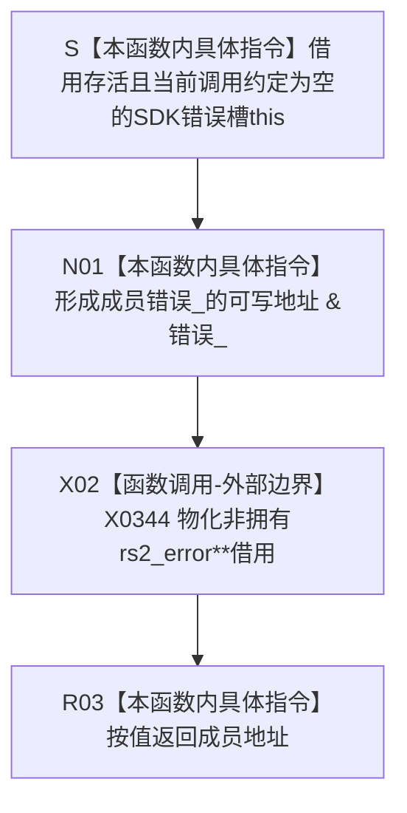

# CF-L5-0182 `SDK错误槽::接收` 现状流程图

图类型：现状流程图
代码版本：`a48a70b2d678dea64dd8228adb4f26f0badd9506`
覆盖文件：`海中鱼巣/适配/采集器.D455相机.ixx:54-56`
唯一根函数：F0307
完整签名：`rs2_error** 海中鱼巣::{匿名命名空间}::SDK错误槽::接收() noexcept`
参数：隐式非拥有 `SDK错误槽* this`；调用期间对象必须存活且不得并发读写成员 `错误_`
返回结果：返回成员 `rs2_error* 错误_` 的可写地址，即非拥有 `rs2_error**` 借用；不转移 `SDK错误槽` 或错误对象所有权
非法值 / 拒绝：无；函数不检查 `this`、当前槽是否为空、是否重复接收或外部 SDK 是否将写入有效错误对象
已登记调用方：当前 43 个根可达 SDK 输出槽调用点；既有 E0569 / E0573 / E0576 / E0599 / E1407 / E1412 / E1416 / E1420 / E1439 / E1442 / E1447 / E1456 / E1462，新增 E1505—E1511 / E1513—E1535
直接项目函数：无
调用图：`流程图/代码流程图/00_调用知识图谱.md`
逐行映射表：`流程图/代码流程图/L5/CF-L5-0182_SDK错误槽接收_逐行代码映射表.md`
输入契约 / 调用语境表：本文“输入契约与非成功语境”
非成功返回二分审查表：本文“输入契约与非成功语境”
偏差清单：`流程图/代码流程图/00_规范偏差审计.md` 的 F0307 切片
依据提交 / 结构化消息：冻结源码提交 `a48a70b2d678dea64dd8228adb4f26f0badd9506`；只读子智能体分析，主智能体统一复核和写入
入口前置：当前全部 43 个调用点都以刚默认构造且空的局部 `SDK错误槽` 调用一次，并立即把返回指针交给一个 RealSense C API
结构读取与写入：本函数只形成成员地址；后继 SDK 可以经返回指针写 `错误_`，但该写入属于各调用方的外部边界，不属于 F0307 本体
逻辑内返回：无；本函数总返回地址
内部错误：同一槽非空时重复接收、同槽并发接收 / 检查 / 析构、返回指针在槽生命周期外使用，或调用方不检查后继续消费 SDK 输出
生命周期与资源释放：槽拥有 SDK 写回的 `rs2_error*`；F0307 只借出成员地址，析构 F0309 负责在非空时调用 SDK 释放
异常：声明 `noexcept`；成员地址形成和裸指针返回不抛出
并发 / 幂等：接口本身不幂等且无锁；当前调用约定靠“局部新槽、一次接收、同步检查、作用域析构”避免覆盖和数据竞争
验证入口：冻结源码 blob `9009c0c875af65020d4e2edef14a5e33aa7cc948`、54—56 行、43 个 `.接收()` 调用点、F0613、E1505—E1535 和 X0344 机械核对
验证输出：本批按 606 函数 / 300 已完成 / 306 待处理、1531 项目边、343 外部边界、7 未解析调用执行 JSON / Mermaid / 表格闭合验证
依据：`规范/0050_项目通用机器逻辑与禁止性规则总纲_20260721.md`、`规范/0600_代码函数流程图应用与维护规范.md`、`规范/6350_子规范_双目相机外设独占观察线程_20260720.md`、`规范/详细设计/D455相机采样材料入口详细设计.md`
不得作为施工许可：是
不得宣称：SDK 调用成功、错误已被检查或释放、槽接口支持重复 / 并发接收、D455 采集成功、真实样本通过或生产闭环成立

## 流程图

## 节点合同

| 节点 | 类型 | 参数 / 输入绑定 | 结果 / 输出绑定 | 事实读写 | 后继条件 | 验证 |
| --- | --- | --- | --- | --- | --- | --- |
| S | 指令 | 隐式 `this` | 活动槽借用 | 无 | 对象存活 | 54 行 |
| N01 | 指令 | `this->错误_` | `&错误_` | 本函数不写；暴露可写别名 | 地址形成 | 55 行 |
| X02 | 外部边界 | 成员地址 | `rs2_error**` 非拥有值 | 不改变所有权 | 返回值物化 | X0344 |
| R03 | 指令 | `rs2_error**` | 返回调用方 SDK 参数 | 无 | 退出函数 | 55—56 行 |

## 输入契约与非成功语境

| 入口 / 节点 | 输入来源 | 上游是否保证有效 | 非成功结果 | 二分口径 | 结构变化与后续归属 |
| --- | --- | --- | --- | --- | --- |
| 当前 43 个调用点 → S | 刚默认构造的局部 SDK错误槽 | 是；当前每个槽实例只调用一次 | 无 | 不适用 | 后继 SDK 可写成员，调用方随后检查 `失败()` |
| N01 | 成员 `错误_` | 当前为空，但函数不复核 | 非空时仍返回同一地址 | 设计 / 接口缺口 | 重复接收前置和旧错误释放合同 |
| X02—R03 | 裸二级指针借用 | 只在同步 SDK 调用表达式内使用 | 逃逸或越过槽生命周期 | 内部错误 | SDK 输出槽借用生命周期 |
| 并发调用 | 同一槽对象 | 否 | 接收、失败检查、错误读取或析构并发 | 内部错误 | 当前接口无同步；调用方必须保持线程局部串行 |
| SDK 返回后 | 外部错误对象 | 由各调用方检查 | F0307 自身不判断成功 | 声明边界 | F0308 / F0309 及各 SDK 调用方后续图 |

## 调用与边界汇总

- 冻结源码共有 43 个当前根可达 `.接收()` 调用点；此前图谱只登记 13 个，本批补登记剩余 30 个入边。
- 新增 E1512：F0600 → F0613 `读取流配置`；F0613 又在 191、198 行两次调用 F0307。F0613 作为 L7 待展开函数，不把其内部流程并入本图。
- 新增 X0344：成员地址形成、裸 `rs2_error**` 返回物化和非拥有借用生命周期边界。
- F0307 本体不调用 RealSense SDK、不分配、不释放、不比较错误对象；这些职责分别留在调用方、F0308 与 F0309。
