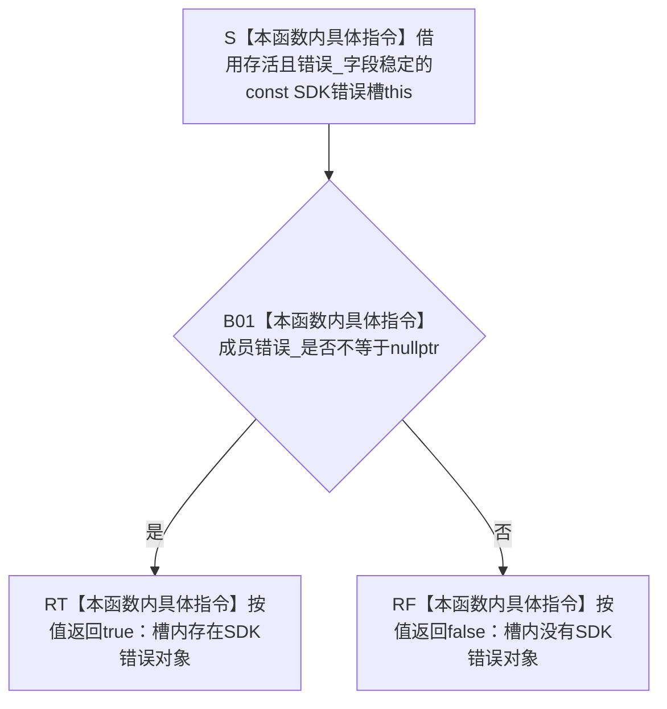

# CF-L5-0183 `SDK错误槽::失败` 现状流程图

图类型：现状流程图
代码版本：`a48a70b2d678dea64dd8228adb4f26f0badd9506`
覆盖文件：`海中鱼巣/适配/采集器.D455相机.ixx:58-60`
唯一根函数：F0308
完整签名：`bool 海中鱼巣::{匿名命名空间}::SDK错误槽::失败() const noexcept`
参数：无显式参数；隐式借用调用期间存活、成员 `错误_` 不被并发写入的 `const SDK错误槽* this`
返回结果：`true` 表示成员 `rs2_error* 错误_` 非空；`false` 表示当前槽内没有 SDK 错误对象
非法值 / 拒绝：无结构化拒绝；任意非空地址都返回 true，本函数不验证错误对象内容、来源或有效性
已登记调用方：当前 43 个根可达 `.失败()` 调用点；既有 E0570 / E0574 / E0577 / E0600 / E1409 / E1413 / E1417 / E1421 / E1443 / E1444 / E1448 / E1457 / E1463，新增 E1536—E1565
直接项目函数：无
调用图：`流程图/代码流程图/00_调用知识图谱.md`
逐行映射表：`流程图/代码流程图/L5/CF-L5-0183_SDK错误槽失败_逐行代码映射表.md`
输入契约 / 调用语境表：本文“输入契约与非成功语境”
非成功返回二分审查表：本文“输入契约与非成功语境”
偏差清单：`流程图/代码流程图/00_规范偏差审计.md` 的 F0308 切片
依据提交 / 结构化消息：冻结源码提交 `a48a70b2d678dea64dd8228adb4f26f0badd9506`；只读子智能体分析，主智能体统一复核和写入
入口前置：当前全部 43 个调用点都在对应 RealSense C API 返回后、同线程顺序检查刚用于该调用的局部错误槽
结构读取与写入：只读取成员裸指针并与空指针比较；不读取错误文本，不写项目结构，不释放或转移错误对象所有权
逻辑内返回：返回 false 只表示槽内无错误对象；调用方仍须独立核对 SDK 输出指针、数值、配置和材料不变量
内部错误：返回 true 后被调用方错误翻译为普通拒绝、返回 false 后把未校验输出当作成功、或与 F0307 / F0309 并发访问同一槽
生命周期与资源释放：槽继续独占非空错误对象，F0309 在作用域退出时负责释放
异常：声明 `noexcept`；裸指针读取、比较和 bool 返回不抛出
并发 / 幂等：字段稳定时为纯读、可重入且重复调用结果相同；同槽接收、检查和析构不得并发
验证入口：冻结源码 blob `9009c0c875af65020d4e2edef14a5e33aa7cc948`、58—60 行、43 个 `.失败()` 调用点、E1536—E1565 机械核对
验证输出：本批按 606 函数 / 303 已完成 / 303 待处理、1591 项目边、345 外部边界、7 未解析调用执行 JSON / Mermaid / 表格闭合验证
依据：`规范/0050_项目通用机器逻辑与禁止性规则总纲_20260721.md`、`规范/0600_代码函数流程图应用与维护规范.md`、`规范/6350_子规范_双目相机外设独占观察线程_20260720.md`、`规范/详细设计/D455相机采样材料入口详细设计.md`
不得作为施工许可：是
不得宣称：SDK 调用整体成功或失败、错误类别已识别、输出材料有效、D455 采集成功、真实样本通过或生产闭环成立

## 流程图

## 节点合同

| 节点 | 类型 | 参数 / 输入绑定 | 结果 / 输出绑定 | 事实读写 | 后继条件 | 验证 |
| --- | --- | --- | --- | --- | --- | --- |
| S | 指令 | 隐式 `const this` | 活动槽借用 | 无 | 对象存活且字段稳定 | 58 行 |
| B01 | 指令 | `this->错误_` | 空值比较结果 | 只读 SDK 临时错误指针 | 非空 / 空 | 59 行 |
| RT | 指令 | 非空比较结果 | `true` | 无 | 调用方继续错误翻译 | 59 行 |
| RF | 指令 | 空比较结果 | `false` | 无 | 调用方继续输出准入 | 59—60 行 |

## 输入契约与非成功语境

| 入口 / 节点 | 输入来源 | 上游是否保证有效 | 非成功结果 | 二分口径 | 结构变化与后续归属 |
| --- | --- | --- | --- | --- | --- |
| 当前 43 个调用点 → S | 刚完成一次 SDK 调用的线程局部错误槽 | 是；当前每个槽实例只接收一次 | 无；总返回 bool | 不适用 | 调用方必须结合资源和值校验 |
| B01 → RT | SDK 写回的非空错误对象 | 只保证指针非空 | 调用方取得错误存在位 | 不能独立裁决 | 错误类别、阶段和追根因归调用方 |
| B01 → RF | SDK 未写错误对象 | 只保证指针为空 | 返回 false | 逻辑内局部结果 | 不证明其它输出有效或业务成功 |
| 并发调用 | 同一槽对象 | 否 | 接收、检查或析构竞态 | 内部错误 | 当前接口无同步；保持线程局部串行 |

## 调用与边界汇总

- 冻结源码共有 43 个当前根可达 `.失败()` 调用点；此前图谱只登记 13 个，本批补登记剩余 30 个入边。
- 多个 `a.失败() || b.失败()` 按左到右短路；后项可能不执行，但所有已构造错误槽仍会析构。
- F0594 的 `追根因 = 追根因 || 停止错误.失败()` 在原追根因为 true 时跳过检查，停止错误对象仍由 F0309 收口。
- F0308 不调用项目函数或 SDK；裸指针比较属于本函数内具体指令，不新增外部边界身份。
