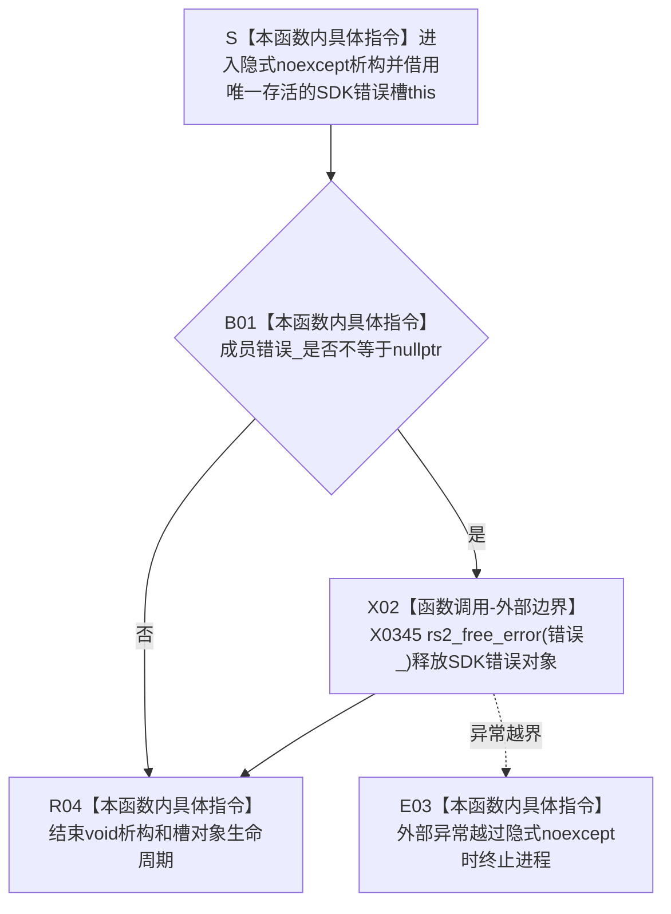

# CF-L5-0184 `SDK错误槽::~SDK错误槽` 现状流程图

图类型：现状流程图
代码版本：`a48a70b2d678dea64dd8228adb4f26f0badd9506`
覆盖文件：`海中鱼巣/适配/采集器.D455相机.ixx:48-52`
唯一根函数：F0309
完整签名：`海中鱼巣::{匿名命名空间}::SDK错误槽::~SDK错误槽() noexcept`
参数：无显式参数；隐式接收正在结束生命周期、独占成员 `错误_` 的 `SDK错误槽* this`
返回结果：`void`；成员为空时直接结束，非空时调用 `rs2_free_error(错误_)` 后结束
非法值 / 拒绝：无结构化拒绝；失效、重复归属或已提前释放的非空指针违反唯一所有权前置
已登记调用方：当前 43 个根可达局部错误槽实例；既有 13 条析构边，新增 E1566—E1595
直接项目函数：无
调用图：`流程图/代码流程图/00_调用知识图谱.md`
逐行映射表：`流程图/代码流程图/L5/CF-L5-0184_SDK错误槽析构_逐行代码映射表.md`
输入契约 / 调用语境表：本文“输入契约与非成功语境”
非成功返回二分审查表：本文“输入契约与非成功语境”
偏差清单：`流程图/代码流程图/00_规范偏差审计.md` 的 F0309 切片
依据提交 / 结构化消息：冻结源码提交 `a48a70b2d678dea64dd8228adb4f26f0badd9506`；只读子智能体分析，主智能体统一复核和写入
入口前置：每个实例是不可复制、不可移动的线程局部唯一所有者；任何正常返回、提前返回、循环 / lambda 退出或异常展开都会调用本析构
结构读取与写入：读取成员指针；非空时释放外部 SDK 错误对象，不写项目节点、关系、索引、领域记录或 D455 材料
逻辑内返回：成员为空是正常生命周期分支，不调用 SDK
内部错误：成员为失效、重复归属或已释放指针，或外部释放异常越过隐式 `noexcept`
生命周期与资源释放：非空成员唯一释放一次；析构后对象生命周期结束，因此不回写 nullptr
异常：源码未显式写 `noexcept`，但成员只有裸指针，用户定义析构的隐式异常规范为 `noexcept(true)`；异常越界触发终止
并发 / 幂等：析构不是幂等入口；不得与 F0307、F0308 或其它线程并发访问同一槽
验证入口：冻结源码 blob `9009c0c875af65020d4e2edef14a5e33aa7cc948`、48—52 行、43 个局部实例、E1566—E1595 和 X0345 机械核对
验证输出：本批按 606 函数 / 303 已完成 / 303 待处理、1591 项目边、345 外部边界、7 未解析调用执行 JSON / Mermaid / 表格闭合验证
依据：`规范/0050_项目通用机器逻辑与禁止性规则总纲_20260721.md`、`规范/0600_代码函数流程图应用与维护规范.md`、`规范/6350_子规范_双目相机外设独占观察线程_20260720.md`、`规范/详细设计/D455相机采样材料入口详细设计.md`
不得作为施工许可：是
不得宣称：SDK 调用成功、错误诊断已保留、采集器状态正确、D455 采集成功、真实样本通过或生产闭环成立

## 流程图

## 节点合同

| 节点 | 类型 | 参数 / 输入绑定 | 结果 / 输出绑定 | 事实读写 | 后继条件 | 验证 |
| --- | --- | --- | --- | --- | --- | --- |
| S | 指令 | 隐式 `this` | 析构中的唯一槽借用 | 无 | 对象仍完整存活 | 48 行 |
| B01 | 指令 | `this->错误_` | 空值比较结果 | 只读 SDK 临时错误指针 | 非空 / 空 | 49 行 |
| X02 | 外部边界 | 非空 `rs2_error*` | 无返回值 | 释放外部 SDK 错误对象 | 正常返回 / 异常越界 | 50 行、X0345 |
| E03 | 指令 | 异常越界 | 进程终止 | 无可读半结构 | 不返回 | 隐式 `noexcept` |
| R04 | 指令 | 空值或释放完成 | `void` 析构完成 | 不写项目机器事实 | 对象生命周期结束 | 51—52 行 |

## 输入契约与非成功语境

| 入口 / 节点 | 输入来源 | 上游是否保证有效 | 非成功结果 | 二分口径 | 结构变化与后续归属 |
| --- | --- | --- | --- | --- | --- |
| 当前 43 个实例 → S | 栈局部、不可复制 / 移动的 SDK错误槽 | 是 | 任意作用域退出均析构 | 不适用 | 成员非空才进入 SDK 释放 |
| B01 空分支 | SDK 未写错误对象 | 是当前允许状态 | 无操作结束 | 逻辑内生命周期分支 | 不产生释放调用 |
| B01 非空分支 | SDK 写回的错误对象 | 当前由槽唯一拥有 | 调用 `rs2_free_error` | 正常资源收口 | 不保留错误文本或类别 |
| 失效 / 重复归属 | 非法所有权 | 否 | 可能重复释放或未定义行为 | 内部错误 | SDK 错误槽唯一所有权合同 |
| X02 异常越界 | 外部 C API | 当前未证明存在 | 隐式 `noexcept` 终止 | 追根因解决 | 外部资源释放异常合同 |

## 调用与边界汇总

- 冻结源码共有 43 个当前根可达 `SDK错误槽` 实例；此前图谱只登记 13 个，本批补登记剩余 30 个析构入边。
- 析构边在成员为空时也真实发生；只有 X0345 外部释放调用受非空门禁控制。
- 错误槽的删除复制构造、删除复制赋值、用户声明析构且未声明 move 共同保证当前实例不可复制、不可移动。
- F0309 只收口外部 SDK 诊断资源，不证明错误已分类或对应 SDK 输出有效。
