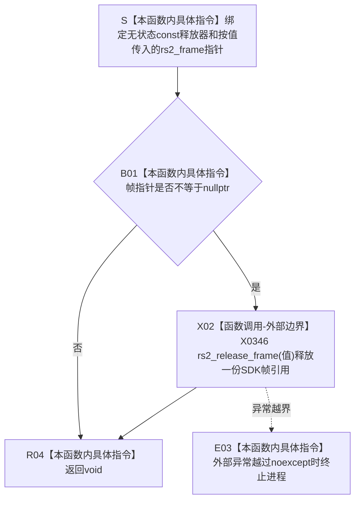

# CF-L5-0185 `帧释放器::operator()` 现状流程图

图类型：现状流程图
代码版本：`a48a70b2d678dea64dd8228adb4f26f0badd9506`
覆盖文件：`海中鱼巣/适配/采集器.D455相机.ixx:75`
唯一根函数：F0310
完整签名：`void 海中鱼巣::{匿名命名空间}::帧释放器::operator()(rs2_frame* 值) const noexcept`
参数：隐式无状态 `const 帧释放器* this`；显式按值接收 `rs2_frame* 值`，调用者必须拥有一份可释放的 SDK 帧引用
返回结果：`void`；空指针无操作，非空时调用一次 `rs2_release_frame(值)` 后结束
非法值 / 拒绝：空值允许；借用、悬空、已释放或重复归属的非空指针违反所有权前置且无结构化拒绝结果
已登记调用方：F0113 内六条 RAII 删除器回调边 E0572 / E0579 / E0580 / E0581 / E0582 / E0583，当前已完整
直接项目函数：无
调用图：`流程图/代码流程图/00_调用知识图谱.md`
逐行映射表：`流程图/代码流程图/L5/CF-L5-0185_帧释放器调用_逐行代码映射表.md`
输入契约 / 调用语境表：本文“输入契约与非成功语境”
非成功返回二分审查表：本文“输入契约与非成功语境”
偏差清单：`流程图/代码流程图/00_规范偏差审计.md` 的 F0310 切片
依据提交 / 结构化消息：冻结源码提交 `a48a70b2d678dea64dd8228adb4f26f0badd9506`；只读子智能体分析，主智能体统一复核和写入
入口前置：F0113 的 `帧指针 = std::unique_ptr<rs2_frame, 帧释放器>` 在所有权槽非空且作用域退出时调用本删除器
结构读取与写入：只消费一份外部 SDK 帧引用；不把裸指针写入项目结构，项目材料只保存复制后的字节和标量
逻辑内返回：空值直接返回 void；标准 `unique_ptr` 当前不会以空指针调用删除器
内部错误：传入借用、悬空、已释放或重复拥有的非空指针，或外部释放异常越过 `noexcept`
生命周期与资源释放：非空时释放一份 SDK 引用，不宣称一定立即销毁底层缓冲区；调用后该所有权槽结束
异常：声明 `noexcept`；RealSense C API 无 C++ 异常结果，异常越界会终止
并发 / 幂等：不是幂等入口；同一拥有引用只能释放一次，不得与别名线程的非法访问并发
验证入口：冻结源码 blob `9009c0c875af65020d4e2edef14a5e33aa7cc948`、75 行、六条已登记入边和 X0346 机械核对
验证输出：本批按 606 函数 / 303 已完成 / 303 待处理、1591 项目边、345 外部边界、7 未解析调用执行 JSON / Mermaid / 表格闭合验证
依据：`规范/0050_项目通用机器逻辑与禁止性规则总纲_20260721.md`、`规范/0600_代码函数流程图应用与维护规范.md`、`规范/6350_子规范_双目相机外设独占观察线程_20260720.md`、`规范/详细设计/D455相机采样材料入口详细设计.md`
不得作为施工许可：是
不得宣称：底层缓冲区一定立即销毁、全部 SDK 帧引用无泄漏、D455 采集成功、真实样本通过或生产闭环成立

## 流程图

## 节点合同

| 节点 | 类型 | 参数 / 输入绑定 | 结果 / 输出绑定 | 事实读写 | 后继条件 | 验证 |
| --- | --- | --- | --- | --- | --- | --- |
| S | 指令 | 无状态 `const this`、按值 `rs2_frame*` | 活动调用材料 | 无 | 输入绑定完成 | 75 行 |
| B01 | 指令 | `值` | 空值比较结果 | 无 | 非空 / 空 | 75 行 |
| X02 | 外部边界 | 非空拥有引用 | 无返回值 | 释放一份外部 SDK 帧引用 | 正常返回 / 异常越界 | 75 行、X0346 |
| E03 | 指令 | 异常越界 | 进程终止 | 无可读半结构 | 不返回 | `noexcept` |
| R04 | 指令 | 空值或释放完成 | `void` | 不写项目机器事实 | 退出函数 | 75 行 |

## 输入契约与非成功语境

| 入口 / 节点 | 输入来源 | 上游是否保证有效 | 非成功结果 | 二分口径 | 结构变化与后续归属 |
| --- | --- | --- | --- | --- | --- |
| E0572 / E0579—E0583 → S | F0113 的六类 `帧指针` RAII 所有权槽 | 是；非空槽持有一份待释放 SDK 引用 | 无结构化结果 | 不适用 | 当前帧、四路帧、复合同步帧逆构造顺序收口 |
| B01 空分支 | 空指针 | 允许 | 无操作返回 | 逻辑内生命周期分支 | 标准 `unique_ptr` 当前不触发该动态边 |
| B01 非空分支 | 唯一拥有引用 | 当前由槽保证 | 调用 `rs2_release_frame` | 正常资源收口 | 只释放一份引用 |
| 非法所有权 | 借用 / 悬空 / 重复拥有 | 否 | 可能重复释放或未定义行为 | 内部错误 | SDK 帧引用所有权合同 |
| X02 异常越界 | 外部 C API | 当前未证明存在 | `noexcept` 终止 | 追根因解决 | 外部资源释放异常合同 |

## 调用与边界汇总

- 六条既有入边完整覆盖复合同步帧、循环当前帧和彩色 / 深度 / 左右红外四路所有权槽，无新增项目调用边。
- `当前帧` 成功移动到四路槽后源槽为空，不重复释放；未识别或未移动的当前帧在本轮循环末释放。
- 正常或异常离开 F0113 时，仍非空的当前帧先释放，随后右红外、左红外、深度、彩色，最后复合同步帧。
- X0346 只表示静态 `rs2_release_frame` 调用点；运行时执行次数由非空所有权槽和采样循环决定。
