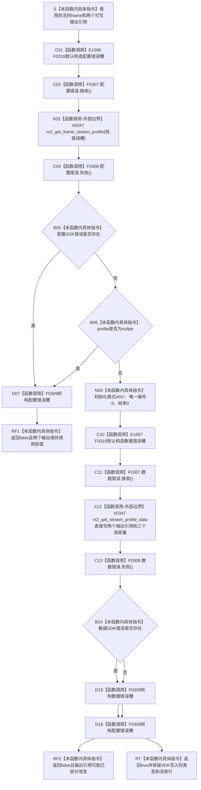

# CF-L5-0186 `读取帧流身份` 现状流程图

图类型：现状流程图
代码版本：`a48a70b2d678dea64dd8228adb4f26f0badd9506`
覆盖文件：`海中鱼巣/适配/采集器.D455相机.ixx:297-310`
唯一根函数：F0311
完整签名：`bool 海中鱼巣::{匿名命名空间}::读取帧流身份(const rs2_frame* 帧, rs2_stream& 类型, int& 流索引)`
参数：非拥有 `const rs2_frame* 帧`；调用方拥有的可写输出引用 `rs2_stream& 类型` 和 `int& 流索引`
返回结果：profile 取得错误 / 空指针或 profile 数据读取错误时返回 false；第二次 SDK 调用未写错误对象时返回 true
非法值 / 拒绝：函数不显式拒绝空 `帧`、未知类型、负索引、异常格式 / 唯一编号 / 帧率；当前调用方已保证帧非空
已登记调用方：F0113 → F0311 的 E0584，当前唯一且完整
直接项目函数：F0316 默认构造两个错误槽、F0307 接收两次、F0308 检查两次、F0309 析构两个槽
调用图：`流程图/代码流程图/00_调用知识图谱.md`
逐行映射表：`流程图/代码流程图/L5/CF-L5-0186_读取帧流身份_逐行代码映射表.md`
输入契约 / 调用语境表：本文“输入契约与非成功语境”
非成功返回二分审查表：本文“输入契约与非成功语境”
偏差清单：`流程图/代码流程图/00_规范偏差审计.md` 的 F0311 切片
依据提交 / 结构化消息：冻结源码提交 `a48a70b2d678dea64dd8228adb4f26f0badd9506`；只读子智能体分析，主智能体统一复核和写入
入口前置：F0113 已成功提取非空 `当前帧`，局部 `帧指针` 在调用期间保持一份 SDK 引用
结构读取与写入：第二次 SDK 调用直接写两个输出引用；不写项目仓库、缓存或领域事实
逻辑内返回：当前唯一调用语境没有普通逻辑内 false；任一 false 均由 F0113 作为内部不一致追根因
内部错误：profile 读取错误 / 空指针、profile 数据错误，或 true 后类型 / 索引 / 实际格式仍不满足四路身份合同
生命周期与资源释放：profile 是随帧存活的函数内非拥有借用；两个错误槽分别由 F0309 逆序析构
异常：未声明 `noexcept`；当前标准 C API 无 C++ 异常结果，异常由 F0113 外层兜底但不构成正常协议分支
并发 / 幂等：不保存共享状态；要求帧不被并发释放、两个输出槽不被并发读写
验证入口：冻结源码 blob `9009c0c875af65020d4e2edef14a5e33aa7cc948`、297—310 行、E0584 / E1596 / E1597 和 X0347 机械核对
验证输出：本批按 608 函数 / 306 已完成 / 302 待处理、1606 项目边、349 外部边界、7 未解析调用执行闭合验证
依据：`规范/0050_项目通用机器逻辑与禁止性规则总纲_20260721.md`、`规范/0600_代码函数流程图应用与维护规范.md`、`规范/6350_子规范_双目相机外设独占观察线程_20260720.md`、`规范/详细设计/D455相机采样材料入口详细设计.md`
不得作为施工许可：是
不得宣称：实际 profile 完整有效、帧一定属于四路请求、SDK 成功、真实样本通过或生产闭环成立

## 流程图

## 节点合同

| 节点组 | 类型 | 输入 | 输出 / 结构变化 | 非成功口径 | 验证 |
| --- | --- | --- | --- | --- | --- |
| S | 指令 | 帧和两个输出引用 | 无 | 不适用 | 297 行 |
| C01—X03 | 项目调用 / 外部边界 | 帧 | profile 裸借用或错误对象 | 前置成立后错误须追根因 | 298—299 行 |
| C04—RF1 | 调用 / 判断 / 返回 | 配置错误位、profile | false；输出引用保持原值 | 追根因解决 | 300—301 行 |
| N09 | 指令 | 无 | 三个局部 SDK 字段初始化 | 不适用 | 303—305 行 |
| C10—X12 | 项目调用 / 外部边界 | profile、五个写回槽 | 类型 / 索引及三个局部量可能改变 | SDK 直接写出 | 306—308 行 |
| C13—RF2 / RT | 调用 / 判断 / 返回 | 数据错误位 | false 可能保留部分输出；true 保留写入值 | false 追根因；true 仍需后验 | 309—310 行 |

## 输入契约与非成功语境

| 分支 | 当前调用前置 | 输出变化 | 二分口径 | 后续 |
| --- | --- | --- | --- | --- |
| profile 错误 / 空指针 | 已提取非空 frame | 两个输出保持调用前值 | 追根因解决 | F0113 返回内部不一致 |
| profile 数据错误 | profile 已取得 | 两个输出可能部分 / 完整改变 | 追根因解决 | F0113 不消费半输出并返回 |
| 返回 true | 两次 SDK 无错误对象 | 类型和索引已由 SDK 写入 | 仍需后验 | F0113 只按类型 / 索引分类 |
| true 但未知类型 / 负索引 | 当前函数不拒绝 | 异常值外泄到调用方局部 | 设计 / 实现缺口 | 可能被降级为同步帧不完整 |

## 调用与边界汇总

- 既有 F0307 / F0308 / F0309 六条边完整；本批补登记 F0316 两次默认构造边 E1596 / E1597。
- X0347 聚合两次 RealSense profile C API 调用，静态调用计数 2。
- 第二次 SDK 调用读取格式、唯一编号和帧率，但当前函数丢弃三者；真实格式没有与 F0313 的调用方预期格式互证。
