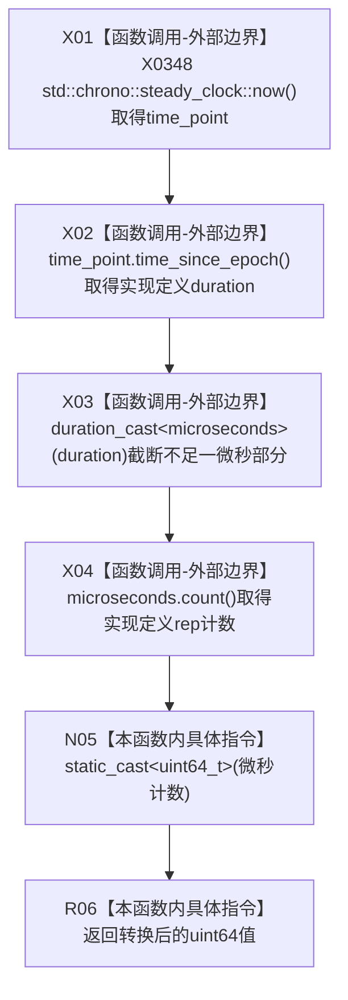

# CF-L5-0187 `当前单调时间戳微秒` 现状流程图

图类型：现状流程图
代码版本：`a48a70b2d678dea64dd8228adb4f26f0badd9506`
覆盖文件：`海中鱼巣/适配/采集器.D455相机.ixx:178-181`
唯一根函数：F0312
完整签名：`std::uint64_t 海中鱼巣::{匿名命名空间}::当前单调时间戳微秒()`
参数：无
返回结果：取得 `steady_clock::now()` 相对实现定义 epoch 的时长，转换为整微秒计数后显式转换成 `std::uint64_t`
非法值 / 拒绝：无拒绝结果；零值、负有符号计数转巨大无符号值和转换溢出均不在本函数内检测
已登记调用方：F0113 → F0312 的 E0585，当前唯一且完整
直接项目函数：无
调用图：`流程图/代码流程图/00_调用知识图谱.md`
逐行映射表：`流程图/代码流程图/L5/CF-L5-0187_当前单调时间戳微秒_逐行代码映射表.md`
输入契约 / 调用语境表：本文“输入契约与非成功语境”
非成功返回二分审查表：本文“输入契约与非成功语境”
偏差清单：`流程图/代码流程图/00_规范偏差审计.md` 的 F0312 切片
依据提交 / 结构化消息：冻结源码提交 `a48a70b2d678dea64dd8228adb4f26f0badd9506`；只读子智能体分析，主智能体统一复核和写入
入口前置：F0113 已提取并确认四路帧句柄完整、建立同步帧材料并分配批次号，尚未复制像素或读取外参
结构读取与写入：本函数只形成临时值；F0113 把结果写入局部材料的 `宿主接收单调时间戳`
逻辑内返回：同一微秒内的重复值是允许的普通结果；接口不保证严格递增
内部错误：负计数无符号包装、转换中间溢出、零值或回绕穿过后置非零门禁
生命周期与资源释放：全部 chrono 对象为值式临时量
异常：未声明 `noexcept`；当前 chrono 值式链无具名正常失败通道
并发 / 幂等：并发调用各自取值且允许相等；批次号递增和取时不在同一锁内，违规并发时不保证批次序等于时间序
验证入口：冻结源码 blob `9009c0c875af65020d4e2edef14a5e33aa7cc948`、178—181 行、E0585 和 X0348 机械核对
验证输出：本批按 608 函数 / 306 已完成 / 302 待处理、1606 项目边、349 外部边界、7 未解析调用执行闭合验证
依据：`规范/0050_项目通用机器逻辑与禁止性规则总纲_20260721.md`、`规范/0600_代码函数流程图应用与维护规范.md`、`规范/6350_子规范_双目相机外设独占观察线程_20260720.md`、`规范/详细设计/D455相机采样材料入口详细设计.md`
不得作为施工许可：是
不得宣称：UTC 时间、设备曝光时间、跨进程 / 重启可比身份、严格递增、四路硬件同步、材料新鲜或生产闭环成立

## 流程图

## 节点合同

| 节点 | 类型 | 输入 | 输出 | 风险 / 后继 | 验证 |
| --- | --- | --- | --- | --- | --- |
| X01 | 外部边界 | 无 | steady time_point | epoch / period 实现定义 | 180 行 |
| X02 | 外部边界 | time_point | steady duration | 可能是实现定义有符号 rep | 180 行 |
| X03 | 外部边界 | duration | 整微秒 duration | 不足一微秒朝零截断 | 179—180 行 |
| X04 | 外部边界 | microseconds | rep 微秒计数 | 标准不保证非负 | 179—180 行 |
| N05 | 指令 | rep 计数 | `uint64_t` | 负值按模转换为巨大值 | 179 行 |
| R06 | 指令 | `uint64_t` | 返回值 | F0113 写局部材料 | 179—181 行 |

## 输入契约与非成功语境

| 结果 | 当前行为 | 二分口径 | 后续 |
| --- | --- | --- | --- |
| 正常非负计数 | 转为 uint64 返回 | 普通结果 | 只适合当前运行语境间隔 / 排序 |
| 同一微秒重复值 | 返回相同值 | 逻辑内普通结果 | 不能宣称严格递增 |
| 零值 | 返回 0 | 后置追根因 | F0108 最终材料有效性拒绝 |
| 负源计数 / 溢出 / 回绕 | 当前无检测，可能形成巨大非零值 | 内部错误 | 可能穿过现有非零门禁 |
| 并发批次 | 取时发生在批次锁释放后 | 合同缺口 | 单采集线程成立时规避 |

## 调用与边界汇总

- X0348 聚合 `steady_clock::now`、`time_since_epoch`、`duration_cast<microseconds>`、`count` 及最终有符号 / 实现定义 rep 到 `uint64_t` 的转换。
- 取值时点晚于 frameset 提取与四路完整性确认、批次分配，早于四路深复制和三组外参读取；字段名“宿主接收”不能解释为 SDK 返回瞬间。
- `steady_clock` 只提供进程内稳定时钟语义；epoch、分辨率和跨重启可比性未冻结。
