# CF-L5-0188 `复制图像平面` 现状流程图

图类型：现状流程图
代码版本：`a48a70b2d678dea64dd8228adb4f26f0badd9506`
覆盖文件：`海中鱼巣/适配/采集器.D455相机.ixx:312-377`
唯一根函数：F0313
完整签名：`bool 海中鱼巣::{匿名命名空间}::复制图像平面(const rs2_frame* 帧, 海中鱼巣::D455流类型 类型, std::uint32_t 流索引, 海中鱼巣::D455像素格式 格式, float 深度比例, 海中鱼巣::D455图像平面材料& 材料)`
参数：非拥有 `const rs2_frame* 帧`；按值的类型、索引、预期格式和深度比例；调用方拥有的可写输出引用 `D455图像平面材料& 材料`
返回结果：profile、布局、数据、编号、时间或内参读取失败 / 非法时返回 false；复制完成后返回 F0306 对材料最低形状验证的 bool
非法值 / 拒绝：拒绝空 profile / 数据、SDK 错误、非正宽高步长位数 / 字节数、位数不能整除 8、零帧号、非有限或非正设备时间戳；不在复制前拒绝布局乘积矛盾、未知类型 / 格式 / 时间域、内参异常或时间戳换算越界
已登记调用方：F0113 → F0313 的 E0586—E0589，分别复制彩色、深度、左红外和右红外四路完整同步帧
直接项目函数：F0316 默认构造 11 个错误槽；F0307 接收 11 次；F0308 检查 11 次；F0309 析构 11 个槽；F0614 转换时间戳域；F0615 转换内参；F0306 复制后验证
调用图：`流程图/代码流程图/00_调用知识图谱.md`
逐行映射表：`流程图/代码流程图/L5/CF-L5-0188_复制图像平面_逐行代码映射表.md`
输入契约 / 调用语境表：本文“输入契约与非成功语境”
非成功返回二分审查表：本文“输入契约与非成功语境”
偏差清单：`流程图/代码流程图/00_规范偏差审计.md` 的 F0313 切片
依据提交 / 结构化消息：冻结源码提交 `a48a70b2d678dea64dd8228adb4f26f0badd9506`；只读子智能体分析，主智能体统一复核和写入
入口前置：F0113 已取得四路非空帧、按 F0311 识别类型 / 索引、证明四路身份完整，并保持六个 SDK 帧引用到本函数返回
结构读取与写入：SDK 数据同步深复制到调用方材料；不写项目仓库、关系、索引或领域事实，但 361 行起会原位改变输出材料
逻辑内返回：当前唯一生产调用语境没有普通逻辑内 false；任一 false 均由 F0113 作为内部不一致追根因
内部错误：已取得完整帧候选后任一 SDK / 布局 / 数据 / 最低形状失败；时间戳换算越界、复制前布局不足和失败后部分输出也是具名缺口
生命周期与资源释放：SDK 数据和 profile 为随 `帧` 存活的非拥有借用，只在同步复制期间使用；11 个错误槽按已构造集合逆序调用 F0309
异常：`vector::resize` 可抛分配异常；发生时材料标量和内参已经原位写入，错误槽析构后异常继续传播到 F0113 的外层兜底
并发 / 幂等：不持锁；要求帧不被并发释放、输出材料不被并发读写；重复调用会覆盖标量并重新分配 / 复制字节，不保证失败零变化
验证入口：冻结源码 blob `9009c0c875af65020d4e2edef14a5e33aa7cc948`、312—377 行、E0586—E0589 / E1502 / E1520—E1530 / E1550—E1560 / E1580—E1590 / E1598—E1610 和 X0349—X0350 机械核对
验证输出：本批按 608 函数 / 306 已完成 / 302 待处理、1606 项目边、349 外部边界、7 未解析调用执行闭合验证
依据：`规范/0050_项目通用机器逻辑与禁止性规则总纲_20260721.md`、`规范/0600_代码函数流程图应用与维护规范.md`、`规范/6350_子规范_双目相机外设独占观察线程_20260720.md`、`规范/详细设计/D455相机采样材料入口详细设计.md`
不得作为施工许可：是
不得宣称：真实 profile 与预期格式一致、复制前布局安全、输出具备失败原子性、真实样本通过、观察 / 体素成立或 D455 已进入生产闭环

## 流程图

```mermaid
flowchart TD
    S["S【本函数内具体指令】借用存活frame并绑定五个按值参数和材料可写引用"]
    C01["C01【函数调用】E1598 F0316默认构造配置错误槽"]
    C02["C02【函数调用】F0307 配置错误.接收()"]
    X03["X03【函数调用-外部边界】X0349 rs2_get_frame_stream_profile(帧,错误槽)"]
    C04["C04【函数调用】F0308 配置错误.失败()"]
    B05{"B05【本函数内具体指令】配置错误存在或profile为空"}
    D06["D06【函数调用】F0309析构配置错误槽"]
    RF0["RF0【本函数内具体指令】返回false且材料保持调用前值"]
    N07["N07【本函数内具体指令】把宽高步长位数和字节数五个局部量置0"]

    C08["C08【函数调用】E1599 F0316默认构造宽错误槽"]
    C09["C09【函数调用】F0307 宽错误.接收()"]
    X10["X10【函数调用-外部边界】X0349 rs2_get_frame_width写宽"]
    C11["C11【函数调用】E1600 F0316默认构造高错误槽"]
    C12["C12【函数调用】F0307 高错误.接收()"]
    X13["X13【函数调用-外部边界】X0349 rs2_get_frame_height写高"]
    C14["C14【函数调用】E1601 F0316默认构造步长错误槽"]
    C15["C15【函数调用】F0307 步长错误.接收()"]
    X16["X16【函数调用-外部边界】X0349 rs2_get_frame_stride_in_bytes写步长"]
    C17["C17【函数调用】E1602 F0316默认构造位数错误槽"]
    C18["C18【函数调用】F0307 位数错误.接收()"]
    X19["X19【函数调用-外部边界】X0349 rs2_get_frame_bits_per_pixel写位数"]
    C20["C20【函数调用】E1603 F0316默认构造字节错误槽"]
    C21["C21【函数调用】F0307 字节错误.接收()"]
    X22["X22【函数调用-外部边界】X0349 rs2_get_frame_data_size写字节数"]

    C23["C23【函数调用】F0308 宽错误.失败()"]
    B24{"B24【本函数内具体指令】宽错误是否存在"}
    C25["C25【函数调用】F0308 高错误.失败()"]
    B26{"B26【本函数内具体指令】高错误是否存在"}
    C27["C27【函数调用】F0308 步长错误.失败()"]
    B28{"B28【本函数内具体指令】步长错误是否存在"}
    C29["C29【函数调用】F0308 位数错误.失败()"]
    B30{"B30【本函数内具体指令】位数错误是否存在"}
    C31["C31【函数调用】F0308 字节错误.失败()"]
    B32{"B32【本函数内具体指令】字节错误是否存在"}
    B33{"B33【本函数内具体指令】五值均为正且位数可整除8"}
    D34["D34【函数调用】按字节到配置逆序分别调用F0309析构六个已构造错误槽"]
    RF1["RF1【本函数内具体指令】返回false且材料保持调用前值"]

    C35["C35【函数调用】E1604 F0316默认构造数据错误槽"]
    C36["C36【函数调用】F0307 数据错误.接收()"]
    X37["X37【函数调用-外部边界】X0349 rs2_get_frame_data取得数据借用"]
    C38["C38【函数调用】E1605 F0316默认构造编号错误槽"]
    C39["C39【函数调用】F0307 编号错误.接收()"]
    X40["X40【函数调用-外部边界】X0349 rs2_get_frame_number取得帧号"]
    C41["C41【函数调用】E1606 F0316默认构造时间错误槽"]
    C42["C42【函数调用】F0307 时间错误.接收()"]
    X43["X43【函数调用-外部边界】X0349 rs2_get_frame_timestamp取得毫秒时间戳"]
    C44["C44【函数调用】E1607 F0316默认构造时间域错误槽"]
    C45["C45【函数调用】F0307 时间域错误.接收()"]
    X46["X46【函数调用-外部边界】X0349 rs2_get_frame_timestamp_domain取得时间域"]
    N47["N47【本函数内具体指令】把rs2_intrinsics局部内参零初始化"]
    C48["C48【函数调用】E1608 F0316默认构造内参错误槽"]
    C49["C49【函数调用】F0307 内参错误.接收()"]
    X50["X50【函数调用-外部边界】X0349 rs2_get_video_stream_intrinsics写局部内参"]

    C51["C51【函数调用】F0308 数据错误.失败()"]
    B52{"B52【本函数内具体指令】数据错误是否存在"}
    C53["C53【函数调用】F0308 编号错误.失败()"]
    B54{"B54【本函数内具体指令】编号错误是否存在"}
    C55["C55【函数调用】F0308 时间错误.失败()"]
    B56{"B56【本函数内具体指令】时间错误是否存在"}
    C57["C57【函数调用】F0308 时间域错误.失败()"]
    B58{"B58【本函数内具体指令】时间域错误是否存在"}
    C59["C59【函数调用】F0308 内参错误.失败()"]
    B60{"B60【本函数内具体指令】内参错误是否存在"}
    B61{"B61【本函数内具体指令】数据非空、帧号非零且时间戳有限正值"}
    D62["D62【函数调用】按内参到配置逆序分别调用F0309析构11个已构造错误槽"]
    RF2["RF2【本函数内具体指令】返回false且材料保持调用前值"]

    N63["N63【本函数内具体指令】原位写类型、索引、格式、宽高、每像素字节数、步长、实际字节数和源帧号"]
    X64["X64【函数调用-外部边界】X0350 计算llround(时间戳乘1000)并转uint64写设备微秒"]
    C65["C65【函数调用】E1609 F0614转换时间戳域并写材料"]
    C66["C66【函数调用】E1610 F0615转换内参并写材料"]
    N67["N67【本函数内具体指令】原位写深度比例"]
    X68["X68【函数调用-外部边界】X0350 vector.resize按SDK字节数分配输出字节组"]
    X69["X69【函数调用-外部边界】X0350 memcpy从SDK借用缓冲复制全部字节"]
    C70["C70【函数调用】E1502 F0306校验复制后的D455图像平面材料"]
    N71["N71【本函数内具体指令】保存F0306布尔结果"]
    D72["D72【函数调用】按内参到配置逆序分别调用F0309析构11个错误槽"]
    RT["RT【本函数内具体指令】返回F0306布尔结果"]
    D73["D73【函数调用】resize异常展开时按内参到配置逆序分别调用F0309析构11个错误槽"]
    EX["EX【本函数内具体指令】继续向F0113传播分配异常且材料保留部分写入"]

    S --> C01 --> C02 --> X03 --> C04 --> B05
    B05 -- "是" --> D06 --> RF0
    B05 -- "否" --> N07 --> C08 --> C09 --> X10 --> C11 --> C12 --> X13 --> C14 --> C15 --> X16 --> C17 --> C18 --> X19 --> C20 --> C21 --> X22 --> C23 --> B24
    B24 -- "是" --> D34
    B24 -- "否" --> C25 --> B26
    B26 -- "是" --> D34
    B26 -- "否" --> C27 --> B28
    B28 -- "是" --> D34
    B28 -- "否" --> C29 --> B30
    B30 -- "是" --> D34
    B30 -- "否" --> C31 --> B32
    B32 -- "是" --> D34
    B32 -- "否" --> B33
    B33 -- "否" --> D34 --> RF1
    B33 -- "是" --> C35 --> C36 --> X37 --> C38 --> C39 --> X40 --> C41 --> C42 --> X43 --> C44 --> C45 --> X46 --> N47 --> C48 --> C49 --> X50 --> C51 --> B52
    B52 -- "是" --> D62
    B52 -- "否" --> C53 --> B54
    B54 -- "是" --> D62
    B54 -- "否" --> C55 --> B56
    B56 -- "是" --> D62
    B56 -- "否" --> C57 --> B58
    B58 -- "是" --> D62
    B58 -- "否" --> C59 --> B60
    B60 -- "是" --> D62
    B60 -- "否" --> B61
    B61 -- "否" --> D62 --> RF2
    B61 -- "是" --> N63 --> X64 --> C65 --> C66 --> N67 --> X68 --> X69 --> C70 --> N71 --> D72 --> RT
    X68 -. "分配异常" .-> D73 --> EX
```

## 节点合同

| 节点组 | 类型 | 输入 | 输出 / 结构变化 | 非成功口径 | 验证 |
| --- | --- | --- | --- | --- | --- |
| S—B05 | 指令 / 项目调用 / 外部边界 | 帧、配置错误槽 | profile 裸借用或 false | 当前调用语境为追根因 | 312—322 行 |
| N07—X22 | 指令 / 项目调用 / 外部边界 | 帧 | 五项布局局部值和六个错误槽 | SDK 调用全部完成后统一检查 | 324—338 行 |
| C23—RF1 | 项目调用 / 判断 / 返回 | 五错误位和五个布局值 | false；材料零写 | 追根因解决 | 339—342 行 |
| C35—X50 | 项目调用 / 外部边界 | 帧、profile | 数据借用、编号、时间、时间域、内参和 11 个错误槽 | SDK 调用全部完成后统一检查 | 344—354 行 |
| C51—RF2 | 项目调用 / 判断 / 返回 | 五错误位和三项值门禁 | false；材料零写 | 追根因解决 | 355—358 行 |
| N63—N67 | 指令 / 项目调用 / 外部边界 | 已检查局部材料 | 原位写材料标量、时间域、内参和深度比例 | 写入后不再具备失败零变化 | 361—373 行 |
| X68—X69 | 外部边界 | SDK 字节数和数据借用 | 分配并深复制字节组 | 分配异常保留部分输出；布局矛盾可能过量复制 | 374—375 行 |
| C70—RT | 项目调用 / 指令 | 已复制材料 | 返回最低形状验证 bool | false 为追根因且材料仍已填充 | 376—377 行 |
| D06 / D34 / D62 / D72 / D73 | 项目调用 | 实际已构造错误槽集合 | 逆序调用 F0309 释放可能存在的 SDK 错误对象 | 不改变材料 | 各作用域退出 |

## 输入契约与非成功语境

| 分支 | 当前调用前置 | 材料变化 | 二分口径 | 后续 |
| --- | --- | --- | --- | --- |
| profile / 布局 / 数据门禁 false | F0113 已证明四路非空且身份完整 | 358 行前材料零写 | 追根因解决 | F0113 返回内部不一致 |
| 时间戳未知域 | SDK 无错误，映射为 `未知` | 已原位写材料 | 后置追根因 | F0306 拒绝未知域 |
| `resize` 抛异常 | 标量、时间域、内参和深度比例已写 | 保留部分材料 | 内部错误 | F0113 catch-all 标记采集器故障 |
| `memcpy` 缓冲或布局不真实 | 只检查 SDK 报告字节数为正 | 可能未定义行为 | 内部错误 | 当前没有安全逻辑返回 |
| F0306 返回 false | 字节已深复制 | 保留完整但非法材料 | 追根因解决 | F0113 丢弃未发布同步候选 |
| F0306 返回 true | 最低形状成立 | 输出材料保留 | 普通成功候选 | 仍需四平面、三外参和整批后验 |

## 调用与边界汇总

- 本批补登记 F0316 默认构造边 E1598—E1608、F0614 转换边 E1609 和 F0615 转换边 E1610；既有 F0306 / F0307 / F0308 / F0309 调用边保持原身份。
- X0349 聚合 11 次 RealSense profile、布局、数据、编号、时间、时间域和内参读取 C API；X0350 聚合数值换算、容器分配 / 访问、`memcpy` 和异常生命周期。
- F0614、F0615 是本次从已可达 F0313 识别出的 L6 待处理项目函数；两者各自后续必须建立唯一单函数流程图。
- 复制前未证明 `步长 >= 宽 × 每像素字节数`、`字节数 == 步长 × 高`、乘法无溢出或字节数处于上限内；F0306 是复制后的最低形状验证，不能保护复制动作本身。
- SDK 实际格式已在 F0311 读取后丢弃；F0313 直接把调用方预期格式写入材料，现行调用链缺少实际格式互证。
