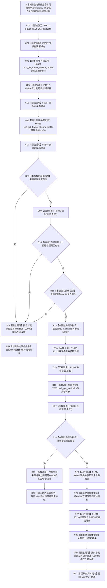

# CF-L5-0189 `读取外参` 现状流程图

图类型：现状流程图
代码版本：`a48a70b2d678dea64dd8228adb4f26f0badd9506`
覆盖文件：`海中鱼巣/适配/采集器.D455相机.ixx:379-402`
唯一根函数：F0314
完整签名：`bool 海中鱼巣::{匿名命名空间}::读取外参(const rs2_frame* 来源帧, const rs2_frame* 目标帧, 海中鱼巣::D455流类型 来源类型, std::uint32_t 来源索引, 海中鱼巣::D455流类型 目标类型, std::uint32_t 目标索引, 海中鱼巣::D455相机外参材料& 材料)`
参数：两个非拥有 `const rs2_frame*` 借用；四个按值的来源 / 目标类型与索引；调用方拥有的可写输出引用 `D455相机外参材料& 材料`
返回结果：任一 profile / 外参 SDK 错误或空 profile 返回 false；成功读取后把 F0616 转换值写入材料并返回 F0110 的有效性 bool
非法值 / 拒绝：拒绝 SDK 错误、空 profile、未知来源 / 目标类型、非有限旋转 / 平移和全零近似旋转；不核对 profile 实际类型 / 索引是否与调用参数一致
已登记调用方：F0113 → F0314 的 E0590—E0592，固定读取 `Depth → RGB`、`左 IR → Depth`、`右 IR → Depth`
直接项目函数：F0316 默认构造三个错误槽；F0307 接收三次；F0308 检查三次；F0309 析构三个槽；F0616 转换外参；F0110 校验外参
调用图：`流程图/代码流程图/00_调用知识图谱.md`
逐行映射表：`流程图/代码流程图/L5/CF-L5-0189_读取外参_逐行代码映射表.md`
输入契约 / 调用语境表：本文“输入契约与非成功语境”
非成功返回二分审查表：本文“输入契约与非成功语境”
偏差清单：`流程图/代码流程图/00_规范偏差审计.md` 的 F0314 切片
依据提交 / 结构化消息：冻结源码提交 `a48a70b2d678dea64dd8228adb4f26f0badd9506`；只读子智能体分析，主智能体统一复核和写入
入口前置：F0113 已证明四路非空帧身份完整并成功复制四个图像平面；六个 SDK 帧引用保持到本函数返回
结构读取与写入：SDK profile 和外参只在函数内借用 / 复制；400 行把转换后的值原位写入未发布同步帧材料的外参子结构
逻辑内返回：当前唯一生产调用语境没有普通逻辑内 false；任一 false 均由 F0113 标为 `材料无效 / 追根因=true`
内部错误：完整同步候选存在后 profile / 外参读失败或 F0110 后验失败；实际 profile 与调用参数身份未互证也是具名缺口
生命周期与资源释放：两个 profile 是随帧存活的非拥有借用；局部 `rs2_extrinsics` 值式保存；三个错误槽按已构造集合逆序调用 F0309
异常：未声明 `noexcept`；当前 SDK C API、F0616 固定数组复制和 F0110 没有具名 C++ 异常结果，未知异常由 F0113 外层兜底
并发 / 幂等：不持锁；要求两个帧不被并发释放、输出材料不被并发读写；相同 SDK 外参重复调用通常同值但不冻结硬件并发稳定性
验证入口：冻结源码 blob `9009c0c875af65020d4e2edef14a5e33aa7cc948`、379—402 行、E0590—E0592 / E1531—E1533 / E1561—E1563 / E1591—E1593 / E1611—E1615 和 X0351 机械核对
验证输出：本批按 610 函数 / 309 已完成 / 301 待处理、1631 项目边、351 外部边界、7 未解析调用执行闭合验证
依据：`规范/0050_项目通用机器逻辑与禁止性规则总纲_20260721.md`、`规范/0600_代码函数流程图应用与维护规范.md`、`规范/6350_子规范_双目相机外设独占观察线程_20260720.md`、`规范/详细设计/D455相机采样材料入口详细设计.md`
不得作为施工许可：是
不得宣称：实际 profile 身份与参数一致、外参完整物理有效、失败零输出、标定已形成稳定版本、真实样本通过或 D455 生产闭环成立

## 流程图

## 节点合同

| 节点组 | 类型 | 输入 | 输出 / 结构变化 | 非成功口径 | 验证 |
| --- | --- | --- | --- | --- | --- |
| S—X06 | 指令 / 项目调用 / 外部边界 | 两个帧借用 | 两个 profile 借用或错误对象 | SDK 调用均完成后统一检查 | 379—390 行 |
| C07—RF1 | 项目调用 / 判断 / 返回 | 两个错误位和 profile 指针 | false；材料零写 | 当前语境追根因 | 391—393 行 |
| N13—X16 | 指令 / 项目调用 / 外部边界 | 两个非空 profile | 局部外参或错误对象 | 后置检查 | 394—396 行 |
| C17—RF2 | 项目调用 / 判断 / 返回 | 外参错误位 | false；材料零写 | 当前语境追根因 | 397—399 行 |
| C20—N21 | 项目调用 / 指令 | SDK 外参与四个身份值 | 原位写输出材料 | 写入后不再失败零变化 | 400 行 |
| C22—RT | 项目调用 / 指令 | 已写外参材料 | 返回 F0110 bool | false 为追根因且材料保留 | 401—402 行 |
| D12 / D19 / D24 | 项目调用 | 实际已构造错误槽集合 | 逆序调用 F0309 | 不改材料 | 各作用域退出 |

## 输入契约与非成功语境

| 分支 | 当前调用前置 | 材料变化 | 二分口径 | 后续 |
| --- | --- | --- | --- | --- |
| profile 错误 / 空指针 | F0113 已证明来源 / 目标帧非空且身份完整 | 材料零写 | 追根因解决 | F0113 返回材料无效 |
| 外参 SDK 错误 | 两个 profile 已取得 | 材料零写 | 追根因解决 | F0113 返回材料无效 |
| F0616 转换 | SDK 无错误 | 材料原位替换 | 普通候选形成 | 进入 F0110 |
| F0110 false | 已写入类型、索引、旋转和平移 | 保留无效材料 | 追根因解决 | F0113 丢弃未发布整批候选 |
| profile 实际身份错配 | 当前函数不读取 / 核对 profile 类型与索引 | 可能标错来源 / 目标身份 | 设计 / 实现缺口 | 与 F0311 完整 profile 身份互证 |

## 调用与边界汇总

- 保留 E0590—E0592 和既有 F0307 / F0308 / F0309 九条边；本批新增三个 F0316 构造边 E1611—E1613。
- 新增 F0616 为 L6 待处理 `转换外参`，E1614 传入 SDK 外参与四个调用方身份值；E1615 调用既有 F0110 校验写入后的值。
- X0351 聚合两次 `rs2_get_frame_stream_profile` 和一次 `rs2_get_extrinsics`，静态调用计数 3。
- 当前函数不读取来源 / 目标 profile 的实际类型、索引、格式或唯一编号；调用方传入的身份直接进入材料，存在标注与 SDK profile 漂移风险。
- F0110 只检查类型非未知、旋转 / 平移有限和至少一个旋转分量超过阈值，不证明正交性、行列式、单位 / 量纲或来源目标互逆关系。
