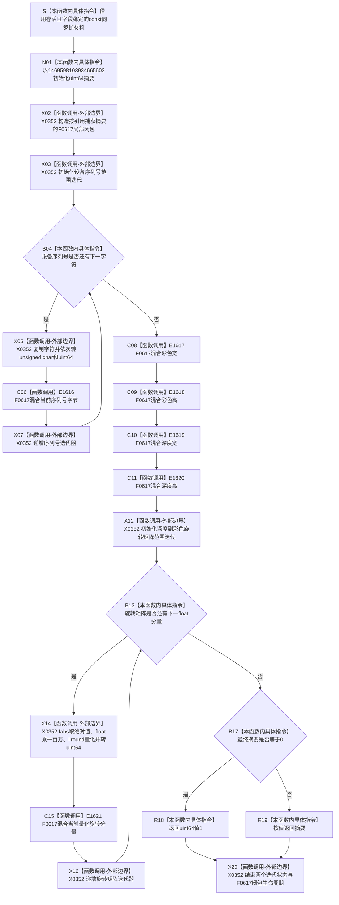

# CF-L5-0190 `计算标定摘要` 现状流程图

图类型：现状流程图
代码版本：`a48a70b2d678dea64dd8228adb4f26f0badd9506`
覆盖文件：`海中鱼巣/适配/采集器.D455相机.ixx:404-421`；局部混合 lambda 身份来源为同文件 `406-409`
唯一根函数：F0315
完整签名：`std::uint64_t 海中鱼巣::{匿名命名空间}::计算标定摘要(const 海中鱼巣::D455同步帧材料& 材料)`
参数：调用期间存活且不可并发写的非拥有 `const D455同步帧材料& 材料`
返回结果：按固定令牌顺序形成模 2^64 的自定义滚动摘要；原累计值为 0 时返回 1，因此值域为 `1..UINT64_MAX`
非法值 / 拒绝：无结构化拒绝；任意可读取材料都会形成非零值，巨大有限旋转分量的 `llround` 越界和浮点异常没有显式收口
已登记调用方：F0113 → F0315 的 E0593，七项平面 / 外参读取成功后写入未发布同步帧材料的 `标定版本摘要`
直接项目函数：F0617 局部混合 lambda；六个静态调用点分别覆盖序列号循环、四个尺寸和旋转矩阵循环
调用图：`流程图/代码流程图/00_调用知识图谱.md`
逐行映射表：`流程图/代码流程图/L5/CF-L5-0190_计算标定摘要_逐行代码映射表.md`
输入契约 / 调用语境表：本文“输入契约与非成功语境”
非成功返回二分审查表：本文“输入契约与非成功语境”
偏差清单：`流程图/代码流程图/00_规范偏差审计.md` 的 F0315 切片
依据提交 / 结构化消息：冻结源码提交 `a48a70b2d678dea64dd8228adb4f26f0badd9506`；只读子智能体分析，主智能体按既有局部 lambda 图谱口径统一复核和写入
入口前置：F0113 已成功复制四平面和三组外参；材料仍由本轮独占、尚未发布，随后还要执行 F0108 完整材料有效性校验
结构读取与写入：只读设备序列号、彩色 / 深度宽高和深度到彩色旋转矩阵；只写局部摘要并按值返回
逻辑内返回：任意正常可读输入都返回非零值；摘要原值 0 映射为 1 不是拒绝
内部错误：悬空 / 并发修改材料、巨大有限分量导致量化越界、浮点陷阱，或调用方把摘要相等升级为完整标定相等
生命周期与资源释放：F0617 闭包按引用借用局部摘要且不逃逸；两个范围循环只持有输入成员借用
异常：函数未声明 `noexcept`；当前无分配，数学域 / 范围错误通常经浮点状态或 errno 表达而非 C++ 异常，但陷阱环境未冻结
并发 / 幂等：输入字段稳定和浮点环境相同时重复调用确定且可重入；不为并发写提供同步
验证入口：冻结源码 blob `9009c0c875af65020d4e2edef14a5e33aa7cc948`、404—421 行、E0593 / E1616—E1621、F0617 和 X0352 机械核对
验证输出：本批按 610 函数 / 309 已完成 / 301 待处理、1631 项目边、351 外部边界、7 未解析调用执行闭合验证
依据：`规范/0050_项目通用机器逻辑与禁止性规则总纲_20260721.md`、`规范/0600_代码函数流程图应用与维护规范.md`、`规范/6350_子规范_双目相机外设独占观察线程_20260720.md`、`规范/详细设计/D455相机采样材料入口详细设计.md`
不得作为施工许可：是
不得宣称：标准 FNV-1a、密码学摘要、完整标定身份、无碰撞、跨版本 / 跨架构稳定编码、材料相同或 D455 生产闭环成立

## 流程图

## 节点合同

| 节点组 | 类型 | 输入 | 输出 / 结构变化 | 非成功口径 | 验证 |
| --- | --- | --- | --- | --- | --- |
| S—N01 | 指令 | const 材料引用、固定种子 | 栈内 uint64 摘要 | 不适用 | 404—405 行 |
| X02—X07 | 外部边界 / 判断 / 项目调用 | 摘要引用、设备序列号字符 | 每个字符经 F0617 更新摘要 | 空序列零轮，不拒绝 | 406—412 行 |
| C08—C11 | 项目调用 | 四个 uint32 尺寸 | 固定顺序更新摘要 | 无拒绝 | 413—416 行 |
| X12—X16 | 外部边界 / 判断 / 项目调用 | 九个旋转 float 分量 | 绝对值百万倍量化后经 F0617 更新 | 量化越界为内部错误 | 417—419 行 |
| B17—X20 | 指令 / 外部边界 | 最终摘要 | 1 或原摘要 | 0→1 造成显式别名，不是拒绝 | 420—421 行 |

## 输入契约与非成功语境

| 结果 / 风险 | 当前行为 | 二分口径 | 后续 |
| --- | --- | --- | --- |
| 正常有限标定材料 | 形成非零摘要 | 普通派生材料 | F0113 写入后执行整批有效性校验 |
| 空序列号 / 零尺寸 | 仍形成摘要 | 本函数不拒绝 | 当前 F0113 前置 / 后置应拒绝非法整批 |
| 旋转 `-0/+0` 或符号相反 | `fabs` 后令牌相同 | 设计 / 实现证据缺口 | 不得以摘要相等证明旋转相等 |
| 巨大有限旋转分量 | 乘法可转无穷，`llround` 可越界 | 内部错误 | 当前没有结构化收口 |
| uint64 乘法回绕 | F0617 按模 2^64 更新 | 定义明确的普通计算 | 增加碰撞，不是失败 |
| 原摘要 0 | 强制返回 1 | 普通非零化 | 与原摘要 1 显式别名 |
| 摘要碰撞 | 当前不可观察 | 只允许非权威摘要 | 必须回读真实材料，不得裁决标定身份 |

## 调用与边界汇总

- 保留 E0593：F0113 → F0315；新增 F0617 为 L6 待处理局部 lambda。
- E1616—E1621 对应六个静态调用点；序列号和旋转矩阵循环的运行时调用次数不复制成静态项目边。
- X0352 聚合局部闭包、两个范围循环、字符无符号转换、`fabs`、百万倍 float 量化、`llround`、uint64 转换和返回生命周期。
- 当前令牌只含设备序列号、RGB / Depth 宽高和 `Depth → RGB` 旋转绝对值；遗漏四路内参、畸变、深度比例、三组平移、两组 IR 外参和其它标定字段。
- 初始常量不是标准 FNV-1a 64 位 offset basis；摘要字段没有算法版本，不能承担跨版本标定身份。
