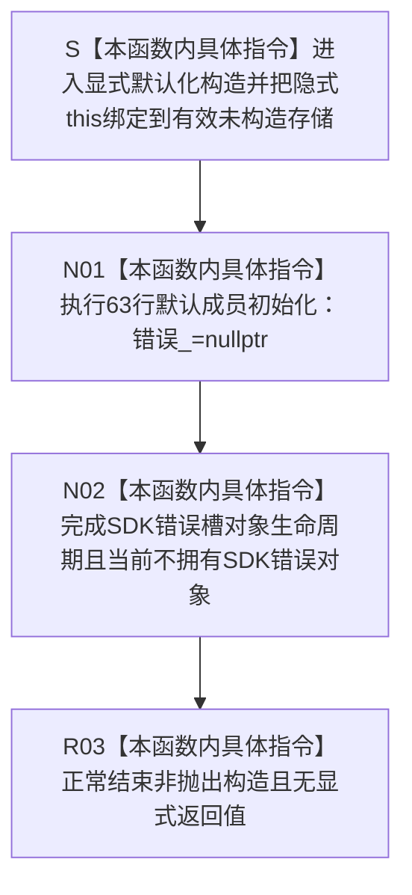

# CF-L5-0191 `SDK错误槽::SDK错误槽` 现状流程图

图类型：现状流程图
代码版本：`a48a70b2d678dea64dd8228adb4f26f0badd9506`
覆盖文件：`海中鱼巣/适配/采集器.D455相机.ixx:42-64`；根定义在 44 行，默认成员初始化器在 63 行
唯一根函数：F0316
完整签名：`海中鱼巣::{匿名命名空间}::SDK错误槽::SDK错误槽()`
参数：无显式参数；隐式 `this` 指向满足对齐且尚未开始完整对象生命周期的存储
返回结果：构造函数无返回类型；正常完成后形成 `错误_ == nullptr`、尚未拥有 SDK 错误对象的完整 `SDK错误槽`
非法值 / 拒绝：无逻辑内拒绝；无效存储、重复 placement 构造或并发抢先访问违反 C++ 生命周期前置
已登记调用方：冻结源码共有 43 个根可达源码构造点；循环 / lambda 点运行时可构造多次
直接项目函数：无
调用图：`流程图/代码流程图/00_调用知识图谱.md`
逐行映射表：`流程图/代码流程图/L5/CF-L5-0191_SDK错误槽默认构造_逐行代码映射表.md`
输入契约 / 调用语境表：本文“构造与所有权语境”
非成功返回二分审查表：本文“构造与所有权语境”
偏差清单：`流程图/代码流程图/00_规范偏差审计.md` 的 F0316 切片
依据提交 / 结构化消息：冻结源码提交 `a48a70b2d678dea64dd8228adb4f26f0badd9506`；只读子智能体全量构造点扫描，主智能体统一复核和写入
入口前置：每个调用点提供新的自动局部对象存储；旧对象生命周期未在同一存储中存续
结构读取与写入：只把对象成员裸指针初始化为空；不调用 RealSense，不写 D455 材料或项目机器事实
逻辑内返回：无；正常构造只有一个空槽后置
内部错误：生命周期存储无效、构造完成前并发访问，或后继在非空错误尚未释放时再次借出接收槽
生命周期与资源释放：构造完成后对象独占成员指针槽；F0307 只借出地址，F0308 判空，F0309 在对象退出时唯一释放非空错误对象
异常：源码未显式写 `noexcept`；当前仅执行裸指针空初始化，推导异常规范为非抛出，但未来成员变化可使合同漂移
并发 / 幂等：每个新对象独立构造；对同一存储重复构造不是幂等操作
验证入口：冻结源码 blob `9009c0c875af65020d4e2edef14a5e33aa7cc948`、44 / 63 行、43 条 F0316 入边与 F0307 / F0308 / F0309 各 43 个源码点机械对账
验证输出：本批按 610 函数 / 309 已完成 / 301 待处理、1631 项目边、351 外部边界、7 未解析调用执行闭合验证
依据：`规范/0050_项目通用机器逻辑与禁止性规则总纲_20260721.md`、`规范/0600_代码函数流程图应用与维护规范.md`、`规范/6350_子规范_双目相机外设独占观察线程_20260720.md`、`规范/详细设计/D455相机采样材料入口详细设计.md`
不得作为施工许可：是
不得宣称：SDK 调用成功、错误对象存在 / 已分类、运行期只构造 43 个实例、所有错误资源已配对释放或 D455 生产闭环成立

## 流程图

## 构造与所有权语境

| 语境 | 当前事实 | 二分口径 | 后续 |
| --- | --- | --- | --- |
| 新自动局部对象 | 63 行把唯一成员置空 | 普通构造完成 | F0307 可借出成员地址 |
| 循环 / lambda 构造点 | 每次执行形成新的对象实例 | 普通构造完成 | 不能把 43 个源码点解释为 43 个运行时实例上限 |
| 无效 / 重复构造存储 | 当前没有结构化检测 | 内部错误 / 未定义行为 | C++ 生命周期前置治理 |
| 构造后从未写入错误 | F0309 仍执行，空值分支不调用 SDK 释放 | 普通资源收口 | 不证明 SDK 调用发生或成功 |
| 非空槽再次接收 | 构造不能阻止后继覆盖已有错误指针 | 设计 / 接口缺口 | SDK错误槽一次接收与诊断双账 |

## 43 个根可达构造点

| 调用方 | 源码位置 | 源码点数 | 语境 |
| --- | --- | ---: | --- |
| F0113 | 608、624、634 | 3 | 等待、帧数量、每轮提取 |
| F0115 | 702 | 1 | 管线停止 |
| F0295 | 455、460、465、473、527、529、534、554、564 | 9 | 打开设备和管线 |
| F0311 | 298、306 | 2 | 帧 profile 身份 |
| F0313 | 319、329、331、333、335、337、344、346、348、350、353 | 11 | 平面 profile、布局和材料读取 |
| F0314 | 387、389、395 | 3 | 两个 profile 和外参 |
| F0594 | 721 | 1 | 打开失败停止收口 |
| F0595 | 89、98 | 2 | 设备信息支持 / 读取 |
| F0598 | 265、270、276、281、290 | 5 | 传感器列表、枚举、类型和比例 |
| F0599 | 540 | 1 | 每次启用流 lambda |
| F0600 | 231、237、247 | 3 | 实际流配置列表和每轮读取 |
| F0613 | 189、197 | 2 | profile 数据和分辨率 |
| 合计 | 43 个源码点 | 43 | 与 F0307 / F0308 / F0309 各 43 个点闭合 |

## 调用与边界汇总

- F0316 本体项目被调函数 0、外部边界身份 0、未解析调用 0。
- 2a227ea1 已登记 26 条构造边；本批新增 E1611—E1613 的 F0314 三条和 E1622—E1635 的其它 14 条，使 F0316 入边达到 43。
- 44 行 `= default` 仍执行 63 行默认成员初始化，不是保持未初始化内存的空操作。
- 复制构造和复制赋值在 45—46 行删除；用户声明析构抑制隐式 move，当前槽不可复制、不可移动。
