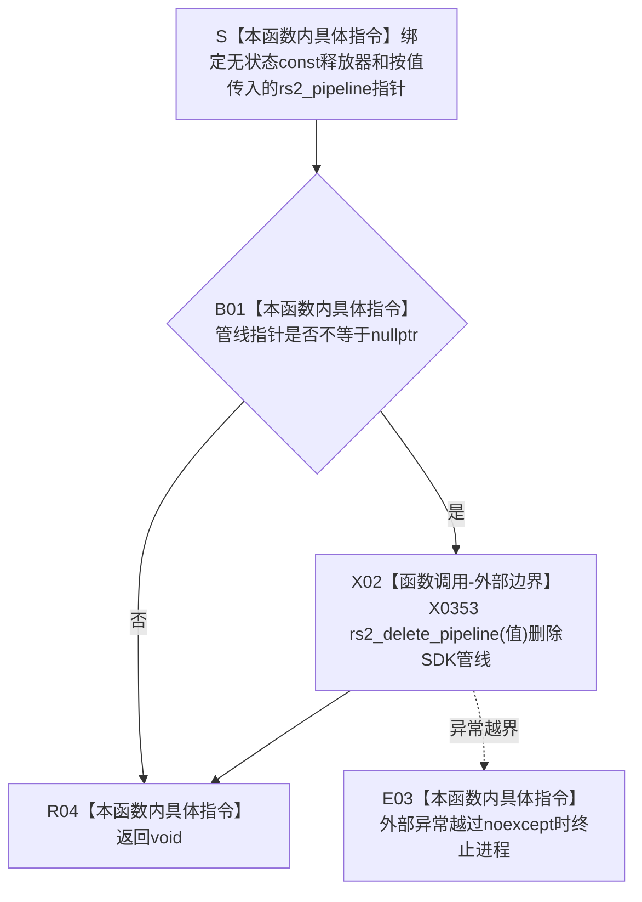

# CF-L5-0192 `管线释放器::operator()` 现状流程图

图类型：现状流程图
代码版本：`a48a70b2d678dea64dd8228adb4f26f0badd9506`
覆盖文件：`海中鱼巣/适配/采集器.D455相机.ixx:69`
唯一根函数：F0317
完整签名：`void 海中鱼巣::{匿名命名空间}::管线释放器::operator()(rs2_pipeline* 值) const noexcept`
参数：隐式无状态 `const 管线释放器* this`；显式按值接收 `rs2_pipeline* 值`，非空时必须是调用方交给删除器消费的唯一拥有 SDK 管线
返回结果：`void`；空指针无操作，非空时调用一次 `rs2_delete_pipeline(值)` 后结束
非法值 / 拒绝：空值允许；借用、悬空、已删除、重复归属、仍在采样或仍被其它 SDK 句柄使用的非空指针违反生命周期前置且没有结构化拒绝
已登记调用方：F0115 → F0317 的 E0602、F0295 → F0317 的 E1440、F0594 → F0317 的 E1636
直接项目函数：无
调用图：`流程图/代码流程图/00_调用知识图谱.md`
逐行映射表：`流程图/代码流程图/L5/CF-L5-0192_管线释放器调用_逐行代码映射表.md`
输入契约 / 调用语境表：本文“输入契约与非成功语境”
非成功返回二分审查表：本文“输入契约与非成功语境”
偏差清单：`流程图/代码流程图/00_规范偏差审计.md` 的 F0317 切片
依据提交 / 结构化消息：冻结源码提交 `a48a70b2d678dea64dd8228adb4f26f0badd9506`；MSVC / Clang 对采集器模块仅保留缺少 RealSense 外部头的环境诊断；只读源码审计由主智能体复核
入口前置：`管线指针 = std::unique_ptr<rs2_pipeline, 管线释放器>` 在 reset 或析构时只对非空旧值调用本删除器；正常关闭和打开失败均先尝试停止已启动管线
结构读取与写入：只消费外部 SDK 管线；不写项目仓库、关系、索引、D455 材料或采集状态，owner 置空由 `unique_ptr` 完成
逻辑内返回：空值直接返回 `void`
内部错误：指针不是唯一有效拥有值、管线仍被并发使用、同一值重复删除，或外部异常越过 `noexcept`
生命周期与资源释放：非空调用返回后管线句柄生命周期结束；本函数不调用 `rs2_pipeline_stop`，也不验证停止成功
异常：声明 `noexcept`；外部 C API 没有 C++ 异常结果，异常越界会终止进程
并发 / 幂等：无锁且不是幂等入口；同一管线只能删除一次，并要求采样和其它管线操作已经静止
验证入口：冻结源码 blob `9009c0c875af65020d4e2edef14a5e33aa7cc948`、69 行、E0602 / E1440 / E1636 和 X0353 机械核对
验证输出：本批按 610 函数 / 312 已完成 / 298 待处理、1632 项目边、353 外部边界、7 未解析调用执行闭合验证
依据：`规范/0050_项目通用机器逻辑与禁止性规则总纲_20260721.md`、`规范/0600_代码函数流程图应用与维护规范.md`、`规范/6350_子规范_双目相机外设独占观察线程_20260720.md`、`规范/详细设计/D455相机采样材料入口详细设计.md`
不得作为施工许可：是
不得宣称：管线已成功停止、SDK 内部资源已读回确认、并发采样已经静止、真实样本通过或 D455 生产闭环成立

## 流程图

## 节点合同

| 节点 | 类型 | 参数 / 输入绑定 | 结果 / 输出绑定 | 事实读写 | 后继条件 | 验证 |
| --- | --- | --- | --- | --- | --- | --- |
| S | 指令 | 无状态 `const this`、按值 `rs2_pipeline*` | 活动调用材料 | 无 | 输入绑定完成 | 69 行 |
| B01 | 指令 | `值` | 空值比较结果 | 无 | 非空 / 空 | 69 行 |
| X02 | 外部边界 | 非空唯一拥有管线 | 无返回值 | 删除外部 SDK 管线 | 正常返回 / 异常越界 | 69 行、X0353 |
| E03 | 指令 | 异常越界 | 进程终止 | 无可读半结构 | 不返回 | `noexcept` |
| R04 | 指令 | 空值或删除调用完成 | `void` | 不写项目机器事实 | 退出函数 | 69 行 |

## 输入契约与非成功语境

| 入口 / 节点 | 输入来源 | 上游是否保证有效 | 非成功结果 | 二分口径 | 结构变化与后续归属 |
| --- | --- | --- | --- | --- | --- |
| E0602 → S | F0115 `关闭` 的成员管线 reset | 是；当前 owner 非空时为唯一拥有句柄 | stop 失败仍继续删除 | 资源收口 / 停止失败由 F0115 记录 | 删除后 owner 由 reset 置空 |
| E1440 → S | F0295 `打开` 的 reset 旧值 | 合法状态机预期旧值为空；非空表示重开 / 状态漂移 | 删除旧管线但不先 stop | 具名前置违反 | F0295 生命周期和重复打开合同 |
| E1636 → S | F0594 `打开失败` 的成员管线 reset | 是；已启动时先调用 stop | stop 错误只提升追根因，不阻止删除 | 资源收口 | 删除后继续释放上下文 |
| B01 空分支 | 空指针 | 允许 | 无操作返回 | 逻辑内生命周期分支 | 标准 `unique_ptr` 动态回调通常不传空 |
| 非法所有权 | 借用 / 悬空 / 重复拥有 / 在途使用 | 否 | 可能重复删除、竞态或未定义行为 | 内部错误 | 管线唯一所有权与并发静止合同 |
| X02 异常越界 | 外部 C API | 当前未证明存在 | `noexcept` 终止 | 追根因解决 | 外部释放异常合同 |

## 调用与边界汇总

- E0602 和 E1440 已有；本批补登记 F0594 失败收口的 E1636。F0117 析构先调用 F0115 并把成员置空，正常成员析构不再动态调用 F0317。
- X0353 只表示 69 行静态 `rs2_delete_pipeline` 边界；RealSense 头和实现属于外部依赖，不生成项目函数流程图。
- 删除器不负责 stop；F0115 / F0594 即使 stop 报错仍删除管线，F0295 的旧值非空分支甚至没有当前 stop。
- `void` 正常返回只证明删除调用已经返回，不提供 SDK 内部资源、设备状态或并发静止读回。
