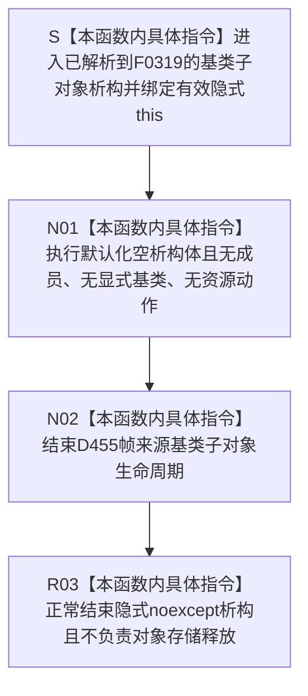

# CF-L5-0194 `D455帧来源::~D455帧来源` 现状流程图

图类型：现状流程图
代码版本：`a48a70b2d678dea64dd8228adb4f26f0badd9506`
覆盖文件：`海中鱼巣/适配/协议.D455采样材料.ixx:160-167`；根定义在 162 行
唯一根函数：F0319
完整签名：`海中鱼巣::D455帧来源::~D455帧来源() noexcept`
参数：无显式参数；隐式 `this` 指向派生对象成员已经析构、但 `D455帧来源` 基类子对象仍存活的有效存储
返回结果：析构函数无返回类型；正常完成后结束 `D455帧来源` 基类子对象生命周期，不负责完整对象存储释放
非法值 / 拒绝：没有合法空 `this`；悬空、已析构、重复析构或仍被其它线程虚调用的对象违反 C++ 生命周期前置且无结构化拒绝
已登记调用方：F0117 → F0319 的 E0605；当前根可达唯一具体类型为 `D455相机采集器 final`
直接项目函数：无
调用图：`流程图/代码流程图/00_调用知识图谱.md`
逐行映射表：`流程图/代码流程图/L5/CF-L5-0194_D455帧来源析构_逐行代码映射表.md`
输入契约 / 调用语境表：本文“析构与所有权语境”
非成功返回二分审查表：本文“析构与所有权语境”
偏差清单：`流程图/代码流程图/00_规范偏差审计.md` 的 F0319 切片
依据提交 / 结构化消息：冻结源码提交 `a48a70b2d678dea64dd8228adb4f26f0badd9506`；`tools/clang_ast` 对协议模块成功抽取该显式默认析构且 `flow_nodes=0`；主智能体逐行复核
入口前置：虚析构已经解析到当前 final 派生对象；F0117 显式析构体、成员和空基类之前的派生生命周期均按顺序结束
结构读取与写入：默认化空析构不读写字段、不调用关闭 / 停止、不释放 SDK 资源、不写项目机器事实
逻辑内返回：无；析构只有正常生命周期结束路径
内部错误：非法 `this`、重复析构、对象仍被并发使用，或未来基类成员使推导异常合同漂移
生命周期与资源释放：类无数据成员和显式基类；只结束当前基类子对象，完整对象存储由调用方的 delete / unique_ptr 边界释放
异常：源码未拼写 `noexcept`，当前默认化空析构推导为 `noexcept(true)`；编译器 ABI 析构变体不另建项目函数身份
并发 / 幂等：不是幂等入口；析构前必须销毁借用者并停止任何虚调用
验证入口：冻结源码 blob `f110508fd4e607469d69db1068bd1b15ee010d60`、160—167 行、E0605 和 Clang 候选机械核对
验证输出：本批按 610 函数 / 312 已完成 / 298 待处理、1632 项目边、353 外部边界、7 未解析调用执行闭合验证
依据：`规范/0050_项目通用机器逻辑与禁止性规则总纲_20260721.md`、`规范/0600_代码函数流程图应用与维护规范.md`、`规范/6350_子规范_双目相机外设独占观察线程_20260720.md`、`规范/详细设计/D455相机采样材料入口详细设计.md`
不得作为施工许可：是
不得宣称：具体采集器已关闭、SDK 资源已释放、在途线程已收口、对象存储已释放、真实样本通过或 D455 生产闭环成立

## 流程图

## 析构与所有权语境

| 语境 | 当前事实 | 二分口径 | 后续 |
| --- | --- | --- | --- |
| E0605 / F0117 | final 具体采集器显式析构、成员逆序析构后进入基类析构 | 普通生命周期收口 | 基类结束后由调用方释放完整对象存储 |
| F0038 成功拥有 | `unique_ptr<D455帧来源>` 动态解析到 F0117，再由 E0605 进入 F0319 | 普通生命周期收口 | E0178 覆盖正常退出和非空后的异常展开 |
| F0101 打开失败 | 局部具体 unique_ptr 先调用 F0117，再由 E0605 进入 F0319 | 普通失败收口 | E0539 已覆盖 |
| F0038 打开失败早退 | 工厂失败时已经在 F0101 销毁局部具体对象并返回空 base unique_ptr | 不调用 F0319 | 删除原不可达 E0181 和 N10A |
| 非法 `this` / 重复析构 | 当前没有结构化检测 | 内部错误 / 未定义行为 | C++ 生命周期前置治理 |
| 编译器 ABI 变体 | base / complete / deleting 析构可能生成多个符号 | 同一源码函数身份 | 不新增项目函数或外部边界 |

## 调用与边界汇总

- F0319 项目被调函数 0、外部边界身份 0、未解析调用 0；唯一直接入边 E0605 完整。
- `D455帧来源` 无数据成员和显式基类，163—166 行四个纯虚业务入口不属于析构运行路径。
- F0038 的失败分支 `!打开结果.成功 || !采集器` 中，工厂失败已返回空 unique_ptr；原“非空早退析构”E0181 / N10A 不可达，本批删除。
- E0178 仍由 F0038 指向 F0117，但条件扩展为成功取得非空对象后的正常退出或任意异常展开；F0319 继续只通过 E0605 到达。
- `operator delete` 和 `unique_ptr` 控制块属于调用方 / 标准库边界，不是 F0319 内部调用，也不为其生成项目函数流程图。
