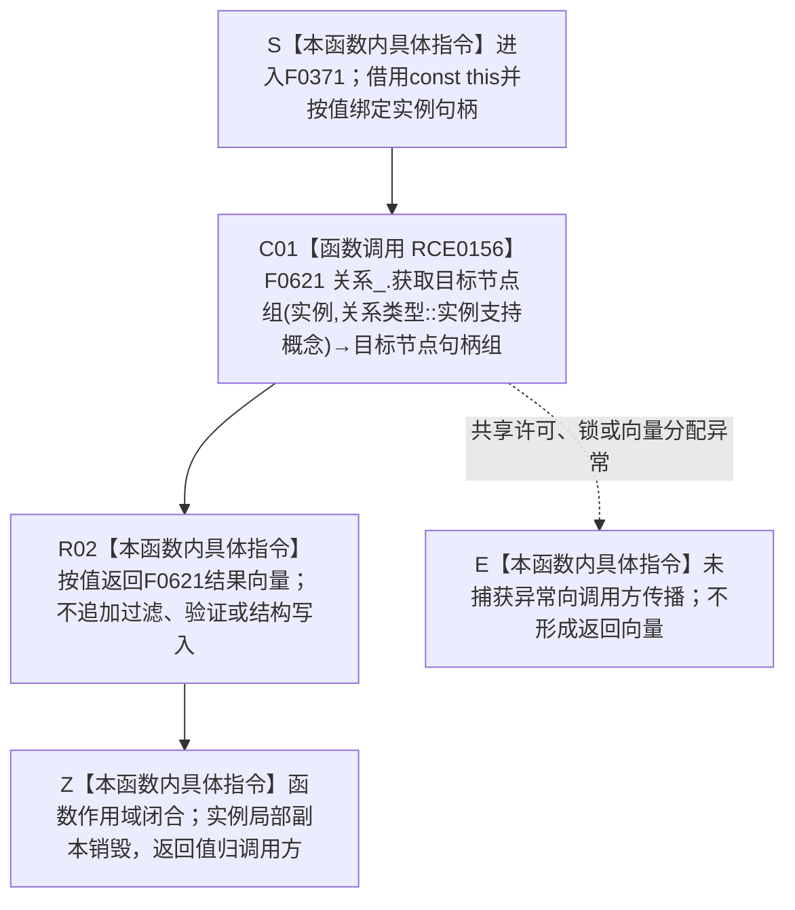

# CF-L5-0195 `概念图服务::读取实例支持概念` 现状流程图

图类型：现状流程图
代码版本：`7342125cb3aa42b81a2c01393ca86abd383ec387`
覆盖文件：`海中鱼巣/领域/概念图服务.h:1044-1046`
唯一根函数：F0371
完整签名：`std::vector<海中鱼巣::节点句柄> 海中鱼巣::概念图服务::读取实例支持概念(海中鱼巣::节点句柄 实例) const`
参数：隐式 `this` 是调用期有效的 const `概念图服务` 非拥有借用；`实例` 按值复制完整节点句柄，不转移实例节点所有权
返回结果：把 F0621 针对固定关系类型 `关系类型::实例支持概念` 返回的目标节点句柄组按值返回；返回向量拥有自己的句柄副本，不拥有目标节点
非法值 / 拒绝：本函数没有显式准入和具名拒绝；无效实例、没有有效关系或所有候选目标均失效时，F0621 返回空向量，本函数原样返回
已登记调用方：F0191 经 E0780；F0259 经 E1099
调用方图：`流程图/代码流程图/L5/CF-L5-0071_概念图服务确保实例支持对应根_现状流程图.md`；`流程图/代码流程图/L5/CF-L5-0135_运行自我存在实例根支持自检_现状流程图.md`
直接项目函数：F0621，共 1 个项目调用点，调用关系 RCE0156
外部边界：无；`std::vector` 是公开返回类型，但本函数源码没有单独显式调用标准库函数
未解析项目调用：无
调用图：`流程图/主程序可达调用关系/01_main可达项目调用边表.md`
逐行映射表：`流程图/代码流程图/L5/CF-L5-0195_概念图服务读取实例支持概念_逐行代码映射表.md`
输入契约 / 调用语境表：本文“调用语境与非成功分账”
非成功返回二分审查表：本文“调用语境与非成功分账”
偏差清单：本文“当前边界与规范核对”
依据提交 / 结构化消息：冻结源码提交 `7342125cb3aa42b81a2c01393ca86abd383ec387`；E0780、E1099、RCE0156 及 F0621 两参数重载由源码和 main 可达关系表交叉复核
结构读取与写入：本函数只转发 F0621 的只读关系查询；F0621 在共享许可下读取有效关系，过滤无效源、未定义关系类型、失效关系和无效目标，不写机器结构
逻辑内返回：对一般读取调用，空向量可以表示无有效支持关系或输入不能查询；本函数不区分空结果原因
内部错误：F0191 在刚完成关系 9 绑定后调用本函数，若结果不包含预期根节点，则由 F0191 的双向读回后验进入追根因；F0371 自身不判定该语境
生命周期与资源释放：`实例` 局部副本随函数退出销毁；返回向量按值交给调用方，仓库关系和节点生命周期不受局部值销毁影响
异常：未声明 `noexcept` 且不捕获；F0621 的共享许可、锁或向量分配异常直接向调用方传播
并发 / 幂等：只读且对同一仓库快照结果确定；F0621 查询期间持有关系仓库共享锁，返回后向量是值式投影，不保证后续关系当前性不变化
验证入口：`概念图服务.h:1044-1046`、E0780、E1099、RCE0156
验证输出：3 行源码完整覆盖；1 个项目调用点、0 外部边界、0 未解析项目调用；本批不运行构建或程序
依据：`规范/0050_项目通用机器逻辑与禁止性规则总纲_20260721.md`、`规范/0600_代码函数流程图应用与维护规范.md`、`规范/4010_子规范_统一仓库稳定句柄与通用关系索引边界.md`、`规范/7140_子规范_概念身份生命周期退役删除与活动投影分账.md`
不得作为施工许可：是
不得宣称：空向量已证明实例没有历史支持关系、非空向量中的目标仍是当前概念、读取已经验证实例与概念类别兼容，或返回投影在函数退出后继续保持当前

## 流程图

## 项目源码调用合同

| 调用边 | 节点 | 被调函数 | 实参 | 结果 / 条件 | 被调图 |
| --- | --- | --- | --- | --- | --- |
| RCE0156 | C01 | F0621 `std::vector<海中鱼巣::节点句柄> 海中鱼巣::关系仓库::获取目标节点组(海中鱼巣::节点句柄, 海中鱼巣::关系类型) const` | `this=&关系_`、`实例`、`关系类型::实例支持概念` | 函数进入后无条件调用；返回有效关系 9 的有效目标句柄组，按顺序号、关系编号稳定排序 | 待生成 |

## 已登记调用方

| 调用方 | 调用边 | 位置 / 前置 | 本函数结果用途 | 调用方图 |
| --- | --- | --- | --- | --- |
| F0191 `概念图服务::确保实例支持对应根` | E0780 | `概念图服务.h:4417`；E0779 绑定返回 `true` | 与反向读取结果共同检查新绑定关系可双向读回 | [F0191](CF-L5-0071_概念图服务确保实例支持对应根_现状流程图.md) |
| F0259 `运行自我存在实例根支持自检` | E1099 | `自检.入口初始化.ixx:241-242`；初始化结果成功、根支持句柄相等后 | 读取自我存在实例支持概念并检查向量大小为 1 | [F0259](CF-L5-0135_运行自我存在实例根支持自检_现状流程图.md) |

## 调用语境与非成功分账

| 调用语境 | 当前前置 | 空向量后继 | 二分口径 | 结构后果 |
| --- | --- | --- | --- | --- |
| F0191 绑定后读回 | E0779 已返回绑定成功 | 后续双向读回条件为 false，并经 F0184 进入追根因检查 | 写入后预期关系缺失属于内部错误，不是普通候选为空 | F0371 零写入；不撤销绑定链可能形成的结构 |
| F0259 初始化自检读取 | 系统初始化成功且自我存在根支持回执等于存在根 | `.size() == 1` 为 false，自检失败 | 自检观察结果；不由 F0371 写机器事实 | F0371 零写入 |
| 一般只读调用 | 调用方只提供一个节点句柄 | 调用方可把空向量解释为当前无有效目标，但不能区分无效源与确无关系 | 协议允许的只读空结果 | 零写入 |

## 当前边界与规范核对

- F0371 精确固定关系类型 9，不接受调用方传入任意关系类型；不会把其它关系误混入返回组。
- F0621 只返回状态有效、源匹配、类型为关系 9 且目标节点有效的记录，并按顺序号和关系编号稳定排序；F0371 不增加第二份持久事实。
- 7140 要求关系 9 的源为允许实例、目标为当前概念且同一完整源目标不得重复。F0371 只读取通用仓库投影，不自行重验类别兼容、目标生命周期、顺序号固定为 1 或重复关系不变量。
- 空向量同时覆盖无效源、无有效关系及有效关系目标全部失效，不能单独证明“实例从未支持任何概念”，也不能在 F0191 的写后读回语境中降级为普通空候选。
- 返回向量是调用时刻的非持久值式投影；调用方若需要裁决当前概念身份或生命周期，必须继续读取相应权威结构和版本。
