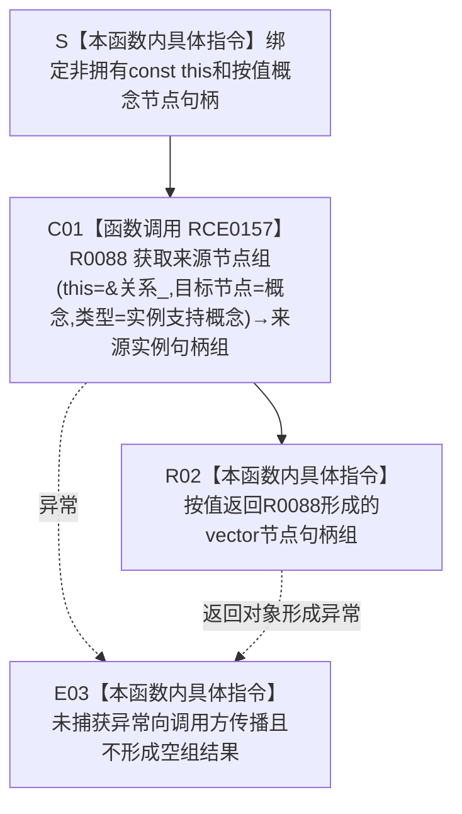

# CF-L5-0196 `概念图服务::读取支持概念的实例` 现状流程图

图类型：现状流程图
代码版本：`7342125cb3aa42b81a2c01393ca86abd383ec387`
覆盖文件：`海中鱼巣/领域/概念图服务.h:1048-1050`
唯一根函数：F0372
完整签名：`std::vector<海中鱼巣::节点句柄> 海中鱼巣::概念图服务::读取支持概念的实例(海中鱼巣::节点句柄 概念) const`
参数：隐式 `this` 是对当前 `const 概念图服务` 的非拥有借用；`概念` 按值复制完整节点句柄，不转移节点所有权
返回结果：经 R0088 按值返回以 `概念` 为关系 9 目标节点的有效来源节点句柄组；本函数不复制节点所有权、不追加过滤，也不区分无匹配关系与非法目标节点形成的空组
非法值 / 拒绝：本函数不自行拒绝；无效 `概念` 由 R0088 返回空组，悬空 `this` 或并发违反被借用服务生命周期属于调用前置错误
已登记调用方：F0191 → F0372 的 E0781；F0260 → F0372 的 E1120
直接项目函数：R0088 `关系仓库::获取来源节点组(节点句柄,关系类型) const`，调用边 RCE0157
调用图：`流程图/主程序可达调用关系/01_main可达项目调用边表.md`
逐行映射表：`流程图/代码流程图/L5/CF-L5-0196_概念图服务读取支持概念的实例_逐行代码映射表.md`
输入契约 / 调用语境表：本文“输入契约与非成功语境”
非成功返回二分审查表：本文“输入契约与非成功语境”
偏差清单：无新增；本图只冻结当前薄只读包装事实
依据提交 / 结构化消息：冻结源码提交 `7342125cb3aa42b81a2c01393ca86abd383ec387`；调用关系中的 E0781、E1120、RCE0157 与源码逐行复核
入口前置：调用期间 `this`、成员 `关系_` 及其节点有效性回调保持存活；调用方只把待反向读取的完整概念节点句柄按值传入
结构读取与写入：只经 R0088 读取关系仓库中类型为 `关系类型::实例支持概念`、目标为 `概念` 的有效关系及其有效来源节点；本函数不写节点、关系、索引或概念登记投影
逻辑内返回：R0088 对无效目标节点或零条匹配关系均返回空 vector，本函数原样按值返回
内部错误：关系仓库或节点有效性回调在前置成立后发生内部异常、并发 / 生命周期合同失效，或调用方把空组擅自解释成某一种唯一原因
生命周期与资源释放：返回 vector 及其中节点句柄均按值交给调用方；仓库、节点和概念对象所有权不转移，R0088 内部锁和临时对象在其返回前收口
异常：未声明 `noexcept` 且不捕获；R0088、分配或返回对象形成产生的异常直接向调用方传播，不形成空组假成功
并发 / 幂等：本函数无自有锁，读取同步由 R0088 承担；仓库状态不变时重复调用形成等价值式投影，不承诺跨并发写入的快照连续性
验证入口：源码 blob `dc4bd08f99622b3380c91dd15258fc8ab2e1b9c6`、1048—1050 行、E0781 / E1120、RCE0157 / R0088
验证输出：3 行源码完整覆盖；1 个项目调用点、0 个外部边界、0 个未解析项目调用
依据：`规范/0050_项目通用机器逻辑与禁止性规则总纲_20260721.md`、`规范/0600_代码函数流程图应用与维护规范.md`、`规范/4010_子规范_统一仓库稳定句柄与通用关系索引边界.md`、`规范/4050_子规范_入口拒绝逻辑内结果与内部逻辑错误.md`、`规范/7140_子规范_概念身份生命周期退役删除与活动投影分账.md`
不得作为施工许可：是
不得宣称：空组具有唯一原因、概念身份已经完整验证、关系 9 已创建、仓库状态未并发变化、节点实体所有权已经转移或相关生产闭环成立

## 流程图

## 节点合同

| 节点 | 类型 | 参数 / 输入绑定 | 结果 / 输出绑定 | 事实读写 | 后继条件 | 验证 |
| --- | --- | --- | --- | --- | --- | --- |
| S | 本函数内具体指令 | `const this`、按值 `概念` | 活动调用材料 | 无 | 输入绑定完成 | 1048 行 |
| C01 | 函数调用 | `this=&关系_`、`目标节点=概念`、`类型=关系类型::实例支持概念` | R0088 按值形成来源节点 vector | 只读关系仓库和节点有效性投影 | 正常返回 / 异常传播 | 1049 行、RCE0157 |
| R02 | 本函数内具体指令 | R0088 返回对象 | 调用方取得按值 vector | 不写项目机器事实 | 函数结束 / 返回对象形成异常 | 1049—1050 行 |
| E03 | 本函数内具体指令 | R0088 或返回对象形成异常 | 异常向调用方传播 | 不生成结构化空组结果 | 不正常返回 | 1049—1050 行 |

## 输入契约与非成功语境

| 入口 / 结果 | 输入来源 | 上游是否保证有效 | 当前行为 | 二分口径 | 后续边界 |
| --- | --- | --- | --- | --- | --- |
| E0781 → S | F0191 已绑定实例与对应概念根后，以 `根材料->根节点` 读回反向来源 | 部分保证；F0191 已取得根材料并完成绑定，但本函数不重验完整当前概念身份 | 返回关系 9 的来源实例组 | 普通只读投影；空组在该后验语境可能触发调用方追根因 | F0191 继续检查实例是否存在于返回组 |
| E1120 → S | F0260 入口初始化自检，以存在根节点读取来源实例组 | 自检已完成系统初始化和第二实例支持绑定 | 返回来源实例组并由调用方检查数量 | 自检材料读取 | F0260 期望数量为 2 |
| 无效 `概念` | 任意调用材料 | 否 | R0088 返回空组 | 逻辑内空查询结果 | 不得与合法零匹配唯一等同 |
| 合法概念但零匹配 | 当前关系仓库 | 是 / 部分保证 | R0088 返回空组 | 逻辑内空查询结果 | 调用方按自身后验合同裁决 |
| R0088 或返回对象形成异常 | 仓库读取 / 分配 / 返回边界 | 不适用 | 异常传播 | 追根因解决 | 不得折叠为空组或成功 |

## 调用与边界汇总

- RCE0157 是本函数唯一项目出边：F0372 → R0088；实参固定为 `this=&关系_`、`概念`、`关系类型::实例支持概念`。
- E0781 与 E1120 是当前已登记的两个项目入边；前者用于生产初始化后的双向读回，后者位于当前入口可达的完整自检路径。
- 本函数没有标准库、系统或第三方显式调用节点；vector 的值式返回属于 C++ 对象语义，不另造外部函数身份。
- 空 vector 同时覆盖无效目标节点和合法零匹配；本函数不能提供唯一原因，也不能替代 R0088 的锁、排序和节点有效性合同。
