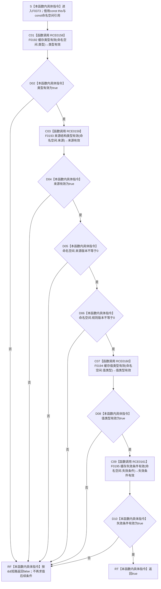

# CF-L5-0197 `统计服务::缓存命名空间有效` 现状流程图

图类型：现状流程图
代码版本：`7342125cb3aa42b81a2c01393ca86abd383ec387`
覆盖文件：`海中鱼巣/领域/统计服务.h:958-965`
唯一根函数：F0373
完整签名：`bool 海中鱼巣::统计服务::缓存命名空间有效(const 海中鱼巣::缓存命名空间& 命名空间) const`
参数：隐式 `this` 是调用期有效的 const `统计服务` 非拥有借用；`命名空间` 是调用方对象的 const 左值引用，本函数只在调用期间借用并读取字段，不复制、不保存、不取得所有权
返回结果：当且仅当缓存类型、来源结构类型、缓存值类型和缓存失效条件分别命中当前具名白名单，并且来源版本、规则版本均非零时返回 `true`；任一条件不成立即按 `&&` 左到右短路返回 `false`
非法值 / 拒绝：未设置或未知枚举、零来源版本、零规则版本均以裸 `false` 拒绝且不区分原因；悬空 `this` 或悬空 `命名空间` 引用违反 C++ 生命周期前置，不形成结构化拒绝
已登记调用方：F0196 经 E0785
调用方图：`流程图/代码流程图/L5/CF-L5-0076_统计服务创建统计快照结构_现状流程图.md`
直接项目函数：F0192、F0193、F0194、F0195，共 4 个项目调用点，调用关系 RCE0158—RCE0161
外部边界：无
未解析项目调用：无
调用图：`流程图/主程序可达调用关系/01_main可达项目调用边表.md`
逐行映射表：`流程图/代码流程图/L5/CF-L5-0197_统计服务缓存命名空间有效_逐行代码映射表.md`
输入契约 / 调用语境表：本文“调用语境与非成功分账”
非成功返回二分审查表：本文“调用语境与非成功分账”
偏差清单：本文“当前边界与规范核对”
依据提交 / 结构化消息：冻结源码提交 `7342125cb3aa42b81a2c01393ca86abd383ec387`；源码 blob `7cbbec0d46f3943a0e769599d797807f97057d84`；E0785、RCE0158—RCE0161 由源码和 main 可达关系表交叉复核
结构读取与写入：只读取传入值对象的类型、来源、来源版本、规则版本、值类型和失效条件；四个被调函数只做枚举白名单比较；不读取仓库、不修改命名空间、不写缓存或项目机器事实
逻辑内返回：任一枚举不在当前白名单或任一版本为零时返回 `false`；该结果只表示本函数的通用结构准入未通过，不携带具名失败原因
内部错误：调用方已经有正式前置保证命名空间应有效、但本函数返回 `false` 时，调用方必须追查字段或版本来源；悬空引用、对象生命周期失效及未来白名单扩展未同步属于内部合同问题
生命周期与资源释放：两个参数均为非拥有借用；函数不保存引用、不创建资源，返回后调用方继续拥有命名空间
异常：函数及四个被调函数均未声明 `noexcept`；当前冻结函数体只含字段读取、枚举比较和整数比较，没有显式抛出、分配或外部调用
并发 / 幂等：只读、无锁、无共享写入；对同一冻结值和同一白名单版本重复调用返回相同结果，但不证明来源对象或规则版本当前受支持
验证入口：`统计服务.h:958-965`、E0785、RCE0158—RCE0161、F0192—F0195 配对流程图
验证输出：8 行函数源码及所读结构字段完整覆盖；4 个项目调用点、0 外部边界、0 未解析项目调用；本批不运行构建或程序
依据：`规范/0050_项目通用机器逻辑与禁止性规则总纲_20260721.md`、`规范/0600_代码函数流程图应用与维护规范.md`、`规范/4060_子规范_非权威缓存统计失效与确定重建.md`
不得作为施工许可：是
不得宣称：返回 `true` 已证明来源稳定身份存在、来源内容版本当前、规则版本受支持、类型组合符合具体领域、允许持久化、缓存材料有效，或缓存可以裁决机器事实

## 流程图

## 项目源码调用合同

| 调用边 | 节点 | 被调函数 | 实参 | 调用前置 / 结果用途 | 被调图 |
| --- | --- | --- | --- | --- | --- |
| RCE0158 | C01 | F0192 `bool 海中鱼巣::统计服务::缓存类型有效(海中鱼巣::缓存类型 类型) const` | `this`、`命名空间.类型` | 函数进入后无条件调用；结果为 `false` 时短路整个合取式 | [F0192](CF-L5-0072_统计服务缓存类型有效_现状流程图.md) |
| RCE0159 | C03 | F0193 `bool 海中鱼巣::统计服务::来源结构类型有效(海中鱼巣::来源结构类型 来源) const` | `this`、`命名空间.来源` | 仅在 F0192 返回 `true` 后调用；结果为 `false` 时短路 | [F0193](CF-L5-0073_统计服务来源结构类型有效_现状流程图.md) |
| RCE0160 | C07 | F0194 `bool 海中鱼巣::统计服务::缓存值类型有效(海中鱼巣::缓存值类型 类型) const` | `this`、`命名空间.值类型` | 仅在前两个白名单结果为 `true` 且两个版本均非零后调用；结果为 `false` 时短路 | [F0194](CF-L5-0074_统计服务缓存值类型有效_现状流程图.md) |
| RCE0161 | C09 | F0195 `bool 海中鱼巣::统计服务::缓存失效条件有效(海中鱼巣::缓存失效条件 条件) const` | `this`、`命名空间.失效条件` | 仅在全部前置条件为 `true` 后调用；其结果成为整个合取式的最终结果 | [F0195](CF-L5-0075_统计服务缓存失效条件有效_现状流程图.md) |

## 已登记调用方

| 调用方 | 调用边 | 位置 / 前置 | 本函数结果用途 | 调用方图 |
| --- | --- | --- | --- | --- |
| F0196 `统计服务::创建统计快照结构` | E0785 | `统计服务.h:258`；F0196 已按值接收命名空间和三个计数 | 作为 F0196 专属类型、来源和值类型检查之前的第一项通用短路门禁；`false` 使 F0196 返回默认空快照 | [F0196](CF-L5-0076_统计服务创建统计快照结构_现状流程图.md) |

## 调用语境与非成功分账

| 调用语境 / 节点 | 当前前置 | `false` 原因与后继 | 二分口径 | 结构后果 |
| --- | --- | --- | --- | --- |
| E0785 / F0196 | 调用方已取得一个按值命名空间；F0373 不假定其已经通过通用准入 | 任一白名单或非零版本条件失败；F0196 随后返回默认空快照 | 写入前输入准入的逻辑内返回 | F0373 零写入，F0196 也不形成有效快照 |
| C01 / D02 | 无前置字段保证 | 类型未知或未设置；C03—C09 均不执行 | 逻辑内返回 | 零写入 |
| C03 / D04 | 缓存类型已有效 | 来源未知或未设置；D05—C09 均不执行 | 逻辑内返回 | 零写入 |
| D05 | 类型、来源均有效 | 来源版本为零；D06—C09 均不执行 | 逻辑内返回 | 零写入 |
| D06 | 前项有效且来源版本非零 | 规则版本为零；C07—C09 均不执行 | 逻辑内返回 | 零写入 |
| C07 / D08 | 类型、来源与版本前置均通过 | 值类型未知或未设置；C09 不执行 | 逻辑内返回 | 零写入 |
| C09 / D10 | 前五项全部通过 | 失效条件未知或未设置；返回 `false` | 逻辑内返回 | 零写入 |
| 正式上游已经保证完整命名空间有效 | 上游宣称所有准入字段、来源和版本已经成立 | 仍返回 `false` | 追根因解决 | 追查上游构造、版本或白名单漂移；不得把内部不一致降级为普通未命中 |

## 当前边界与规范核对

- F0373 严格保留 C++ `&&` 的左到右求值与短路顺序：RCE0158 无条件发生；RCE0159、RCE0160、RCE0161 分别受前序全部条件门控。
- 两个版本条件只检查 `!= 0`；本函数不检查版本是否仍受支持、是否与当前来源内容一致，也不比较版本新旧。
- `命名空间.可持久化` 不参与本函数结果；返回 `true` 不表示 4060 已允许该缓存持久化或恢复后消费。
- 本函数不验证缓存类型、来源和值类型的组合兼容性，不读取来源稳定身份，也不验证合法写入方、读取方、清空范围或重建策略。
- 四个白名单函数都只比较枚举，不读写 `统计服务` 状态；因此 F0373 形成的是当前代码的通用结构门禁，不是缓存材料当前性或业务事实裁决。
- 4060 要求缓存命中后仍回读权威来源；F0373 的裸 `bool` 不能替代来源回读、版本兼容或缓存三态读取结果。
