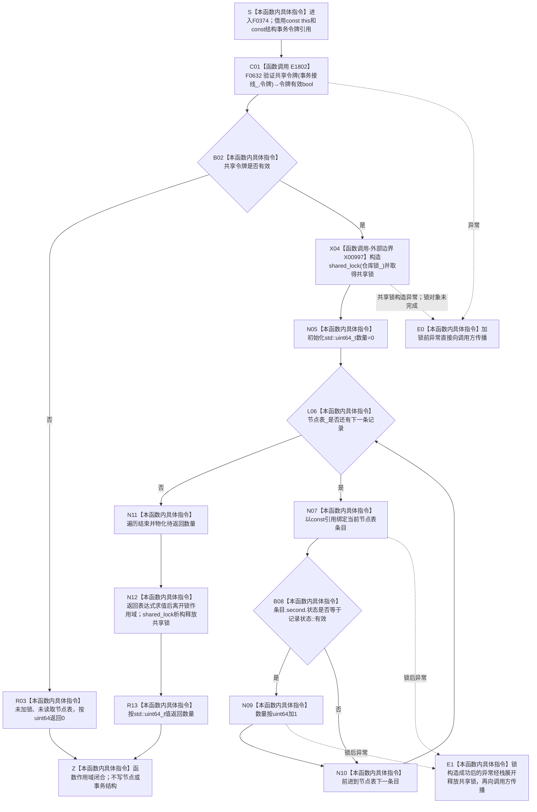

# CF-L5-0198 `节点仓库::有效节点数量(const 结构事务令牌&)` 现状流程图

图类型：现状流程图
代码版本：`4fc271f1d6adafe67b43e262527d2385ea8bcfaa`
覆盖文件：`海中鱼巣/核心/节点仓库.cpp:468-474`
唯一根函数：F0374
完整签名：`std::uint64_t 海中鱼巣::节点仓库::有效节点数量(const 海中鱼巣::结构事务令牌& 令牌) const`
参数：隐式 `this` 是调用期有效的 const `节点仓库` 非拥有借用；`令牌` 是调用方拥有且调用期间有效的 const 左值引用，本函数不复制、不保存、不延长其生命周期
返回结果：令牌验证失败时返回 `std::uint64_t{0}`；验证通过后持有仓库共享锁遍历 `节点表_`，只累计 `记录状态::有效` 的记录并按 `std::uint64_t` 返回数量
非法值 / 拒绝：F0632 判定令牌与当前事务接线不满足共享路径时，在取得仓库锁和读取节点表之前返回 0；该 0 与合法空仓库计数不可区分
已登记调用方：F0197 `节点仓库::有效节点数量() const`，经 E0789 调用
调用方图：`流程图/代码流程图/L5/CF-L5-0077_节点仓库有效节点数量_现状流程图.md`
直接项目函数：F0632，共 1 个项目调用点，调用关系 E1802
外部边界：X00997 `std::shared_lock<std::shared_mutex>` 构造及其 RAII 生命周期；标准容器遍历只作为本函数内具体循环指令，不登记为项目函数
未解析项目调用：无
调用图：`流程图/主程序可达调用关系/01_main可达项目调用边表.md`
逐行映射表：`流程图/代码流程图/L5/CF-L5-0198_节点仓库有效节点数量令牌重载_逐行代码映射表.md`
输入契约 / 调用语境表：本文“调用语境与非成功分账”
非成功返回二分审查表：本文“调用语境与非成功分账”
偏差清单：本文“当前边界与规范核对”
依据提交 / 结构化消息：冻结源码提交 `4fc271f1d6adafe67b43e262527d2385ea8bcfaa`；E0789、E1802、X00997 由源码和正式 main 可达调用边表交叉复核
结构读取与写入：令牌通过后在仓库共享锁内只读 `节点表_` 的每项 `节点记录::状态`；不创建、修改、失效或发布节点，不写索引或事务材料
逻辑内返回：一般令牌调用中，令牌不满足共享路径时按当前局部协议返回 0；合法空仓库也返回 0
内部错误：唯一 main 可达调用方 F0197 只在共享许可已经报告有效并取出令牌后调用；该语境中 F0632 再判无效表示许可、令牌或事务接线发生内部不一致，当前仍被折叠为 0
生命周期与资源释放：验证失败路径不构造共享锁；验证通过后共享锁覆盖计数初始化、全部遍历和返回表达式求值，随后 RAII 析构释放锁；返回后令牌和仓库仍由原所有者管理
异常：未声明 `noexcept` 且不捕获；F0632 异常发生在加锁前并直接传播；共享锁构造可抛出；锁构造成功后的异常按栈展开析构共享锁再传播
并发 / 幂等：持共享锁期间得到相对于同一仓库写锁的稳定遍历；返回值是调用时刻的值式计数，不保证返回后仍当前；同一冻结节点表和有效令牌重复调用得到相同数量
验证入口：`节点仓库.cpp:468-474`、E0789、E1802、X00997
验证输出：7 行源码完整覆盖；1 个项目调用点、1 类外部边界、0 未解析项目调用；本批不运行构建或程序
依据：`规范/0050_项目通用机器逻辑与禁止性规则总纲_20260721.md`、`规范/0600_代码函数流程图应用与维护规范.md`、`规范/4010_子规范_统一仓库稳定句柄与通用关系索引边界.md`、`规范/4040_子规范_不透明结构事务候选确认撤销与最后发布.md`、`规范/4050_子规范_入口拒绝逻辑内结果与内部逻辑错误.md`
不得作为施工许可：是
不得宣称：返回 0 已证明仓库合法为空、返回数量包含未发布事务候选、数量在函数退出后仍当前，或计数值本身取得独立机器事实身份

## 流程图

## 项目源码调用合同

| 调用边 | 节点 | 被调函数 | 实参 | 调用前置 / 结果用途 | 被调图 |
| --- | --- | --- | --- | --- | --- |
| E1802 | C01 | F0632 `bool 海中鱼巣::{匿名命名空间@节点仓库.cpp}::验证共享令牌(const 海中鱼巣::结构事务接线&, const 海中鱼巣::结构事务令牌&)` | `事务接线_`、`令牌` const 借用 | 函数进入后无条件调用；`false` 立即返回 0，`true` 才允许取得仓库共享锁并扫描 | 待生成 |

## 已登记调用方

| 调用方 | 调用边 | 位置 / 前置 | 本函数结果用途 | 调用方图 |
| --- | --- | --- | --- | --- |
| F0197 `节点仓库::有效节点数量() const` | E0789 | `节点仓库.cpp:456`；事务域已接入且取得的共享许可报告有效 | 令牌重载返回值成为 F0197 的最终返回值；许可在返回表达式完成后析构 | [F0197](CF-L5-0077_节点仓库有效节点数量_现状流程图.md) |

## 调用语境与非成功分账

| 调用语境 | 当前前置 | 返回 0 的原因 | 二分口径 | 结构后果 |
| --- | --- | --- | --- | --- |
| E0789 / F0197 | 共享许可已经返回有效，F0197 随即借用许可令牌调用 | F0632 再判令牌无效，或合法扫描结果确为 0 | 前者是许可 / 令牌 / 接线内部不一致，须追根因；后者是正常计数结果 | 两种路径均零写入；当前返回值无法区分 |
| 其它直接调用 | 只提供一个令牌引用 | 令牌不属于当前共享路径 | 写前入口拒绝被折叠为数值 0 | 不加锁、不读取节点表、零写入 |
| 有效令牌与空仓库 | 令牌有效并取得共享锁 | 遍历未发现状态为有效的记录 | 正常值式读取结果 | 零写入 |

## 当前边界与规范核对

- F0374 先验证共享令牌，失败路径不构造 X00997、不读取节点表；验证成功后共享锁完整覆盖初始化、遍历和返回值形成。
- 计数只依据 `节点记录::状态 == 记录状态::有效`，不会把其它状态计入；它不读取节点类型、稳定主键、版本、关系或领域类型化记录。
- 返回类型固定为无符号 `std::uint64_t`，从 0 开始逐项递增；当前代码没有饱和或溢出拒绝，结果只代表本次实际遍历的有效记录数。
- F0197 已确认共享许可有效后才调用 F0374；因此该实际调用语境中的令牌复核失败不能当作普通空仓库，但裸 0 把两者合并。
- 该数量是只读审计投影，不是节点身份或独立持久机器事实，也不证明事务候选、关系和领域记录完整。
