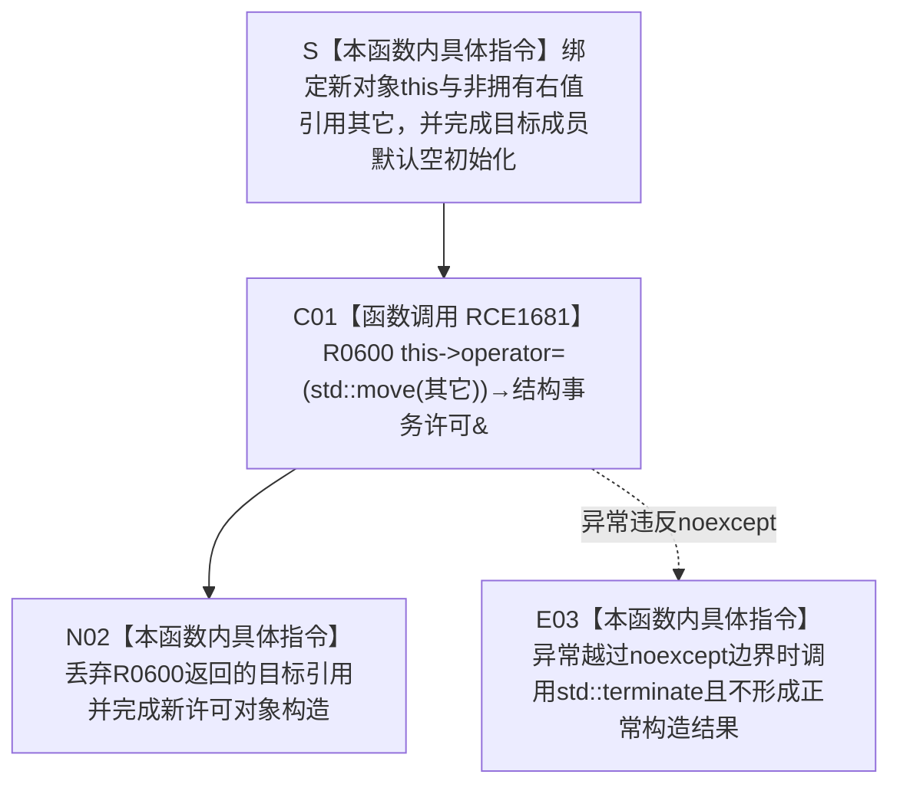

# CF-L5-0199 `结构事务许可::结构事务许可` 移动构造现状流程图

图类型：现状流程图
代码版本：`4fc271f1d6adafe67b43e262527d2385ea8bcfaa`
覆盖文件：`海中鱼巣/核心/结构事务接线.数据.h:28`
唯一根函数：F0375
完整签名：`海中鱼巣::结构事务许可::结构事务许可(海中鱼巣::结构事务许可&& 其它) noexcept`
参数：隐式 `this` 指向正在构造、尚未完成完整对象生命周期的新存储；`其它` 是绑定到来源许可对象的右值引用和非拥有借用，参数绑定本身不转移资源
返回结果：构造函数无返回类型；R0600 正常返回后形成完整的 `结构事务许可` 新对象，具体运行期状态、令牌、释放回调转移和来源清空结果全部由 R0600 裁决
非法值 / 拒绝：没有结构化拒绝；悬空来源、来源与目标存储重叠、来源被并发访问或非法重复构造属于 C++ 生命周期前置错误
已登记调用方：F0198 → F0375 的 E0793；`关系共享许可范围` 宏把取得共享许可返回的临时对象移动构造进 `optional<结构事务许可>`
直接项目函数：R0600 `结构事务许可::operator=(结构事务许可&&) noexcept`，调用边 RCE1681
外部边界：无；`std::move(其它)` 只进行值类别转换，不建立项目函数或外部函数身份
调用图：`流程图/主程序可达调用关系/01_main可达项目调用边表.md`
逐行映射表：`流程图/代码流程图/L5/CF-L5-0199_结构事务许可移动构造_逐行代码映射表.md`
输入契约 / 调用语境表：本文“移动构造与所有权语境”
非成功返回二分审查表：本文“移动构造与所有权语境”
偏差清单：无新增；本图只冻结当前委托移动赋值的实现事实
依据提交 / 结构化消息：冻结源码提交 `4fc271f1d6adafe67b43e262527d2385ea8bcfaa`；正式 main 可达调用关系表中的 E0793、RCE1681 与源码逐行复核
入口前置：`this` 指向新的合法对象存储，`其它` 指向仍存活且可独占修改的来源许可；两者不是同一对象且没有并发访问
结构读取与写入：进入函数体前，新对象成员处于默认空状态：`运行期状态_` 为空、`令牌_` 各整数为 0 且类型为 `无效`、`释放许可_ == nullptr`；本函数随后只调用 R0600，运行期状态、令牌、释放回调的实际转移和来源对象清空均属于 R0600
逻辑内返回：无拒绝分支；合法输入只有 R0600 正常完成后结束构造
内部错误：非法对象生命周期、并发移动、R0600 内部不满足无抛出合同，或调用方把“构造已返回”扩大为协调器许可仍有效 / 已验证
生命周期与资源释放：新对象初始为空，因此 R0600 对目标的前置 `释放()` 应为空操作；R0600 随后把来源许可的共享运行期状态、令牌和释放回调转入新对象并清空来源，来源仍存活但成为可安全析构的已移动对象
异常：F0375 和 R0600 均声明 `noexcept`；若 R0600 内部操作或回调违反无抛出合同并使异常越界，进程调用 `std::terminate`，F0375 不形成正常构造结果
并发 / 幂等：移动构造不是幂等操作；来源对象在调用期间须由当前线程独占，成功后只能按已移动空对象使用或析构
验证入口：源码 blob `9d89cee25f00ba0f721d0b6c1bea517524e40663`、28 行、E0793、RCE1681 / R0600
验证输出：1 行源码完整覆盖；1 个项目调用点、0 个外部调用身份、0 个未解析项目调用
依据：`规范/0050_项目通用机器逻辑与禁止性规则总纲_20260721.md`、`规范/0600_代码函数流程图应用与维护规范.md`、`规范/4040_子规范_不透明结构事务候选确认撤销与最后发布.md`、`规范/4050_子规范_入口拒绝逻辑内结果与内部逻辑错误.md`
不得作为施工许可：是
不得宣称：移动构造自行实现了资源转移、来源许可的协调器状态已读回、跨线程移动安全、释放回调成功或结构事务已经发布

## 流程图

## 节点合同

| 节点 | 类型 | 参数 / 输入绑定 | 结果 / 输出绑定 | 事实读写 | 后继条件 | 验证 |
| --- | --- | --- | --- | --- | --- | --- |
| S | 本函数内具体指令 | 新存储 `this`、非拥有 `其它&&` | 目标成员为默认空状态 | 初始化本地对象成员，不释放或取得许可 | 默认初始化完成 | 28 行 |
| C01 | 函数调用 | `this`、`std::move(其它)` | R0600 返回 `结构事务许可&` 指向目标 | 资源 / 令牌 / 回调转移及来源清空由 R0600 完成 | 正常返回 / 违反 noexcept | 28 行、RCE1681 |
| N02 | 本函数内具体指令 | R0600 返回的目标引用 | 完整构造的新许可对象；无构造返回值 | 不追加机器事实写入 | 构造结束 | 28 行 |
| E03 | 本函数内具体指令 | noexcept 越界异常 | 进程终止 | 不形成正常对象结果 | 不返回 | F0375 / R0600 `noexcept` |

## 移动构造与所有权语境

| 语境 | 当前对象状态 | 当前行为 | 二分口径 | 后继 |
| --- | --- | --- | --- | --- |
| E0793 → S | `optional` 内新对象存储尚未完成构造；来源是取得共享许可返回的临时对象 | 默认空初始化后调用 R0600 转移来源许可 | 普通 RAII 所有权转移 | optional 持有新许可；完整表达式末析构已移动来源 |
| 目标默认状态 | 空 `shared_ptr`、零 / 无效令牌、空释放回调 | R0600 的前置 `释放()` 不应调用动态释放回调 | 合法空资源动作 | 继续接收来源成员 |
| 来源有效许可 | 来源拥有运行期状态、令牌和释放回调 | R0600 转入目标并把来源置为空许可 | 普通移动结果 | 目标负责后继唯一释放；来源可安全析构 |
| 来源默认 / 已移动许可 | 来源为空 | R0600 形成空目标 | 合法移动结果 | 两对象均不持有有效许可 |
| 非法重叠 / 悬空 / 并发来源 | 生命周期前置不成立 | 当前无结构化检测 | 内部错误 / 未定义行为 | 不得解释为正常空许可 |
| noexcept 违反 | R0600 或其内部动作抛出 | `std::terminate` | 追根因解决 | 不产生逻辑内返回 |

## 调用与边界汇总

- E0793 是当前登记的唯一直接入边：F0198 在已接域且无当前关系令牌时，把取得共享许可返回的临时许可移动构造进 optional。
- RCE1681 是唯一项目出边：F0375 → R0600；调用表达式固定为 `*this = std::move(其它)`。
- `std::move` 不移动任何字段，只把 `其它` 转成允许 R0600 接收的右值表达式；不得为其建立单独项目函数或外部边界身份。
- F0375 只负责目标默认初始化、调用 R0600 和结束构造；具体资源转移、来源清空、自移动防护与释放动作均应在 R0600 单函数图中展开。
