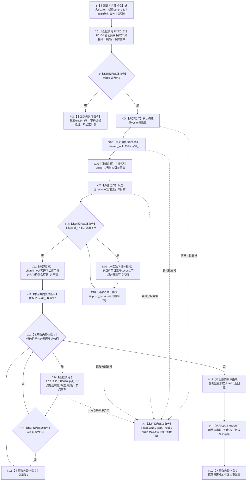

# CF-L5-0200 `索引仓库::有效主键数量` 令牌重载现状流程图

图类型：现状流程图
代码版本：`4fc271f1d6adafe67b43e262527d2385ea8bcfaa`
覆盖文件：`海中鱼巣/核心/索引仓库.cpp:418-429`
唯一根函数：F0376
完整签名：`std::uint64_t 海中鱼巣::索引仓库::有效主键数量(const 海中鱼巣::结构事务令牌& 令牌) const`
参数：隐式 `this` 是调用期有效的 const `索引仓库` 非拥有借用；`令牌` 是调用方持有共享许可期间的 const 左值引用，本函数只在调用期间借用并向节点仓库透传，不复制、不保存、不取得许可所有权
返回结果：共享令牌无效时返回 `0`；令牌有效时返回 `主键索引_` 中目标节点经同一令牌复核为当前有效的绑定记录数量。一个节点若被多个主键记录引用，会按有效主键记录分别计数，不执行节点去重
非法值 / 拒绝：R0120 拒绝未接域、错域、错纪元、非共享路径或已经失效的令牌并返回 `false`；F0376 将该拒绝折叠为 `0`，与合法空索引或全部候选节点失效的数量结果同值
实际直接调用方：F0199 经 E0805
正式入边：仅 E0805；本批已删除误绑到 F0376 且与既有边重复的 RCE0064、RCE0076、RCE0081、RCE0102、RCE0104，并将 RCE0249 改绑到无参数重载 F0199；详见本文“正式入边重载审计”
实际直接项目函数：R0120（RCE0162）与 F0630（RCE1736）
正式项目出边：RCE0162 → R0120；RCE1736 → F0630
外部边界：正式登记 X00998 `std::shared_lock` 构造；源码还显式使用标准容器默认构造、`主键索引_.size()`、`候选组.reserve(...)`、`候选组.push_back(...)`、范围迭代和 RAII 析构，均不生成项目函数图
未解析项目调用：0；F0630 目标由完整签名和定义位置唯一解析，并已登记为 RCE1736
调用图：`流程图/主程序可达调用关系/01_main可达项目调用边表.md`
外部边界表：`流程图/主程序可达调用关系/02_main可达外部边界表.md`
逐行映射表：`流程图/代码流程图/L5/CF-L5-0200_索引仓库有效主键数量令牌重载_逐行代码映射表.md`
输入契约 / 调用语境表：本文“调用语境与非成功分账”
非成功返回二分审查表：本文“调用语境与非成功分账”
偏差清单：本文“局部调用图偏差”
依据提交 / 结构化消息：冻结源码提交 `4fc271f1d6adafe67b43e262527d2385ea8bcfaa`；源码 blob `8874312f67f19b220a08b1397c6103396878513d`；E0805、RCE0162、RCE1736、X00998 与源码逐点复核；RCE0064、RCE0076、RCE0081、RCE0102、RCE0104 的删除及 RCE0249 的改绑保留为本批重载审计历史
结构读取与写入：在索引仓库共享锁内读取 `主键索引_` 并复制每条记录的节点句柄；锁外只读调用节点仓库；不修改索引、节点、关系、事务域或其它项目机器事实
逻辑内返回：共享令牌验证失败返回 `0`；有效令牌下合法空索引或没有任何有效目标节点也返回 `0`
内部错误：正式上游保证共享许可有效而 R0120 拒绝、同一许可存续期内节点仓库拒绝同一令牌、容器结构在共享锁保护下损坏或计数与权威结构读回不一致时必须追根因；本函数的裸数量不能表达这些差异
生命周期与资源释放：局部候选向量拥有节点句柄副本；索引共享锁只覆盖候选复制作用域，随后 RAII 解锁；节点有效性查询全部发生在索引锁外；返回值形成后候选向量析构释放局部存储
异常：未声明 `noexcept` 且不捕获；共享锁构造、容器分配/扩容或节点仓库读取异常向调用方传播，已成功构造的共享锁和候选向量按 C++ 栈展开逆序析构
并发 / 幂等：索引共享锁保证候选复制期间 `主键索引_` 不被索引写入并发改变；同一外部共享许可令牌继续约束节点仓库读取。函数本身不持有许可，只验证并借用令牌，调用方必须保持许可覆盖完整调用
验证入口：`索引仓库.cpp:18-20,418-429`、`节点仓库.cpp:449-451`、E0805、RCE0162、RCE1736、X00998 及本批重载审计
验证输出：418—429 行完整覆盖；实际项目调用点 2 个且均已正式登记；正式外部边界 1 个并补记源码可见标准容器/RAII 边界；本批不运行构建或程序
依据：`规范/0050_项目通用机器逻辑与禁止性规则总纲_20260721.md`、`规范/0600_代码函数流程图应用与维护规范.md`、`规范/4010_子规范_统一仓库稳定句柄与通用关系索引边界.md`、`规范/4040_子规范_不透明结构事务候选确认撤销与最后发布.md`
不得作为施工许可：是
不得宣称：数量是不同节点数量、索引记录本身证明节点存在、无效令牌与合法零数量已经区分、候选复制顺序稳定，或统计结果可以替代权威结构读回

## 流程图

## 项目源码调用合同

| 调用身份 | 节点 | 被调函数 | 实参 | 调用前置 / 结果用途 | 被调图 |
| --- | --- | --- | --- | --- | --- |
| RCE0162 | C01 | R0120 `bool 海中鱼巣::{匿名命名空间@索引仓库.cpp}::验证共享令牌(const 海中鱼巣::结构事务接线& 接线, const 海中鱼巣::结构事务令牌& 令牌)` | `事务接线_`、`令牌`，均 const 借用 | 函数进入后第一项且无条件调用；`false` 在任何容器或锁动作前返回 0 | 待生成 |
| RCE1736 | C14 | F0630 `bool 海中鱼巣::节点仓库::节点是否有效(海中鱼巣::节点句柄 节点, const 海中鱼巣::结构事务令牌& 令牌) const` | `this=&节点_`、候选句柄按值、同一 `令牌` const 借用 | 仅在令牌通过、索引锁内候选复制完成且索引锁已经释放后逐候选调用；`true` 时数量加 1 | 待生成 |

## 正式入边重载审计

| 修正前边表身份 | 表中调用方 / 位置 | 源码实际表达式 | 当前裁决 | 调用方图 |
| --- | --- | --- | --- | --- |
| E0805 | F0199 `索引仓库::有效主键数量()` / `索引仓库.cpp:405` | `有效主键数量(许可.读取令牌())` | F0376 唯一已验证直接入边；事务接线已接域且许可有效 | [F0199](CF-L5-0079_索引仓库有效主键数量_现状流程图.md) |
| RCE0064 | F0258 / `自检.入口初始化.ixx:209,218` | `上下文.索引.有效主键数量()` | 无参数重载精确绑定 F0199；与既有 E1070 重复，本批已删除 RCE0064 | [F0258](CF-L5-0134_运行概念图重复初始化结构不变自检_现状流程图.md) |
| RCE0076 | F0261 / `自检.入口初始化.ixx:291,299` | `上下文.索引.有效主键数量()` | 无参数重载精确绑定 F0199；与既有 E1141 重复，本批已删除 RCE0076 | [F0261](CF-L5-0137_运行存在根支持拒绝自检_现状流程图.md) |
| RCE0081 | F0262 / `自检.入口初始化.ixx:324` | `上下文.索引.有效主键数量()` | 无参数重载精确绑定 F0199；与既有 E1170 重复，本批已删除 RCE0081 | [F0262](CF-L5-0138_运行自我线程进入与初始化自检_现状流程图.md) |
| RCE0102 | F0266 / `自检.入口初始化.ixx:443,450` | `上下文.索引.有效主键数量()` | 无参数重载精确绑定 F0199；与既有 E1260 重复，本批已删除 RCE0102 | [F0266](CF-L5-0142_运行自我线程重复启动结构不变自检_现状流程图.md) |
| RCE0104 | F0267 / `自检.入口初始化.ixx:476` | `上下文.索引.有效主键数量()` | 无参数重载精确绑定 F0199；与既有 E1289 重复，本批已删除 RCE0104 | [F0267](CF-L5-0143_运行自我线程无效参数拒绝与生命周期自检_现状流程图.md) |
| RCE0249 | F0468 / `自检.入口初始化.ixx:62` | `装配.上下文->索引.有效主键数量()` | 无参数重载精确绑定 F0199；本批已将 RCE0249 改绑到 F0199 | 待生成 |

上述六个自检/环境函数仍可经 F0199 的接域且许可有效分支间接到达 F0376，但间接可达不能伪装为直接调用边。

## 外部边界与 RAII

| 边界身份 | 位置 | 当前源码行为 | 结果 / 失败影响 |
| --- | --- | --- | --- |
| 未编号标准容器边界 | 420 | 默认构造 `std::vector<节点句柄>` | 形成空局部候选组；异常则函数无数量返回 |
| X00998 | 422 | `std::shared_lock<std::shared_mutex>` 构造并取得 `仓库锁_` 共享锁 | 保证复制索引候选期间索引容器不被写入；构造异常向外传播 |
| 未编号标准容器边界 | 423 | `主键索引_.size()` 后调用 `候选组.reserve(...)` | 只预留容量，不改变候选数量；分配异常触发锁和向量 RAII |
| 未编号标准容器边界 | 424 | 范围遍历 `主键索引_` 并对每条记录调用 `候选组.push_back(...)` | 按 `unordered_map` 当前遍历顺序复制节点句柄；顺序不稳定但计数不依赖顺序 |
| 未编号 RAII 边界 | 425 | 内层作用域闭合并析构 `shared_lock` | 在第一次节点仓库查询前释放索引共享锁，避免同时持有索引锁和节点仓库内部锁 |
| 未编号标准容器边界 | 427 | 范围遍历局部候选向量 | 逐个提供节点句柄副本给 F0630；不读索引容器 |
| 未编号 RAII 边界 | 428—429 | 返回值形成后析构候选向量 | 释放局部容量，不影响索引记录和节点生命周期 |

## 调用语境与非成功分账

| 调用语境 / 节点 | 当前前置 | 零结果或异常后继 | 二分口径 | 结构后果 |
| --- | --- | --- | --- | --- |
| E0805 / F0199 | F0199 已确认事务域接线存在、共享许可有效并从许可借出令牌 | R0120 仍拒绝时 F0376 返回 0，F0199 原样返回 | 已成立共享许可与仓库令牌验证矛盾应追根因，不应解释为合法空索引 | 零写入 |
| C01 / D02 一般内部调用 | 调用方提供任意 const 令牌引用，本函数不假设其有效 | R0120 拒绝后返回 0 | 写入前入口拒绝的逻辑内返回；裸 0 与合法零数量同值 | 零写入，未加索引锁 |
| 有效令牌与空 `主键索引_` | R0120 已通过 | 候选组为空，返回 0 | 合法零数量 | 零写入 |
| 有效令牌但候选目标全部失效 | 候选复制完成，逐项 F0630 均返回 false | 返回 0 | 当前函数按协议只统计有效目标；但悬空索引候选仍须由权威结构审计治理，不能因计数忽略而视为结构正确 | 零写入 |
| 标准库或节点仓库异常 | 已进入候选构造、锁定或节点读取 | 异常向调用方传播；已构造对象逆序析构 | 内部错误 / 资源失败，不转换为 0 | 零写入；不遗留索引锁 |

## 局部调用图偏差

| 偏差 | 当前代码事实 | 正式表事实 | 本切片收口 |
| --- | --- | --- | --- |
| `GRAPH-F0376-INBOUND-OVERLOAD` | F0258、F0261、F0262、F0266、F0267、F0468 的具名调用点均调用无参数 F0199 | 修正前 RCE0064、RCE0076、RCE0081、RCE0102、RCE0104、RCE0249 错绑到令牌重载 F0376 | 本批已删除五条重复误绑边并将 RCE0249 改绑 F0199；F0376 正式直接入边收敛为 E0805 |
| `GRAPH-F0376-F0630-MISSING` | `索引仓库.cpp:427` 唯一绑定 F0630 两参数重载，且 F0630 已在正式函数身份表登记 | 修正前项目调用边表遗漏 F0376→F0630 | 本批已登记 RCE1736，并同步 caller/callee 正反引用 |

## 当前边界与规范核对

- 4010 规定索引只提供候选定位，命中后必须回读节点。F0376 没有把索引条目数量直接当成有效主键数量，而是在锁外逐个调用 F0630 复核节点当前有效性。
- 本函数按主键绑定记录计数，不按不同节点去重；同一有效节点对应多个主键时产生多个有效主键计数单位。
- 索引候选复制在 `仓库锁_` 共享锁内完成，节点读取在该锁释放后发生；这避免索引锁与节点仓库锁叠加，但要求调用方持有的同一共享许可覆盖整个函数。
- 无效令牌、合法空索引和全部节点失效都返回数值 0；该返回类型不能单独承载 4040 的许可拒绝、结构内部不一致或材料不足三态。
- 节点失效候选不会被本函数删除、补写或修复；统计结果也不能证明正反绑定一致、类型正确或领域当前性成立。
