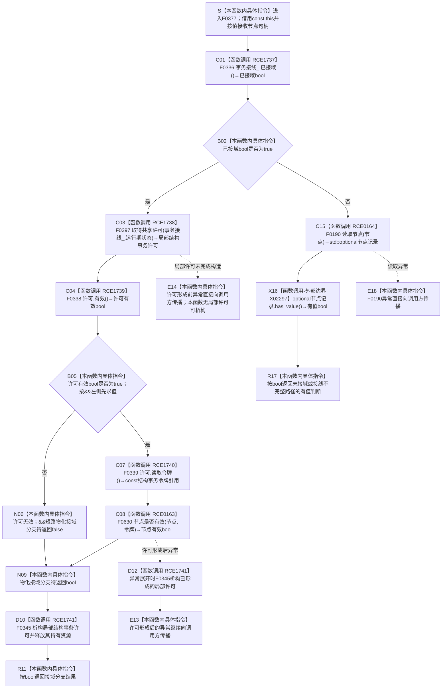

# CF-L5-0201 `节点仓库::节点是否有效(节点句柄)` 现状流程图

图类型：现状流程图
代码版本：`3686cc2882ba42216609174c8e45e59b684e2958`；源码冻结提交 `2b5e1ea547986ece688988452c6b92e50a6cce23`，两提交间 `海中鱼巣/**` 源码零差异
覆盖文件：`海中鱼巣/核心/节点仓库.cpp:441-447`
唯一根函数：F0377
完整签名：`bool 海中鱼巣::节点仓库::节点是否有效(海中鱼巣::节点句柄 节点) const`
参数：隐式 `this` 是调用期有效的 const `节点仓库` 非拥有借用；`节点` 是按值传入的 `节点句柄`，本函数不保存它，也不延长仓库或句柄所指记录的生命周期
返回结果：接域时仅在共享许可有效后把节点和许可令牌交给 F0630，并返回 F0630 的 bool；许可无效时由 `&&` 短路返回 `false`；未接域或接线不完整时经 F0190 读取节点，并返回 X02297 `has_value()` 的 bool
非法值 / 拒绝：本函数不独立拒绝零值、错仓或错版本句柄；这些形态由 F0630 或 F0190 的读取结果折叠为 `false`。接域但共享许可无效也折叠为 `false`
已登记调用方：F0199、F0343、F0352、F0354、F0355、F0358、R0605，共 7 个直接调用方
直接项目函数：F0336、F0397、F0338、F0339、F0630、F0345、F0190，共 7 个被调身份和 7 条项目调用边
外部边界：X02297 `bool std::optional<节点记录>::has_value() const noexcept`
未解析项目调用：无；RCE1738 的函数指针已按当前正式生产接线唯一解析为 F0397
调用图：`流程图/主程序可达调用关系/01_main可达项目调用边表.md`
逐行映射表：`流程图/代码流程图/L5/CF-L5-0201_节点仓库节点是否有效无令牌重载_逐行代码映射表.md`
输入契约 / 调用语境表：本文“调用语境与非成功分账”
非成功返回二分审查表：本文“调用语境与非成功分账”
偏差清单：本文“当前边界与规范核对”
依据提交 / 结构化消息：源码冻结提交 `2b5e1ea547986ece688988452c6b92e50a6cce23`；关系表发布提交 `3686cc2882ba42216609174c8e45e59b684e2958`；RCE1737、RCE1738、RCE1739、RCE1740、RCE0163、RCE1741、RCE0164、X02297 已由正式 main 可达关系表发布
结构读取与写入：只读取事务接线形态、许可有效性和节点仓当前记录；不创建、修改、删除、失效或发布节点、主信息、关系、索引或事务材料
逻辑内返回：共享许可无法形成有效许可、节点读取不命中或句柄不对应当前有效记录时均返回 `false`，零机器事实写入
内部错误：若正式上游保证接线形态完整，F0336 却因部分接线返回 `false`，本函数仍会进入无令牌读取路径而不显式报告内部不一致；裸 bool 也不能区分许可拒绝与节点无效
生命周期与资源释放：F0397 成功形成局部许可后，许可覆盖 F0338、F0339、F0630 和返回表达式求值；正常返回前或后续异常展开时均经 RCE1741 调用 F0345 析构。F0397 在局部许可构造完成前抛出时，本函数没有已构造许可可析构
异常：未声明 `noexcept` 且不捕获；F0397 在许可形成前发生的异常直接传播；许可形成后的 F0630 异常先触发 F0345 栈展开析构再传播；F0190 异常直接传播；F0336、F0338、F0339 和 X02297 的当前定义路径无可抛操作
并发 / 幂等：接域路径的稳定读取窗口由共享许可及其令牌承担；未接域路径的仓库共享锁由 F0190 内部承担。返回 bool 是调用时刻的值式判断，不保证返回后节点仍有效；相同冻结结构和接线状态下重复调用结果确定
验证入口：`节点仓库.cpp:441-447`、7 条项目出边、X02297、7 条项目入边
验证输出：7 行源码完整覆盖；7 个项目被调身份、1 个外部边界、0 未解析项目调用；本批不运行构建或程序
依据：`规范/0050_项目通用机器逻辑与禁止性规则总纲_20260721.md`、`规范/0600_代码函数流程图应用与维护规范.md`、`规范/4010_子规范_统一仓库稳定句柄与通用关系索引边界.md`、`规范/4040_子规范_不透明结构事务候选确认撤销与最后发布.md`、`规范/4050_子规范_入口拒绝逻辑内结果与内部逻辑错误.md`
不得作为施工许可：是
不得宣称：返回 `true` 已形成长期节点事实，返回 `false` 已唯一证明节点不存在，接线不完整已被显式拒绝，或本函数修改了任何节点及事务结构

## 流程图

## 项目源码调用合同

| 调用边 | 节点 | 被调函数 | 实参 | 调用前置 / 结果用途 | 被调图 |
| --- | --- | --- | --- | --- | --- |
| RCE1737 | C01 | F0336 `bool 海中鱼巣::结构事务接线::已接域() const` | `this=&事务接线_` | 函数进入后先调用；结果决定接域许可路径或无令牌读取路径 | `流程图/代码流程图/L6/CF-L6-0016_结构事务接线已接域_现状流程图.md` |
| RCE1738 | C03 | F0397 `海中鱼巣::结构事务许可 海中鱼巣::结构事务协调器::生成接线()::<lambda@协调.结构事务.ixx:152>::operator()(const std::shared_ptr<void>& 状态) const` | `状态=事务接线_.运行期状态` | 仅 F0336 返回 true 时调用；返回值构造局部 `许可` | 待生成 |
| RCE1739 | C04 | F0338 `bool 海中鱼巣::结构事务许可::有效() const` | `this=&许可` | 局部许可形成后先判断；false 触发 `&&` 短路 | `流程图/代码流程图/L6/CF-L6-0018_结构事务许可有效_现状流程图.md` |
| RCE1740 | C07 | F0339 `const 海中鱼巣::结构事务令牌& 海中鱼巣::结构事务许可::读取令牌() const` | `this=&许可` | 仅许可有效时读取；返回引用立即传给 F0630，不保存 | `流程图/代码流程图/L6/CF-L6-0019_结构事务许可读取令牌_现状流程图.md` |
| RCE0163 | C08 | F0630 `bool 海中鱼巣::节点仓库::节点是否有效(节点句柄, const 结构事务令牌&) const` | 同一 `this`、`节点`、C07 返回的 `令牌` 引用 | 仅 C07 完成后调用；其 bool 成为接域分支结果 | 待生成 |
| RCE1741 | D10 / D12 | F0345 `海中鱼巣::结构事务许可::~结构事务许可() noexcept` | `this=&许可` | 局部许可已形成；正常返回表达式完成或异常展开时释放 | `流程图/代码流程图/L6/CF-L6-0024_结构事务许可析构_现状流程图.md` |
| RCE0164 | C15 | F0190 `std::optional<节点记录> 海中鱼巣::节点仓库::读取节点(节点句柄) const` | 同一 `this`、`节点` | 仅 F0336 返回 false 时调用；optional 交给 X02297 | `流程图/代码流程图/L5/CF-L5-0070_节点仓库读取节点_现状流程图.md` |

## 已登记调用方

| 调用方 | 调用边 | 位置 / 前置 | 本函数结果用途 | 调用方图 |
| --- | --- | --- | --- | --- |
| F0199 `索引仓库::有效主键数量() const` | E0807 | `索引仓库.cpp:414`；未接域路径逐个候选 | true 时累计有效主键数量 | `流程图/代码流程图/L5/CF-L5-0079_索引仓库有效主键数量_现状流程图.md` |
| F0343 `关系仓库::节点有效_(节点句柄) const` | E1783 | `关系仓库.cpp:181`；当前关系令牌为空 | 直接成为辅助判断结果 | `流程图/代码流程图/L6/CF-L6-0022_关系仓库节点有效_现状流程图.md` |
| F0352 `概念图服务::读取概念根(概念根类别) const` | E1854 | `概念图服务.h:898`；登记槽有值 | false 时返回空 optional | `流程图/代码流程图/L6/CF-L6-0031_概念图服务读取概念根_现状流程图.md` |
| F0354 `概念图服务::读取生命周期状态(概念生命周期阶段) const` | E1859 | `概念图服务.h:975`；登记 optional 有值 | false 时返回空 optional | `流程图/代码流程图/L6/CF-L6-0033_概念图服务读取生命周期状态_现状流程图.md` |
| F0355 `概念图服务::读取全部概念根() const` | E1860 | `概念图服务.h:909`；逐个有值登记槽 | true 时把登记材料加入结果 | `流程图/代码流程图/L6/CF-L6-0034_概念图服务读取全部概念根_现状流程图.md` |
| F0358 `概念图服务::生命周期状态登记完整() const` | RCE0117 | `概念图服务.h:3005`；逐个登记状态 | false 时判登记不完整 | `流程图/代码流程图/L6/CF-L6-0037_概念图服务生命周期状态登记完整_现状流程图.md` |
| R0605 `概念图服务::读取生命周期阶段_已加锁(节点句柄) const` | RCE1696 | `概念图服务.h:3020`；登记状态等于输入 | true 时返回对应生命周期阶段 | 待生成 |

## 调用语境与非成功分账

| 调用语境 | 当前前置 | `false` 原因 | 二分口径 | 结构后果 |
| --- | --- | --- | --- | --- |
| 接域且许可有效 | F0336=true、F0397 已形成许可、F0338=true | F0630 判节点当前无效或读取不命中 | 正常值式读取结果 | 许可析构后零写入返回 |
| 接域但许可无效 | F0336=true、F0397 返回无效许可 | F0338=false，`&&` 右侧的 F0339 和 F0630 均不调用 | 协议允许的许可拒绝折叠为 bool `false` | 无节点读取；许可对象仍析构；零写入 |
| 完全未接域 | F0336=false，接线为完全未接域形态 | F0190 返回空 optional，X02297=false | 正常值式读取结果 | F0190 内部锁生命周期收口后零写入 |
| 接线不完整 | F0336=false，但上游原本应保证接线形态完整 | 本函数仍调用 F0190；读取结果决定 bool | 若正式上游保证完整，则部分接线应追根因；当前接口未显式区分 | 可能以普通 bool 掩盖接线内部不一致；零写入 |

## 当前边界与规范核对

- F0377 严格先执行 RCE1737。接域后严格依次执行 RCE1738、RCE1739；只有许可有效才执行 RCE1740 和 RCE0163，符合 `&&` 左到右短路。
- RCE1741 的动态发生条件是“RCE1738 已成功形成局部许可”，不是“许可有效”。因此许可无效的正常返回路径仍析构许可；许可形成后的异常也先析构再传播。
- F0336 返回 false 时不调用许可函数指针，而是经 RCE0164 调用 F0190，再经 X02297 把 optional 有无折成 bool。该分支从源码上同时覆盖完全未接域和接线不完整。
- 接域路径由 F0630 的令牌重载读取；未接域路径由 F0190 自行承担无令牌读取和仓库锁。F0377 不直接取得仓库锁，也不直接读取节点表。
- 返回 `false` 合并了许可拒绝、无效句柄、错仓 / 错版本、节点不存在或失效等不同原因；返回 `true` 只证明本次读取窗口命中当前有效节点，不提供返回后的持续有效保证。
- 本函数零机器事实写入，不创建新的节点身份、状态、关系、索引、事务候选或持久审计材料。
