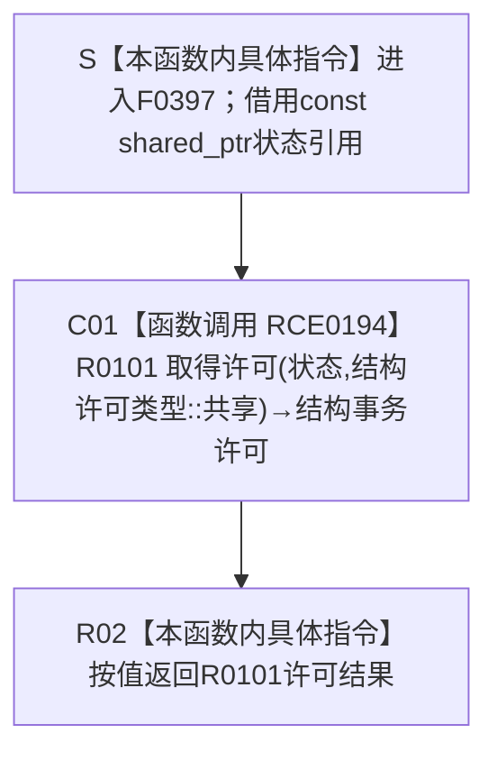

# CF-L5-0202 `结构事务接线取得共享许可 lambda` 现状流程图

图类型：现状流程图
代码版本：`9ce1a8acb973155ef7a14c307e22a2b2358c173d`
源码 blob：`946512e4b88d29bbf6d43eb07b02823471489dae`
覆盖文件：`海中鱼巣/核心/协调.结构事务.ixx:152`
唯一根函数：F0397
完整签名：`海中鱼巣::结构事务许可 海中鱼巣::结构事务协调器::生成接线()::<lambda@协调.结构事务.ixx:152>::operator()(const std::shared_ptr<void>& 状态) const`
参数：无捕获 lambda 的隐式 `this` 不承载外部状态；显式参数 `状态` 是调用期间有效的 `const std::shared_ptr<void>&` 非拥有借用。F0397 不复制保存该引用，只把同一引用传给 R0101
返回结果：以固定枚举 `结构许可类型::共享` 调用 R0101，并把其 move-only `结构事务许可` 结果按值返回。R0101 可以返回持有共享锁和活动令牌的有效许可，也可以按其内部拒绝 / 失败分支返回默认无效许可
非法值 / 拒绝：F0397 自身不复核空状态、事务域身份、隔离、同线程重入或许可登记；全部由 R0101 处理。空 / 不可转换状态、隔离状态、同线程已有许可、登记失败、锁取得失败或锁后隔离均可使 R0101 返回无效许可
已登记调用方：RCE0041、RCE0042、RCE0043、RCE0044、E0871、E0918、RCE0106、RCE0107、RCE1260、RCE1738、RCE1744、RCE1752。E0871 是 F0233 把无捕获 lambda 绑定进 `结构事务接线::取得共享许可` 函数指针的建立边；其它 11 条是当前正式接线下的已解析调用边
直接项目函数：RCE0194 调用 R0101 `结构事务内部::取得许可(const std::shared_ptr<void>&, 结构许可类型)`，实参为原 `状态` 引用和固定 `共享`
外部边界：无独立外部调用。正式外部边界表中的 X01068 实际重复描述同一次项目函数 R0101 调用，类别误标为 Standard library；本图不把 X01068 画成第二个运行节点，等待顶层共享聚合收口删除
未解析项目调用：无；`取得共享许可` 函数指针在当前生产接线中唯一绑定 F0397，12 条稳定入边已区分建立边与调用边
调用图：`流程图/主程序可达调用关系/01_main可达项目调用边表.md`
外部边界表：`流程图/主程序可达调用关系/02_main可达外部边界表.md`
逐行映射表：`流程图/代码流程图/L5/CF-L5-0202_结构事务接线取得共享许可lambda_逐行代码映射表.md`
输入契约 / 调用语境表：本文“调用语境与非成功分账”
非成功返回二分审查表：本文“调用语境与非成功分账”
偏差清单：本文“当前边界与聚合缺口”
依据提交 / 结构化消息：冻结提交 `9ce1a8acb973155ef7a14c307e22a2b2358c173d`；F0397、R0101、12 条入边、RCE0194、X01068 与当前源码交叉复核
结构读取与写入：F0397 仅转发状态与固定许可类型；R0101 内部可能读取运行期事务状态、登记活动记录、取得共享锁并返回许可，或在失败 / 隔离路径撤销活动记录并返回无效许可。本 lambda 不直接读写业务节点、关系、索引或领域记录
逻辑内返回：R0101 返回无效许可时，F0397不区分原因，原样返回。对统一冻结读取，正式 4040 把许可取得失败定义为形成快照前的具名逻辑内结果；其它调用方仍须按自身入口合同分类
内部错误：F0397 没有把 R0101 的无效许可转换为成功，也不自行重试。调用方若在正式强前置保证许可必然有效的语境取得无效许可，必须沿 R0101 状态、隔离、重入、登记或锁路径追根因
生命周期与资源释放：有效许可按值移交调用方，内部持有运行期状态、令牌和释放函数；许可析构或移动覆盖时由其 RAII 路径释放活动记录与共享锁。F0397 不保存状态引用或许可副本
异常：函数未声明 `noexcept` 且不捕获；R0101 对共享锁构造异常有内部清理并返回无效许可，但其进入该 try 之前的分配、活动表操作等异常仍可能传播，F0397 原样传播
并发 / 幂等：并发与同线程重入由 R0101 的活动锁、活动表、结构共享锁和隔离标志裁决。每次成功调用产生新的许可序号和活动记录，不是幂等读取；F0397 不增加第二层同步
验证入口：`协调.结构事务.ixx:152`、12 条稳定入边、RCE0194、R0101 `84-131`、结构事务接线函数指针字段
验证输出：1 行源码完整映射；12 条项目入边（1 条绑定、11 条调用）、1 条项目出边、0 条真实外部调用、1 条重复误分类外部项、0 个动态未解析调用；本子任务不运行构建或程序
依据：`规范/0050_项目通用机器逻辑与禁止性规则总纲_20260721.md`、`规范/0600_代码函数流程图应用与维护规范.md`、`规范/4040_子规范_不透明结构事务候选确认撤销与最后发布.md`、`规范/4050_子规范_入口拒绝逻辑内结果与内部逻辑错误.md`
不得作为施工许可：是
不得宣称：返回许可一定有效、函数指针绑定等于每个调用都取得许可、X01068 是第二次外部调用、共享许可允许写入、锁或令牌是业务机器事实，或本函数证明事务闭环已经完成

## 流程图

## 项目源码调用合同

| 调用边 | 节点 | 被调函数 | 实参 | 调用前置 / 结果用途 | 被调图 |
| --- | --- | --- | --- | --- | --- |
| RCE0194 | C01 | R0101 `结构事务许可 结构事务内部::取得许可(const std::shared_ptr<void>& 状态, 结构许可类型 类型)` | 原 `状态` const 引用；固定 `结构许可类型::共享` | F0397 被函数指针调用后唯一执行体；返回值直接成为 F0397 结果 | 待生成 |

## 已登记调用方

| 调用边 | 调用方 | 位置 | 边类型 / 当前前置 |
| --- | --- | --- | --- |
| E0871 | F0233 `结构事务协调器::生成接线()` | `协调.结构事务.ixx:152` | `callback_bind`；`状态_` 非空时把无捕获 lambda 转换并写入接线函数指针 |
| RCE0041 | F0190 `节点仓库::读取节点(节点句柄) const` | `节点仓库.cpp:235` | 已接域后经唯一生产共享许可函数指针调用 |
| RCE0042 | F0197 `节点仓库::有效节点数量() const` | `节点仓库.cpp:455` | 已接域后经唯一生产共享许可函数指针调用 |
| RCE0043 | F0199 `索引仓库::有效主键数量() const` | `索引仓库.cpp:404` | 已接域后经唯一生产共享许可函数指针调用 |
| RCE0044 | F0217 `主信息仓库::读取I64值(...) const` | `主信息仓库.cpp:432` | 已接域后经唯一生产共享许可函数指针调用 |
| E0918 | F0239 `运行期上下文::结构核心完整() const` | `启动.运行期上下文.ixx:65` | 四项入口条件通过后调用 |
| RCE0106 | F0331 `主信息仓库::创建主信息()` | `主信息仓库.cpp:40` | 已接域后调用；结果用于创建路径前置 |
| RCE0107 | F0332 `节点仓库::创建节点(...)` | `节点仓库.cpp:55` | 已接域后调用；结果用于创建路径前置 |
| RCE1260 | R0402 `状态动态数据操作::读取状态材料(...) const` | `数据操作.状态动态.ixx:378` | 当前生产接线唯一共享许可目标 |
| RCE1738 | F0377 `节点仓库::节点是否有效(...) const` | `节点仓库.cpp:443` | 已接域判断为 true 后调用 |
| RCE1744 | F0384 `主信息仓库::读取主信息(...) const` | `主信息仓库.cpp:199` | 已接域判断为 true 后调用 |
| RCE1752 | F0387 `关系仓库::获取子节点(...) const` | `关系仓库.cpp:734` | 已接域且当前线程没有复用令牌时由宏展开调用 |

## 调用语境与非成功分账

| 语境 | 当前前置 | R0101 可能结果 | F0397 后继 | 结构后果 |
| --- | --- | --- | --- | --- |
| E0871 建立接线 | F0233 `状态_` 非空 | 不执行 R0101，只保存 F0397 函数指针 | 接线形成后等待调用 | 零许可活动记录；不能当作一次许可取得 |
| 普通共享读取调用 | 调用方已确认接线已接域 | 有效共享许可或无效许可 | 原样按值返回 | 成功时登记活动记录并持有共享锁；失败时不留下有效许可 |
| 统一冻结读取 | 统一协调方请求一次冻结权 | 许可取得失败或有效许可 | 原样交给协调方 | 4040 把取得失败列为形成快照前逻辑内结果 |
| 强前置保证后仍无效 | 调用方契约要求共享许可必然取得 | 无效许可 | 不伪造成功、不重试 | 沿 R0101 隔离、重入、登记、锁或状态转换追根因 |
| R0101 异常传播 | R0101 内部未捕获操作抛出 | 无结构事务许可正常结果 | F0397 异常退出 | 已形成的 R0101 局部资源按其异常路径释放；F0397 无补偿 |

## 当前边界与聚合缺口

- 12 条稳定入边完整覆盖 F0397 的当前可达建立和调用关系：E0871 是函数指针绑定，不是一次 operator() 执行；其余 11 条是已解析调用。未发现缺失直接项目入边或出边。
- 第 152 行只有一次具名调用，静态目标是项目函数 R0101，并已由 RCE0194 表达。X01068 以相同名称、签名和位置把它重复登记成 Standard library 外部边界，不能作为第二个节点或第二次调用；顶层维护者将从共享外部边界表删除该误分类项。
- F0397 固定请求共享许可，不从调用方接收许可类型，也不直接暴露锁。返回许可是 move-only 值式资源边界；调用方只在许可有效且按对应合同读取令牌后继续。
