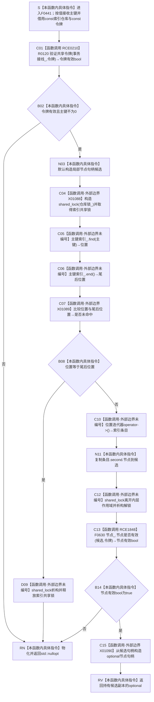

# CF-L5-0203 `索引仓库::按主键查节点` 令牌重载现状流程图

图类型：现状流程图
代码版本：`5cc7036de0decad163293a0b77c4789f068fd73a`
源码 blob：`8874312f67f19b220a08b1397c6103396878513d`
覆盖文件：`海中鱼巣/核心/索引仓库.cpp:188-198`
唯一根函数：F0441
完整签名：`std::optional<海中鱼巣::节点句柄> 海中鱼巣::索引仓库::按主键查节点(std::uint64_t 主键, const 海中鱼巣::结构事务令牌& 令牌) const`
参数：隐式 `this` 是调用期有效的 const `索引仓库` 非拥有借用；`主键` 按值传入，`0` 为拒绝值；`令牌` 是调用方持有共享许可期间的 const 左值引用，本函数只同步借用，不复制、不保存、不释放
返回结果：令牌验证失败、主键为 `0`、索引未命中或候选节点不能按同一令牌权威读回时返回 `std::nullopt`；索引命中且 F0630 返回 `true` 时返回持有候选节点句柄副本的 `std::optional<节点句柄>`
非法值 / 拒绝：R0120 返回 `false` 或 `主键 == 0` 时不加仓库锁；索引未命中时在共享锁仍存活的返回路径上返回空 optional，随后由 RAII 释放锁
已登记调用方：F0239、F0264、R0338、R0347、R0353、R0384、R0413、R0422、R0423、R0424、R0429、R0430、F0544、R0573、R0574、R0626、R0662、R0704、R0720
直接项目函数：RCE0210 调用 R0120；RCE1848 调用 F0630
外部边界：X01088 构造 `std::shared_lock`；X01089 比较查找位置与 `end()`；X01090 从候选节点句柄构造成功 optional。源码还显式调用 `unordered_map::find/end`、迭代器 `operator->` 和 `shared_lock` 析构，当前正式外部边界表未为这些调用分配独立 X 身份
未解析项目调用：0
调用图：`流程图/主程序可达调用关系/01_main可达项目调用边表.md`
外部边界表：`流程图/主程序可达调用关系/02_main可达外部边界表.md`
逐行映射表：`流程图/代码流程图/L5/CF-L5-0203_索引仓库按主键查节点令牌重载_逐行代码映射表.md`
输入契约 / 调用语境表：本文“调用语境与返回分账”
非成功返回二分审查表：本文“调用语境与返回分账”
偏差清单：本文“当前边界与规范核对”
依据提交 / 结构化消息：冻结提交 `5cc7036de0decad163293a0b77c4789f068fd73a`；F0441、RCE0210、RCE1848、X01088—X01090 与源码逐点复核
结构读取与写入：共享锁内只读取 `主键索引_` 并复制候选节点句柄；锁释放后调用节点仓库权威读回；不修改索引、节点、关系、许可或其它机器事实
逻辑内返回：一般调用语境下，令牌无效、主键为零、索引未命中或候选节点当前无效均返回空 optional
内部错误：正式上游保证令牌有效而 R0120 拒绝、索引命中但同一共享许可下候选节点无法权威读回、共享锁保护下索引迭代器失效或索引正反绑定不一致时须追根因；空 optional 自身不能区分这些原因
生命周期与资源释放：`候选` 只拥有节点句柄值副本；局部 `shared_lock` 在 191—196 行作用域内持锁，索引未命中返回或正常离开作用域时均析构解锁
异常：未声明 `noexcept` 且不捕获；锁构造、标准容器调用或 optional 返回值形成异常向调用方传播，已构造共享锁按栈展开析构
并发 / 幂等：共享锁只保护索引查找和候选复制；F0630 在锁外借用同一共享令牌复核节点。函数只读且相同稳定输入下幂等，但并发可见性由调用方许可和两个仓库各自同步共同约束
验证入口：`索引仓库.cpp:18-20,188-198`、`节点仓库.cpp:449-451`、RCE0210、RCE1848、X01088—X01090
验证输出：188—198 行完整覆盖；2 个项目出边、3 个正式外部边界、0 个未解析项目调用；本切片不运行构建或程序
依据：`规范/0050_项目通用机器逻辑与禁止性规则总纲_20260721.md`、`规范/0600_代码函数流程图应用与维护规范.md`、`规范/4010_子规范_统一仓库稳定句柄与通用关系索引边界.md`、`规范/4040_子规范_不透明结构事务候选确认撤销与最后发布.md`、`规范/4050_子规范_入口拒绝逻辑内结果与内部逻辑错误.md`
不得作为施工许可：是
不得宣称：索引命中即证明节点存在；空 optional 唯一证明主键未登记；本函数修复悬空索引、取得许可、修改节点或完成索引能力

## 流程图

## 项目源码调用合同

| 调用边 | 节点 | 被调函数 | 实参与结果 | 调用前置 | 被调图 |
| --- | --- | --- | --- | --- | --- |
| RCE0210 | C01 | R0120 `bool 海中鱼巣::{匿名命名空间@索引仓库.cpp}::验证共享令牌(const 结构事务接线&,const 结构事务令牌&)` | `事务接线_`、`令牌`均 const 借用 → bool | 函数进入后先调用；false 与主键零共同短路 | 待绘制 |
| RCE1848 | C13 | F0630 `bool 海中鱼巣::节点仓库::节点是否有效(节点句柄,const 结构事务令牌&) const` | `this=&节点_`、候选按值、同一令牌 const 借用 → bool | 索引命中、候选已复制且索引共享锁已释放 | 待绘制 |

## 调用语境与返回分账

| 语境 | 当前行为 | 返回 / 异常 | 二分口径 | 结构后果 |
| --- | --- | --- | --- | --- |
| R0120=false 或主键为0 | 不加索引锁、不查容器 | `std::nullopt` | 一般入口为逻辑内返回；已保证有效令牌却被拒绝须追根因 | 零写入 |
| 索引未命中 | 共享锁内完成 find/end 比较 | 解锁后返回 `std::nullopt` | 合法空候选 | 零写入 |
| 索引命中、F0630=false | 复制候选、先解索引锁，再权威读回节点 | 返回 `std::nullopt` | 当前返回合同允许空结果；悬空索引候选须另行追根因 | 零写入 |
| 索引命中、F0630=true | 从候选副本构造 optional | 返回有值 optional | 成功只读结果 | 零写入 |
| 标准库或节点仓库抛出 | 不捕获 | 已构造共享锁先析构，异常继续传播 | 内部错误 / 资源失败 | 零写入 |

## 当前边界与规范核对

- F0441 遵守“索引只定位候选、命中后必须回读节点”的边界；F0630 发生在索引共享锁释放之后。
- X01089 只登记了位置比较；源码中的 `find`、`end`、迭代器解引用和锁析构仍是实际外部调用，但当前聚合表没有独立 X 身份，本图只记录现状，不擅自修改共享表。
- 索引未命中与候选节点无效均折叠为空 optional，不能从返回值单独裁决索引结构是否一致。
- 本函数没有写入、修复、删除、发布或许可取得路径。
