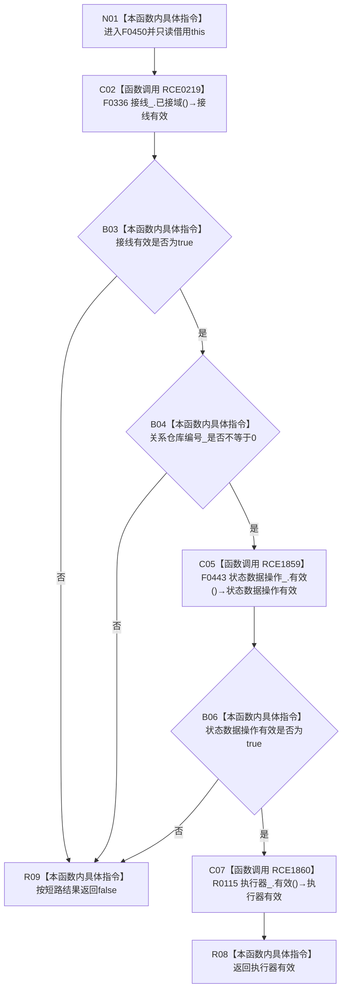

# CF-L5-0204 `概念活动数据操作::有效()` 现状流程图

图类型：现状流程图
代码版本：`5cc7036de0decad163293a0b77c4789f068fd73a`
源码 blob：`0a902454f56f7ee20e65f81ea6864e923a9c7f6a`
覆盖文件：`海中鱼巣/领域/数据操作.概念活动.ixx:37-40`
唯一根函数：F0450
完整签名：`bool 海中鱼巣::概念活动数据操作::有效() const noexcept`
参数：无显式参数；隐式 `this` 是调用期有效的 const `概念活动数据操作` 非拥有借用
返回结果：接线已接域、关系仓库编号非零、状态动态数据操作有效且结构写入执行器有效时返回 `true`；任一条件不成立时短路返回 `false`
调用图：`流程图/主程序可达调用关系/01_main可达项目调用边表.md`
逐行映射表：`流程图/代码流程图/L5/CF-L5-0204_概念活动数据操作有效_逐行代码映射表.md`
输入契约 / 调用语境表：本文“返回语境”
非成功返回二分审查表：本文“返回语境”
偏差清单：无；本文只冻结当前代码事实
依据提交 / 结构化消息：当前提交、F0450、RCE0219、RCE1859、RCE1860 与源码第 37—40 行交叉复核
验证输出：4 行定义完整映射；3 个项目出边；0 个外部边界；0 个未解析调用
不得作为施工许可：是
不得宣称：返回 `true` 证明概念活动业务状态、仓库内容或初始化结果完整；返回 `false` 唯一定位具体失效成员

## 函数合同

```text
根函数：F0450 概念活动数据操作::有效
归属模块 / 文件 / 层级：数据操作.概念活动 / 海中鱼巣/领域/数据操作.概念活动.ixx / L5
现有或待新增：现有
完整签名：bool 海中鱼巣::概念活动数据操作::有效() const noexcept
参数：无显式参数；只读借用隐式 this
返回结果：bool 有效性合取结果
被调函数流程图：
- F0336 结构事务接线::已接域：流程图/代码流程图/L6/CF-L6-0016_结构事务接线已接域_现状流程图.md
- F0443 状态动态数据操作::有效：活动队列待绘制
- R0115 结构写入执行器::有效：活动队列待绘制
```

## 流程图



## 节点合同

| 节点 | 类型 | 参数 / 输入绑定 | 结果 / 输出绑定 | 事实读写 | 后继条件 |
| --- | --- | --- | --- | --- | --- |
| N01 | 本函数内具体指令 | 隐式 `this` | 进入只读判断 | 无写入 | 无条件 |
| C02 | 函数调用 | 成员 `接线_` | F0336 返回值 → 接线有效 | 只读接线状态 | true 继续；false 短路 |
| B03 | 本函数内具体指令 | 接线有效 | 分支 | 无 | 布尔分支 |
| B04 | 本函数内具体指令 | `关系仓库编号_` | 是否非零 | 只读成员值 | true 继续；false 短路 |
| C05 | 函数调用 | 成员 `状态数据操作_` | F0443 返回值 → 状态数据操作有效 | 只读被依赖对象接线 | true 继续；false 短路 |
| B06 | 本函数内具体指令 | 状态数据操作有效 | 分支 | 无 | 布尔分支 |
| C07 | 函数调用 | 成员 `执行器_` | R0115 返回值 → 执行器有效 | 只读执行器接线 | 调用完成 |
| R08 | 本函数内具体指令 | 执行器有效 | 返回同一 bool | 无 | 函数结束 |
| R09 | 本函数内具体指令 | 任一前置短路失败 | 返回 `false` | 无 | 函数结束 |

## 返回语境

| 条件 | 返回 | 二分口径 | 结构变化 |
| --- | --- | --- | --- |
| 接线未接域、关系仓库编号为零、状态数据操作无效或执行器无效 | `false` | 有效性查询的逻辑内返回 | 无 |
| 四项均成立 | `true` | 正常返回；只证明本函数检查的四项接线前置 | 无 |

## 关键边界

- 第 38—39 行是同一个返回表达式，换行不改变从左到右的 `&&` 短路顺序。
- F0443、R0115 只有在其左侧全部条件为 true 时才调用。
- 本函数不读取或写入概念活动、状态、动态、节点、关系或索引事实。
