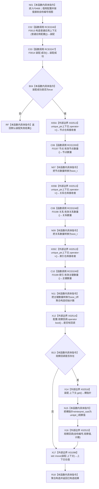

# CF-L5-0206 `构造入口初始化自检环境` 现状流程图

图类型：现状流程图
代码版本：`04b66401f3aed237bb89bf885a63e2b3d0a877dc`
源码 blob：`95681cdeef7ab705cf391738b05b36ca4fafc608`
覆盖文件：`海中鱼巣/自检.入口初始化.ixx:52-71`
唯一根函数：F0468
完整签名：`海中鱼巣::入口初始化自检环境构造结果 海中鱼巣::构造入口初始化自检环境(const 海中鱼巣::入口初始化自检运行配置& 配置, std::string_view 自检编号)`
参数：`配置` 以 const 引用借用，仅在同步调用内读取可选观察回调；`自检编号` 按值传入的非拥有字符串视图，仅同步转交回调
返回结果：普通应用上下文装配失败时返回默认 `装配失败` 结果；成功时读取节点、关系、索引初始数量，可选调用人读观察回调，并移动上下文形成 `已构造` 结果
调用图：`流程图/主程序可达调用关系/01_main可达项目调用边表.md`
逐行映射表：`流程图/代码流程图/L5/CF-L5-0206_构造入口初始化自检环境_逐行代码映射表.md`
输入契约 / 调用语境表：本文“返回与观察语境”
非成功返回二分审查表：本文“返回与观察语境”
偏差清单：无；本文只冻结当前代码事实
依据提交 / 结构化消息：当前提交、F0468、RCE0246—RCE0249、RCE2200、X01096、X02513—X02516 与源码第 52—71 行交叉复核
验证输出：20 行定义完整映射；5 个项目出边；5 个外部边界；0 个未解析调用
不得作为施工许可：是
不得宣称：自检环境构造成功证明业务能力完成、生产状态已初始化或观察回调形成机器事实

## 函数合同

```text
根函数：F0468 构造入口初始化自检环境
归属模块 / 文件 / 层级：自检.入口初始化 / 海中鱼巣/自检.入口初始化.ixx / L5
现有或待新增：现有
完整签名：入口初始化自检环境构造结果 构造入口初始化自检环境(const 入口初始化自检运行配置& 配置, std::string_view 自检编号)
参数：
- 配置：const 引用借用，不保存
- 自检编号：string_view 按值传入，不拥有字符存储，仅同步使用
返回结果：装配失败默认结果，或持有移动后普通应用上下文与初始计数的已构造结果
被调函数流程图：
- F0013 构造普通应用上下文：流程图/代码流程图/L3/CF-L3-0001_构造普通应用上下文_现状流程图.md
- F0014 普通应用装配结果::成功：流程图/代码流程图/L3/CF-L3-0002_普通应用装配结果_成功_现状流程图.md
- F0197 节点仓库::有效节点数量：流程图/代码流程图/L5/CF-L5-0077_节点仓库有效节点数量_现状流程图.md
- F0198 关系仓库::有效关系数量：流程图/代码流程图/L5/CF-L5-0078_关系仓库有效关系数量_现状流程图.md
- F0199 索引仓库::有效主键数量：流程图/代码流程图/L5/CF-L5-0079_索引仓库有效主键数量_现状流程图.md
```

## 流程图



## 节点合同

| 节点 | 类型 | 输入绑定 | 结果 / 输出绑定 | 事实读写 | 后继条件 |
| --- | --- | --- | --- | --- | --- |
| N01 | 本函数内具体指令 | 两个形参 | 进入构造 | 无 | 无条件 |
| C02 | 函数调用 | 默认普通应用配置 | F0013 返回装配结果 | 构造隔离自检上下文 | 调用完成 |
| C03 | 函数调用 | 装配结果 | F0014 返回 bool | 只读结果 | 布尔分支 |
| RF | 本函数内具体指令 | 装配失败 | 默认结果 | 无新增写入 | 函数结束 |
| X05A / X05B / X05C | 外部边界 | `装配.上下文` | 三次取得相应仓库接收者 | 只读 unique_ptr | 依次转交三个仓库读取 |
| C06 / C08 / C10 | 函数调用 | 上下文内三个仓库 | 三项有效数量 | 只读仓库 | 顺序完成 |
| N07 / N09 / N11 | 本函数内具体指令 | 三项数量 | `入口初始化自检初始计数` | 仅局部材料 | 转交回调判断 |
| X12 | 外部边界 | `配置.观察回调` | 是否包含目标 | 只读回调对象 | 布尔分支 |
| X14 / N15 | 外部边界 / 本函数内具体指令 | 上下文 unique_ptr | 非拥有整数观察值 | 无 | 转交回调 |
| X16 | 外部边界 | 自检编号、观察值、计数 | `void` | 人读观察，不裁决机器事实 | 调用后继续 |
| X17 | 外部边界 | 上下文 unique_ptr | 右值 | 转移局部所有权 | 转交 R18 |
| R18 | 本函数内具体指令 | 状态、上下文右值、计数 | 已构造结果 | 所有权进入返回对象 | 函数结束 |

## 返回与观察语境

| 条件 | 返回 / 行为 | 二分口径 | 结构后果 |
| --- | --- | --- | --- |
| F0013 装配结果不成功 | 默认 `装配失败` 结果 | 自检环境构造的逻辑内返回 | 局部装配结果按生命周期释放 |
| 装配成功且无观察回调 | 已构造结果 | 正常返回 | 上下文所有权移入返回值 |
| 装配成功且存在观察回调 | 同步提交编号、指针数值和初始计数后返回已构造结果 | 人读观察材料；非机器裁决 | 上下文所有权移入返回值 |

## 当前边界

- RCE2200 登记第 60 行 F0197 无参节点数量读取；RCE0248 登记第 61 行 F0198 无参关系数量读取；RCE0249 登记第 62 行 F0199 无参主键数量读取。
- X02513 合并登记第 60—62 行三次 `unique_ptr::operator->`；X02514、X02515、X02516 分别登记回调存在性、一次具体回调调用和 `unique_ptr::get`。
- X01096 登记第 70 行显式 `std::move`。本图不把观察回调输出写成机器事实。
