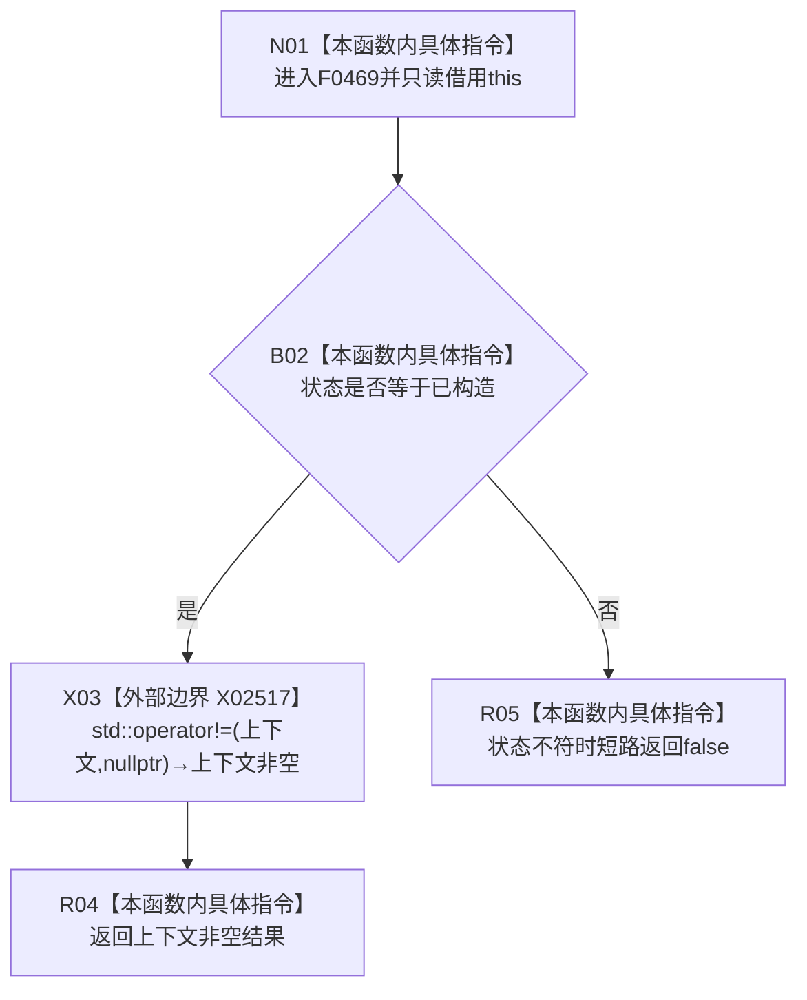

# CF-L5-0207 `入口初始化自检环境构造结果::成功()` 现状流程图

图类型：现状流程图
代码版本：`04b66401f3aed237bb89bf885a63e2b3d0a877dc`
源码 blob：`95681cdeef7ab705cf391738b05b36ca4fafc608`
覆盖文件：`海中鱼巣/自检.入口初始化.ixx:47-49`
唯一根函数：F0469
完整签名：`bool 海中鱼巣::入口初始化自检环境构造结果::成功() const noexcept`
参数：无显式参数；隐式 `this` 是调用期有效的 const `入口初始化自检环境构造结果` 非拥有借用
返回结果：状态为 `已构造` 且上下文 unique_ptr 非空时返回 `true`；否则按 `&&` 短路返回 `false`
调用图：`流程图/主程序可达调用关系/01_main可达项目调用边表.md`
逐行映射表：`流程图/代码流程图/L5/CF-L5-0207_入口初始化自检环境构造结果成功_逐行代码映射表.md`
输入契约 / 调用语境表：本文“返回语境”
非成功返回二分审查表：本文“返回语境”
偏差清单：无；本文只冻结当前代码事实
依据提交 / 结构化消息：当前提交、F0469、X02517 与源码第 47—49 行交叉复核
验证输出：3 行定义完整映射；0 个项目出边；1 个外部边界；0 个未解析调用
不得作为施工许可：是
不得宣称：返回 `true` 证明上下文中全部业务对象、仓库内容或初始化能力完整

## 函数合同

```text
根函数：F0469 入口初始化自检环境构造结果::成功
归属模块 / 文件 / 层级：自检.入口初始化 / 海中鱼巣/自检.入口初始化.ixx / L5
现有或待新增：现有
完整签名：bool 海中鱼巣::入口初始化自检环境构造结果::成功() const noexcept
参数：无显式参数；只读借用隐式 this
返回结果：bool 状态与所有权形态合取结果
被调函数流程图：无
```

## 流程图



## 节点合同

| 节点 | 类型 | 输入绑定 | 结果 / 输出绑定 | 事实读写 | 后继条件 |
| --- | --- | --- | --- | --- | --- |
| N01 | 本函数内具体指令 | 隐式 `this` | 进入只读判断 | 无 | 无条件 |
| B02 | 本函数内具体指令 | `状态` | 是否为已构造 | 无 | false 短路 |
| X03 | 外部边界 | const unique_ptr 与 nullptr | 是否非空 | 只读所有权形态 | 调用完成 |
| R04 / R05 | 本函数内具体指令 | 合取结果 | 返回 bool | 无 | 函数结束 |

## 返回语境

| 条件 | 返回 | 二分口径 | 结构变化 |
| --- | --- | --- | --- |
| 状态不是已构造 | `false` | 构造结果查询的逻辑内返回 | 无 |
| 状态为已构造但上下文为空 | `false` | 构造结果查询的逻辑内返回 | 无 |
| 状态为已构造且上下文非空 | `true` | 正常返回；不继续检查上下文内容 | 无 |

## 当前边界

- X02517 登记第 48 行 unique_ptr 与 nullptr 的标准库非成员比较；仅在状态为已构造时因 `&&` 短路条件执行。
- 本函数不解引用上下文、不读取仓库、不修改状态或所有权。
