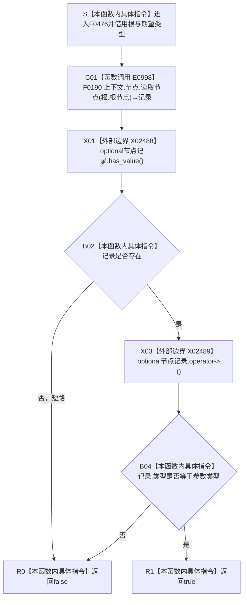

# CF-L5-0208 `概念图四根创建自检根完整 lambda` 现状流程图

图类型：现状流程图
代码版本：`0a93526882cb33c61c2fbb04ecad1aeaddcfe225`
源码 blob：`59de05d5ba3594942c819c9ec50e3d0ebc6cb9bd`
覆盖文件：`海中鱼巣/自检.入口初始化.ixx:89-92`
唯一根函数：F0476
完整签名：`bool 海中鱼巣::运行概念图四根创建自检(const 海中鱼巣::入口初始化自检运行配置&)::<lambda@自检.入口初始化.ixx:89>::operator()(const 海中鱼巣::概念根初始化项& 根, 海中鱼巣::节点类型 类型) const`
参数：闭包按引用借用外层 `上下文`；`根` 为 const 引用，`类型` 按值传入；返回：节点存在且类型相等时 true
已登记调用方：F0254 经 E0982
直接项目函数：F0190/E0998
外部边界：X02488—X02489
未解析项目调用：无
逐行映射表：`流程图/代码流程图/L5/CF-L5-0208_概念图四根创建自检根完整lambda_逐行代码映射表.md`
不得作为施工许可：是

X02488/X02489 按 `std::optional<节点记录>` 的具体模板实例登记；本函数只做读取后的类型谓词，不创建或修复根节点。
