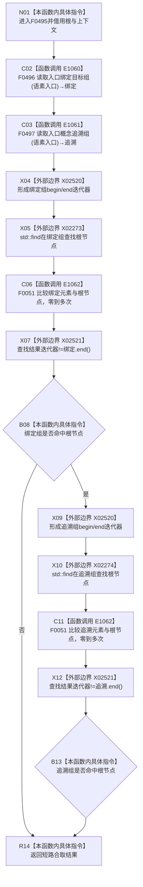

# CF-L5-0209 概念图根名绑定自检绑定可读 lambda 现状流程图

图类型：现状流程图
代码版本：`5c5dbc536a250b080bf6045bf4c4e556730b1b7d`
源码 blob：`95681cdeef7ab705cf391738b05b36ca4fafc608`
覆盖文件：`海中鱼巣/自检.入口初始化.ixx:174-179`
唯一根函数：F0495
完整签名：`bool 海中鱼巣::运行概念图根名绑定自检(const 海中鱼巣::入口初始化自检运行配置&)::<lambda@自检.入口初始化.ixx:174>::operator()(const 海中鱼巣::概念根初始化项& 根) const`
参数：`根` 为只读引用；lambda 通过 `[&]` 非拥有引用捕获外层 `上下文`
返回结果：绑定目标组与概念追溯组均包含 `根.根节点` 时返回 true，否则返回 false
调用图：`流程图/主程序可达调用关系/01_main可达项目调用边表.md`
逐行映射表：`流程图/代码流程图/L5/CF-L5-0209_概念图根名绑定自检绑定可读lambda_逐行代码映射表.md`
依据提交 / 结构化消息：当前提交、F0495、E1060—E1062、X02273—X02274、X02520—X02521 与源码 174—179 行交叉复核
验证输出：6 行定义完整映射；3 个项目出边；4 个外部边界；0 个未解析调用
不得作为施工许可：是
不得宣称：返回 true 证明绑定或追溯关系由本函数创建、长期有效或生产能力完成

E1062 表示 `std::find` 内部对项目强类型句柄比较函数的零到多次调用；第二次查找只在第一次命中时执行。
