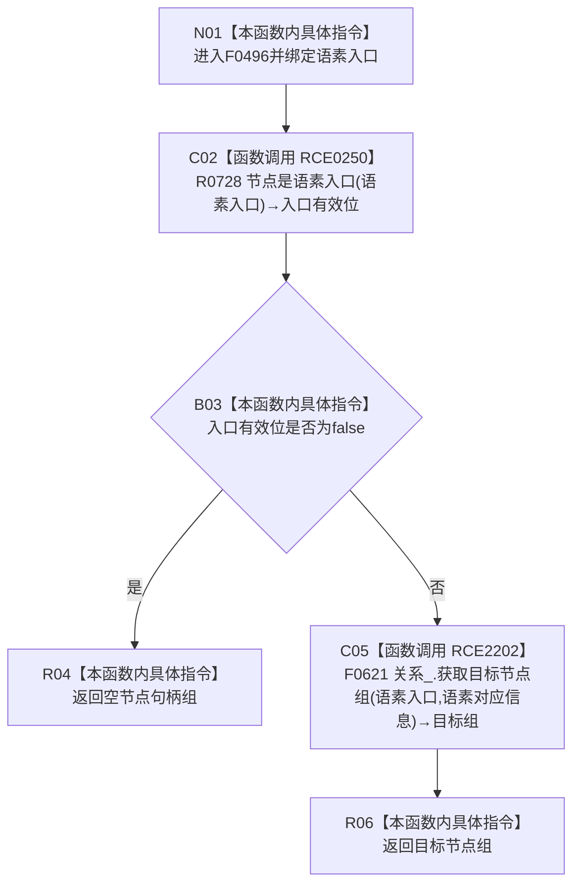

# CF-L5-0210 语素服务读取入口绑定目标组现状流程图

图类型：现状流程图
代码版本：`5c5dbc536a250b080bf6045bf4c4e556730b1b7d`
源码 blob：`1355a1afd544cd44c14ee904246e9cb0778fb39b`
覆盖文件：`海中鱼巣/领域/语素服务.h:188-193`
唯一根函数：F0496
完整签名：`std::vector<海中鱼巣::节点句柄> 海中鱼巣::语素服务::读取入口绑定目标组(海中鱼巣::节点句柄 语素入口) const`
参数：`语素入口` 按值传入；不持有调用方对象
返回结果：入口不是语素节点时返回空组；否则返回关系仓库读取到的语素对应信息目标节点组
调用图：`流程图/主程序可达调用关系/01_main可达项目调用边表.md`
逐行映射表：`流程图/代码流程图/L5/CF-L5-0210_语素服务读取入口绑定目标组_逐行代码映射表.md`
依据提交 / 结构化消息：当前提交、F0496、RCE0250、RCE2202 与源码 188—193 行交叉复核
验证输出：6 行定义完整映射；2 个项目出边；0 个外部边界；0 个未解析调用
不得作为施工许可：是
不得宣称：返回组证明关系已创建、持续有效或规范符合

RCE0250 已按单实参调用校正到无令牌 R0728；F0621 仍在正式待绘队列中，本图只冻结调用边。
