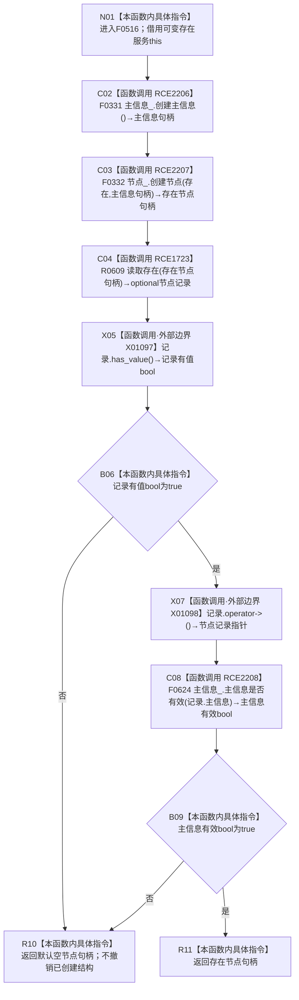

# CF-L5-0212 `存在服务::创建实际存在` 现状流程图

图类型：现状流程图
代码版本：`45786c8e1ed2cec34b4fd32924cda16d643be7a1`
源码 blob：`045d1eb190f44a38cc129974c2681969fedba9d5`
覆盖文件：`海中鱼巣/领域/存在服务.h:93-101`
唯一根函数：F0516
完整签名：`海中鱼巣::节点句柄 海中鱼巣::存在服务::创建实际存在()`
参数：无显式参数；隐式 `this` 是调用期间有效的可变 `存在服务` 非拥有借用
返回结果：创建主信息和类型为 `存在` 的节点后，读回节点记录并确认记录有值且其主信息有效时返回新存在节点句柄；否则返回默认空节点句柄
已登记调用方：F0260 经 E1116；F0261 经 E1137
直接项目函数：RCE2206 → F0331；RCE2207 → F0332；RCE1723 → R0609；RCE2208 → F0624
外部边界：X01097 `std::optional<节点记录>::has_value()`；X01098 `std::optional<节点记录>::operator->()`
未解析项目调用：0
调用图：`流程图/主程序可达调用关系/01_main可达项目调用边表.md`
外部边界表：`流程图/主程序可达调用关系/02_main可达外部边界表.md`
逐行映射表：`流程图/代码流程图/L5/CF-L5-0212_存在服务创建实际存在_逐行代码映射表.md`
输入契约 / 调用语境表：本文“调用与非成功边界”
非成功返回二分审查表：本文“调用与非成功边界”
偏差清单：写后读回失败时当前代码返回空句柄，且不撤销已经创建的主信息和存在节点；本文只登记现状，不形成施工许可
依据提交 / 结构化消息：当前提交、F0516、E1116、E1137、RCE2206—RCE2208、RCE1723、X01097—X01098 与源码 93—101 行交叉复核
结构读取与写入：F0331 创建主信息；F0332 创建引用该主信息的存在节点；R0609 与 F0624 只读复核；根函数本身不直接操作仓库结构
逻辑内返回：无已确认的写前入口拒绝
内部错误：创建完成后的节点读回为空或主信息无效属于写后结构异常；当前代码以空句柄收口
生命周期与资源释放：主信息句柄、存在节点句柄和 optional 节点记录均为局部值；函数结束后局部对象销毁，不撤销仓库结构
异常：未声明 `noexcept` 且不捕获；被调函数异常向调用方传播
并发 / 幂等：并发和唯一性由被调仓库入口承担；本函数每次调用均发起新的创建，不冻结幂等身份
验证输出：93—101 行完整映射；4 条项目出边、2 条外部边界、0 条未解析调用
不得作为施工许可：是
不得宣称：返回非空证明实际存在已进入场景、已取得稳定业务身份、已经发布到完整业务闭环或相关能力完成

## 函数合同

```text
根函数：F0516 存在服务::创建实际存在
归属模块 / 文件 / 层级：头文件内联/模板定义 / 海中鱼巣/领域/存在服务.h / L5
现有或待新增：现有成员函数
完整签名：海中鱼巣::节点句柄 海中鱼巣::存在服务::创建实际存在()
参数：无显式参数；可变 this 为非拥有借用
返回结果：成功返回新存在节点句柄；写后读回异常返回默认空句柄
被调函数流程图：F0331、F0332 已有独立现状图；R0609、F0624 待按队列绘制
```

## 流程图



## 节点合同

| 节点 | 类型 | 参数 / 输入绑定 | 结果 / 输出绑定 | 事实读写 | 后继条件 |
| --- | --- | --- | --- | --- | --- |
| N01 | 本函数内具体指令 | 可变 `this` | 进入创建路径 | 无 | 无条件 |
| C02 | 函数调用 | `主信息_` → F0331 隐式 this | 主信息句柄 | F0331 创建主信息 | 调用完成 |
| C03 | 函数调用 | `节点_` → F0332 隐式 this；`存在`、主信息句柄 → 两个形参 | 存在节点句柄 | F0332 创建节点 | 调用完成 |
| C04 | 函数调用 | 同一 `this`、存在节点句柄 | optional 节点记录 | R0609 只读 | 调用完成 |
| X05 | 函数调用 | optional 记录 | 记录有值 bool | 无 | 调用完成 |
| B06 | 本函数内具体指令 | 记录有值 bool | 短路分支 | 无 | 否 → R10；是 → X07 |
| X07 | 函数调用 | 有值 optional 记录 | const 节点记录指针 | 无 | 调用完成 |
| C08 | 函数调用 | `主信息_` → F0624 隐式 this；记录主信息 → 形参 | 主信息有效 bool | F0624 只读 | 调用完成 |
| B09 | 本函数内具体指令 | 主信息有效 bool | 返回分支 | 无 | 否 → R10；是 → R11 |
| R10 | 本函数内具体指令 | 无 | 默认空节点句柄 | 已创建结构保留 | 函数结束 |
| R11 | 本函数内具体指令 | 存在节点句柄 | 原样返回 | 无新增写入 | 函数结束 |

## 项目源码调用合同

| 边身份 | 节点 | 被调函数 | 实参与结果 | 被调图 |
| --- | --- | --- | --- | --- |
| RCE2206 | C02 | F0331 `主信息仓库::创建主信息()` | `this=&主信息_` → 主信息句柄 | [F0331](../L6/CF-L6-0011_主信息仓库创建主信息_现状流程图.md) |
| RCE2207 | C03 | F0332 `节点仓库::创建节点(节点类型,主信息句柄)` | `this=&节点_`、`存在`、主信息句柄 → 节点句柄 | [F0332](../L6/CF-L6-0012_节点仓库创建节点_现状流程图.md) |
| RCE1723 | C04 | R0609 `存在服务::读取存在(节点句柄) const` | 同一 `this`、存在节点句柄 → optional 节点记录 | 待绘制 |
| RCE2208 | C08 | F0624 `主信息仓库::主信息是否有效(主信息句柄) const` | `this=&主信息_`、记录主信息 → bool | 待绘制 |

## 外部边界调用合同

| 边界身份 | 节点 | 完整签名 | 源码行 |
| --- | --- | --- | --- |
| X01097 | X05 | `bool std::optional<海中鱼巣::节点记录>::has_value() const noexcept` | 97 |
| X01098 | X07 | `const 海中鱼巣::节点记录* std::optional<海中鱼巣::节点记录>::operator->() const noexcept` | 97 |

## 调用与非成功边界

| 语境 | 上游前置 | 当前非成功 | 二分口径 | 结构后果 |
| --- | --- | --- | --- | --- |
| E1116 / E1137 调用 F0516 | 调用方进入自检创建路径；本函数没有显式输入 | 节点读回为空 | 追根因解决 | 主信息和存在节点已经创建，当前代码不撤销 |
| 同上 | 节点读回有值 | 记录中的主信息无效 | 追根因解决 | 已创建结构保留，返回空节点句柄 |
| 同上 | 记录有值且主信息有效 | 无 | 成功返回 | 返回新存在节点句柄；未创建场景归属 |
