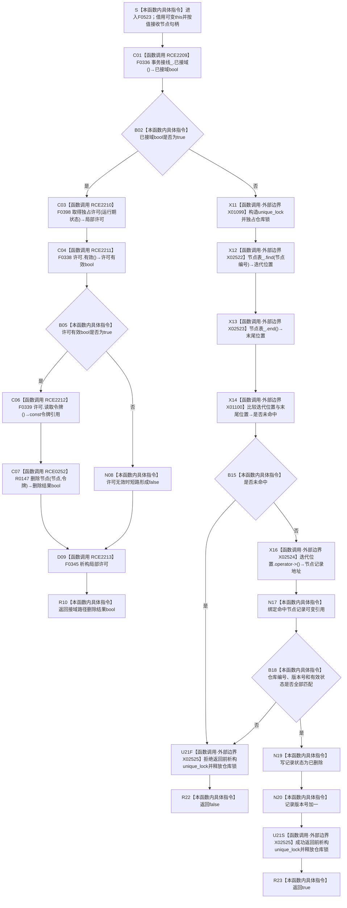

# CF-L5-0213 `节点仓库::删除节点(节点句柄)` 现状流程图

图类型：现状流程图
代码版本：`f7bc742f8126fcf66288fc940300de3331a0eebb`
源码 blob：`f38b979a3f7cefd182a50e0b687c5a6fffebc91c`
覆盖文件：`海中鱼巣/核心/节点仓库.cpp:331-348`
唯一根函数：F0523
完整签名：`bool 海中鱼巣::节点仓库::删除节点(海中鱼巣::节点句柄 节点)`
参数：隐式 `this` 是调用期间有效的可变 `节点仓库` 非拥有借用；`节点` 按值传入。本函数不保存句柄、许可、令牌引用、锁或仓库记录引用
返回结果：接域时取得独占许可，仅在许可有效且令牌重载 R0147 返回 true 时返回 true；未接域时持独占仓库锁，只有编号命中、仓库编号与版本匹配且记录当前有效时，把状态改为 `已删除`、版本号加一并返回 true，其余返回 false
已登记调用方：F0261 经 E1138（`自检.入口初始化.ixx:288`）
直接项目函数：RCE2209 → F0336；RCE2210 → F0398；RCE2211 → F0338；RCE2212 → F0339；RCE0252 → R0147；RCE2213 → F0345
外部边界：X01099 构造 `unique_lock`；X02522 查找节点表；X02523 取得节点表 end 位置；X01100 比较迭代位置；X02524 解引用迭代位置；X02525 析构 `unique_lock`
未解析项目调用：无；F0398 是当前正式生产接线中 `取得独占许可` 函数指针的唯一目标
调用图：`流程图/主程序可达调用关系/01_main可达项目调用边表.md`
外部边界表：`流程图/主程序可达调用关系/02_main可达外部边界表.md`
逐行映射表：`流程图/代码流程图/L5/CF-L5-0213_节点仓库删除节点无令牌重载_逐行代码映射表.md`
输入契约 / 调用语境表：本文“删除语境与非成功分账”
非成功返回二分审查表：本文“删除语境与非成功分账”
偏差清单：未接域路径直接修改记录状态与版本，不通过结构事务令牌重载；本文只登记现状，不形成施工许可
依据提交 / 结构化消息：冻结 HEAD `f7bc742f8126fcf66288fc940300de3331a0eebb`；F0523、E1138、RCE0252、RCE2209—RCE2213、X01099、X01100、X02522—X02525 与源码 331—348 行交叉复核
结构读取与写入：接域路径由 R0147 在独占事务许可内执行删除；未接域路径在 X01099/X02525 独占锁窗口内查表、复核句柄，成功时写 `记录.状态=已删除` 并推进 `记录.版本号`
逻辑内返回：许可无效、节点编号未命中、错仓、错版本或记录非有效时返回 false，拒绝路径不写节点记录
内部错误：本函数不区分各类 false；若调用方已具名保证有效节点与可取得许可，则 false 需要沿许可或仓库状态追根因
生命周期与资源释放：接域路径局部 `许可` 覆盖有效性、令牌读取和 R0147 调用，正常返回或异常展开前经 F0345 析构；未接域路径局部 `锁` 覆盖查找、复核和写入，所有正常返回及异常展开均经 X02525 析构
异常：未声明 `noexcept` 且不捕获；F0398 可在许可形成前抛出；许可形成后被调异常先析构许可再传播。未接域路径 X01099 取得锁或容器调用异常在已形成锁时先经 X02525 释放再传播
并发 / 幂等：接域路径由事务域独占许可串行化；未接域路径由仓库独占锁串行化。对已删除或旧版本句柄再次调用返回 false，不重复推进版本
验证输出：331—348 行完整映射；6 条项目出边、6 个外部边界身份、0 个未解析项目调用
依据：`规范/0050_项目通用机器逻辑与禁止性规则总纲_20260721.md`、`规范/0600_代码函数流程图应用与维护规范.md`、`规范/4010_子规范_统一仓库稳定句柄与通用关系索引边界.md`、`规范/4040_子规范_不透明结构事务候选确认撤销与最后发布.md`
不得作为施工许可：是
不得宣称：返回 true 证明所有引用关系已经清理、节点物理删除、删除已经发布到完整业务闭环，或返回 false 唯一证明节点不存在

## 函数合同

```text
根函数：F0523 节点仓库::删除节点(节点句柄)
归属模块 / 文件 / 层级：全局模块片段/源文件定义 / 海中鱼巣/核心/节点仓库.cpp / L5
现有或待新增：现有成员函数
完整签名：bool 海中鱼巣::节点仓库::删除节点(海中鱼巣::节点句柄 节点)
参数：可变 this 为非拥有借用；节点句柄按值
返回结果：成功标记删除并推进版本时返回 true；许可或句柄拒绝时返回 false
被调函数流程图：F0336、F0398、F0338、F0339、F0345 已有独立现状图；R0147 待按队列绘制
```

## 流程图



## 项目源码调用合同

| 调用边 | 节点 | 被调函数 | 实参与结果 | 被调图 |
| --- | --- | --- | --- | --- |
| RCE2209 | C01 | F0336 `bool 结构事务接线::已接域() const` | `this=&事务接线_` → bool | [F0336](../L6/CF-L6-0016_结构事务接线已接域_现状流程图.md) |
| RCE2210 | C03 | F0398 `结构事务许可 结构事务协调器::生成接线()::<lambda>::operator()(const std::shared_ptr<void>&) const` | `事务接线_.运行期状态` → 独占许可 | [F0398](../L6/CF-L6-0221_结构事务接线取得独占许可lambda_现状流程图.md) |
| RCE2211 | C04 | F0338 `bool 结构事务许可::有效() const` | `this=&许可` → bool | [F0338](../L6/CF-L6-0018_结构事务许可有效_现状流程图.md) |
| RCE2212 | C06 | F0339 `const 结构事务令牌& 结构事务许可::读取令牌() const` | `this=&许可` → const 令牌引用 | [F0339](../L6/CF-L6-0019_结构事务许可读取令牌_现状流程图.md) |
| RCE0252 | C07 | R0147 `bool 节点仓库::删除节点(节点句柄,const 结构事务令牌&)` | 同一 `this`、`节点`、C06 的令牌引用 → bool | 待绘制 |
| RCE2213 | D09 | F0345 `结构事务许可::~结构事务许可() noexcept` | `this=&许可`；正常返回和异常展开均执行一次 | [F0345](../L6/CF-L6-0024_结构事务许可析构_现状流程图.md) |

## 外部边界调用合同

| 边界身份 | 节点 | 完整签名 / 行为 | 源码行 |
| --- | --- | --- | --- |
| X01099 | X11 | `std::unique_lock<std::shared_mutex>::unique_lock(std::shared_mutex&)` | 336 |
| X02522 | X12 | `节点表_` 对应 `std::unordered_map::find(const key_type&)` | 337 |
| X02523 | X13 | `节点表_` 对应 `std::unordered_map::end()` | 338 |
| X01100 | X14 | `std::unordered_map` 迭代器相等比较 | 338 |
| X02524 | X16 | `std::unordered_map` 迭代器 `operator->()` | 341 |
| X02525 | U21F / U21S | `std::unique_lock<std::shared_mutex>::~unique_lock()`；任一未接域返回或异常展开执行一次 | 336—348 |

## 删除语境与非成功分账

| 语境 | 当前前置 | false 原因 | 二分口径 | 结构后果 |
| --- | --- | --- | --- | --- |
| 接域且许可有效 | F0336=true、F0398 已形成许可、F0338=true | R0147 拒绝令牌或句柄 | 普通删除拒绝；强前置成立时沿 R0147 追根因 | F0345 析构许可；由 R0147 决定是否写入 |
| 接域但许可无效 | F0336=true、F0338=false | `&&` 短路，不读取令牌、不调用 R0147 | 许可拒绝折叠为 false | F0345 析构许可；零节点写入 |
| 未接域且编号未命中 | F0336=false、已取得仓库独占锁 | `find==end` | 普通句柄拒绝 | X02525 释放锁；零节点写入 |
| 未接域且记录不匹配 | 编号命中 | 错仓、错版本或记录非有效 | 普通句柄拒绝 | X02525 释放锁；零节点写入 |
| 未接域且记录匹配 | 编号命中且完整句柄、状态复核通过 | 无 | 成功返回 | 状态改为已删除，版本号加一，释放锁后返回 true |

## 当前边界与规范核对

- 接域分支严格按短路顺序调用 F0338；只有许可有效时才调用 F0339 和 R0147。局部许可在该分支每次动态执行中恰好析构一次。
- 未接域分支的 X02525 是同一个局部 `unique_lock` 的析构边界；查表未命中、句柄复核失败、成功返回或异常展开都只释放该锁一次。
- 成功删除是逻辑删除：记录仍在节点表中，仅状态改为 `已删除` 且版本号推进；本函数没有物理擦除节点，也没有在本函数内清理其它仓库引用。
- 所有 false 共用一个返回类型，不能仅凭 false 区分许可拒绝、未找到、错仓、错版本或已经删除。
