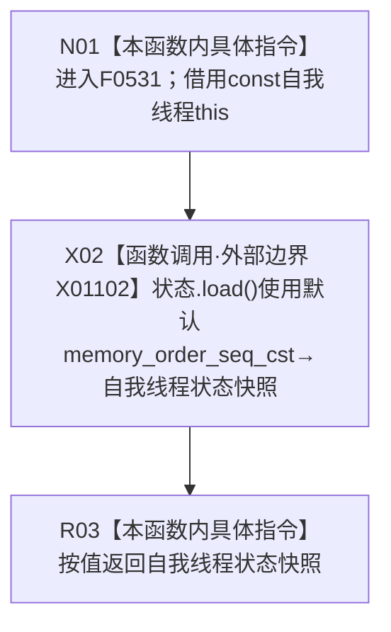

# CF-L5-0215 `自我线程::当前状态` 现状流程图

图类型：现状流程图
代码版本：`f7bc742f8126fcf66288fc940300de3331a0eebb`
源码 blob：`33a355deebc02a2d9eb370a5003312415125210c`
覆盖文件：`海中鱼巣/线程/自我线程.ixx:138-140`
唯一根函数：F0531
完整签名：`海中鱼巣::自我线程状态 海中鱼巣::自我线程::当前状态() const`
参数：无显式参数；隐式 `this` 是调用期间有效的 const `自我线程` 非拥有借用
返回结果：以默认 `std::memory_order_seq_cst` 读取原子成员 `状态`，按值返回该次读取的 `自我线程状态` 快照
已登记调用方：F0262 经 E1167；F0266 经 E1263；F0267 经 E1285
直接项目函数：无
外部边界：X01102 `std::atomic<自我线程状态>::load` 默认顺序一致读取
未解析项目调用：0
调用图：`流程图/主程序可达调用关系/01_main可达项目调用边表.md`
外部边界表：`流程图/主程序可达调用关系/02_main可达外部边界表.md`
逐行映射表：`流程图/代码流程图/L5/CF-L5-0215_自我线程当前状态_逐行代码映射表.md`
偏差清单：无；本文只冻结当前代码的单次原子读取事实
依据提交 / 结构化消息：当前提交、F0531、E1167、E1263、E1285、X01102 与源码 138—140 行交叉复核
结构读取与写入：只读原子成员 `状态`；不修改线程、进入标志、初始化快照或其它结构
逻辑内返回：任一可表示枚举值均为该次读取结果；本函数不解释状态转换是否合法
内部错误：本函数无内部错误分支
生命周期与资源释放：不取得 `this` 或成员所有权；枚举返回值按值离开
异常：原子 load 为 `noexcept` 边界；本函数没有异常映射
并发 / 幂等：每次调用获得一次顺序一致原子快照；不保证与 `已进入` 或其它字段形成同一时点复合快照
验证输出：138—140 行完整映射；3 条项目入边、0 条项目出边、1 条外部边界、0 条未解析调用
不得作为施工许可：是
不得宣称：返回 `运行中` 证明初始化、业务闭环、自我循环或线程生命周期上报已经完成

## 函数合同

```text
根函数：F0531 自我线程::当前状态
归属模块 / 文件 / 层级：自我线程 / 海中鱼巣/线程/自我线程.ixx / L5
现有或待新增：现有 const 成员函数
完整签名：海中鱼巣::自我线程状态 海中鱼巣::自我线程::当前状态() const
参数：无显式参数；const this 为非拥有借用
返回结果：顺序一致读取并按值返回原子成员状态
被调函数流程图：无项目被调函数
```

## 流程图



## 节点合同

| 节点 | 类型 | 参数 / 输入绑定 | 结果 / 输出绑定 | 事实读写 | 后继条件 |
| --- | --- | --- | --- | --- | --- |
| N01 | 本函数内具体指令 | const `this` | 进入只读查询 | 无 | 无条件 |
| X02 | 函数调用 | `this->状态`；默认顺序参数 | `自我线程状态` 快照 | 原子只读 | 调用完成 |
| R03 | 本函数内具体指令 | 状态快照 | 按值返回 | 无新增写入 | 函数结束 |

## 外部边界调用合同

| 边界身份 | 节点 | 完整签名 | 源码行 |
| --- | --- | --- | --- |
| X01102 | X02 | `海中鱼巣::自我线程状态 std::atomic<海中鱼巣::自我线程状态>::load(std::memory_order = std::memory_order_seq_cst) const noexcept` | 139 |

## 调用与非成功边界

| 语境 | 上游前置 | 当前结果 | 二分口径 | 结构后果 |
| --- | --- | --- | --- | --- |
| E1167 / E1263 / E1285 调用 F0531 | 调用期间 `this` 有效 | 返回任一当前枚举值 | 普通只读结果；合法性和业务解释由调用方承担 | 无 |
