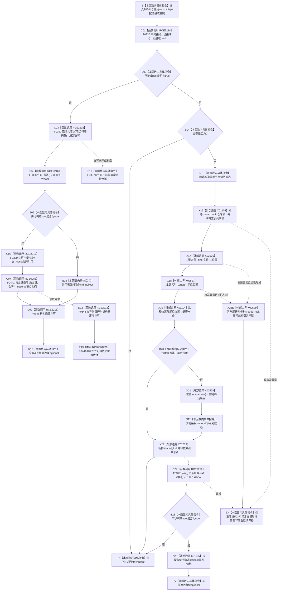

# CF-L5-0216 `索引仓库::按主键查节点` 现状流程图

图类型：现状流程图
代码版本：`14d539ed7ad8af87f35fb0752eed420bbe443316`
源码 blob：`8874312f67f19b220a08b1397c6103396878513d`
覆盖文件：`海中鱼巣/核心/索引仓库.cpp:172-186`
唯一根函数：F0544
完整签名：`std::optional<海中鱼巣::节点句柄> 海中鱼巣::索引仓库::按主键查节点(std::uint64_t 主键) const`
参数：隐式 `this` 是调用期有效的 const `索引仓库` 非拥有借用；`主键` 按值传入，`0` 为未接域路径的拒绝值
返回结果：接域时形成共享许可；许可有效则把主键与许可令牌交给 F0441 并返回其 optional，许可无效则返回 `std::nullopt`。未接域时在共享锁内查找主键索引、复制候选节点句柄，释放锁后经 F0377 权威读回候选；候选有效时返回有值 optional，否则返回 `std::nullopt`
非法值 / 拒绝：未接域且主键为 `0` 时不加锁并返回空；索引未命中、许可无效、F0441 或 F0377 返回空 / false 时也返回空
已登记调用方：F0264 经 E1208 在 `自检.入口初始化.ixx:378,379` 两次调用
直接项目函数：RCE2214 调用 F0336；RCE2215 唯一解析到 F0397；RCE2216 调用 F0338；RCE2217 调用 F0339；RCE0253 调用 F0441；RCE2218 隐式析构 F0345；RCE2219 调用 F0377
外部边界：X01103 构造共享锁；X02526 调用 `unordered_map::find`；X02527 调用 `end`；X01104 比较迭代器；X02528 调用 const_iterator `operator->`；X02529 析构共享锁；X01105 构造成功 optional
未解析项目调用：无；F0397 是当前正式生产接线中 `取得共享许可` 函数指针的唯一目标
调用图：`流程图/主程序可达调用关系/01_main可达项目调用边表.md`
外部边界表：`流程图/主程序可达调用关系/02_main可达外部边界表.md`
逐行映射表：`流程图/代码流程图/L5/CF-L5-0216_索引仓库按主键查节点_逐行代码映射表.md`
输入契约 / 调用语境表：本文“调用语境与非成功分账”
非成功返回二分审查表：本文“调用语境与非成功分账”
偏差清单：本文“当前边界与规范核对”
依据提交 / 结构化消息：当前 HEAD `14d539ed7ad8af87f35fb0752eed420bbe443316`、正式 F0544/F0336/F0397/F0338/F0339/F0441/F0345/F0377 身份、E1208、RCE0253、RCE2214—RCE2219、X01103—X01105、X02526—X02529 与源码逐点复核
结构读取与写入：接域路径由 F0441 读取；未接域路径在共享锁内读取 `主键索引_` 并复制候选句柄，锁外由 F0377 回读节点仓库。不创建、修改、删除或发布索引、节点、关系或其它机器事实
逻辑内返回：一般读取语境下，许可无效、主键为零、索引未命中或候选节点当前无效均折叠为空 optional
内部错误：正式上游保证完整接线但 F0336 返回 false、索引命中但 F0377 无法权威读回、同一共享许可下 F0441 拒绝，或共享锁保护内迭代器失效时须沿接线、索引与节点仓库追根因
生命周期与资源释放：接域路径局部许可覆盖 F0338、F0339、F0441 及返回表达式，之后经 F0345 析构；未接域路径共享锁只覆盖查找与候选复制，所有早退、正常离开或异常展开均经 X02529 释放
异常：未声明 `noexcept` 且不捕获；F0397 可在许可形成前抛出，许可形成后 F0441 异常先析构许可再传播；未接域路径锁取得或容器调用异常在已形成共享锁时先析构锁再传播
并发 / 幂等：接域路径使用事务域共享许可；未接域路径只在共享锁内复制索引候选，随后锁外回读节点。函数零写入；返回值是调用方拥有的句柄值
验证入口：`索引仓库.cpp:172-186`、E1208、RCE0253、RCE2214—RCE2219、X01103—X01105、X02526—X02529
验证输出：15 行源码完整映射；7 个项目出边、7 个外部边界、0 个未解析项目调用；本切片不运行构建或程序
依据：`规范/0050_项目通用机器逻辑与禁止性规则总纲_20260721.md`、`规范/0600_代码函数流程图应用与维护规范.md`、`规范/4010_子规范_统一仓库稳定句柄与通用关系索引边界.md`、`规范/4040_子规范_不透明结构事务候选确认撤销与最后发布.md`、`规范/4050_子规范_入口拒绝逻辑内结果与内部逻辑错误.md`
不得作为施工许可：是
不得宣称：索引命中即证明节点存在；空 optional 唯一证明主键不存在；部分接线已被显式拒绝；本函数修改、修复或发布了索引 / 节点结构，或完成了任何业务能力

## 流程图

## 项目源码调用合同

| 调用边 | 节点 | 被调函数 | 实参与结果 | 调用前置 | 被调图 |
| --- | --- | --- | --- | --- | --- |
| RCE2214 | C01 | F0336 `bool 结构事务接线::已接域() const` | `this=&事务接线_` → bool | 函数进入后首先读取接线形态 | `流程图/代码流程图/L6/CF-L6-0016_结构事务接线已接域_现状流程图.md` |
| RCE2215 | C03 | F0397 当前共享许可函数指针目标 | `事务接线_.运行期状态` → 局部许可 | 仅 F0336=true | 待绘制 |
| RCE2216 | C04 | F0338 `bool 结构事务许可::有效() const` | `this=&许可` → bool | 许可已经形成 | `流程图/代码流程图/L6/CF-L6-0018_结构事务许可有效_现状流程图.md` |
| RCE2217 | C06 | F0339 `const 结构事务令牌& 结构事务许可::读取令牌() const` | `this=&许可` → const 令牌引用 | F0338=true | `流程图/代码流程图/L6/CF-L6-0019_结构事务许可读取令牌_现状流程图.md` |
| RCE0253 | C07 | F0441 `按主键查节点(std::uint64_t,const 结构事务令牌&) const` | 同一 `this`、主键、C06 令牌 → optional 句柄 | 许可有效 | `流程图/代码流程图/L5/CF-L5-0203_索引仓库按主键查节点令牌重载_现状流程图.md` |
| RCE2218 | D09 / D12 | F0345 `结构事务许可::~结构事务许可() noexcept` | `this=&许可` → void | 许可已形成后的正常返回或异常展开 | `流程图/代码流程图/L6/CF-L6-0024_结构事务许可析构_现状流程图.md` |
| RCE2219 | C24 | F0377 `bool 节点仓库::节点是否有效(节点句柄) const` | `this=&节点_`、候选按值 → bool | 未接域索引命中且锁已释放 | `流程图/代码流程图/L5/CF-L5-0201_节点仓库节点是否有效无令牌重载_现状流程图.md` |

## 调用语境与非成功分账

| 语境 | 当前行为 | 返回 / 异常 | 二分口径 | 结构后果 |
| --- | --- | --- | --- | --- |
| 接域且许可有效 | 经 F0441 用同一共享令牌读取 | 原样返回 F0441 optional | 普通空结果；强前置成立却拒绝时沿 F0441 追根因 | 许可析构后零写入 |
| 接域但许可无效 | 不调用 F0339/F0441 | 返回 `std::nullopt` | 许可拒绝折叠为空 optional | 局部许可仍析构；零写入 |
| 完全未接域且主键为0 | 不加锁、不查索引 | 返回 `std::nullopt` | 入口无效值的逻辑内返回 | 零写入 |
| 未接域且索引未命中 | 共享锁内完成 find/end/比较 | 解锁后返回 `std::nullopt` | 合法空候选 | 零写入 |
| 未接域、索引命中但 F0377=false | 复制候选、先解索引锁，再权威回读节点 | 返回 `std::nullopt` | 当前返回合同允许空；悬空索引须追根因 | 零写入 |
| 未接域、索引命中且 F0377=true | 从候选构造 optional | 返回有值 optional | 成功只读结果 | 零写入 |
| 接线、标准库或节点读取抛出 | 本函数不捕获 | 已形成许可 / 锁先释放，异常继续传播 | 内部错误或资源失败 | 零写入 |

## 当前边界与规范核对

- 接域分支一条三元返回表达式实际包含 F0336、F0397、F0338、F0339、F0441 和 F0345 的条件调用与 RAII 生命周期。
- 未接域路径遵守“索引只定位候选、命中后回读节点”：X02529 先释放索引锁，再由 F0377 回读节点仓库。
- `std::nullopt` 合并许可拒绝、零主键、索引未命中和候选节点无效等原因，不能独立裁决主键从未存在、已经删除或索引悬空。
- 本图只登记冻结代码事实与边界，不裁决对新业务的复用，也不授予代码修改许可。
