# CF-L5-0217 安全与服务根需求完整读回自检单根复核 lambda 现状流程图

图类型：现状流程图
代码版本：`14d539ed7ad8af87f35fb0752eed420bbe443316`
源码 blob：`95681cdeef7ab705cf391738b05b36ca4fafc608`
覆盖文件：`海中鱼巣/自检.入口初始化.ixx:404-416`
唯一根函数：F0551
完整签名：`bool 海中鱼巣::运行安全与服务根需求完整读回自检(const 海中鱼巣::入口初始化自检运行配置&)::<lambda@自检.入口初始化.ixx:404>::operator()(const 海中鱼巣::单根需求初始化结果& 单根, std::int64_t 当前, std::int64_t 目标) const`
参数：`单根` 为调用期间有效的 const 非拥有借用；`当前`、`目标` 按值传入；lambda 通过 `[&]` 非拥有引用捕获 `上下文` 与 `结果`
返回结果：六项短路检查全部成立时返回 true；首个不成立项使组合表达式返回 false
已登记调用方：F0265 经 E1231 在第 417、418 行分别复核安全根和服务根
直接项目函数：E1247→F0552、E1248→F0350、E1249→F0553、E1250→F0051（两处 optional 元素比较）、E1251→F0554、E1253→F0555、E1254→F0329
外部边界：X02530 `承接.has_value()`；X02531 `optional<节点句柄>` 构造；X02532 `optional<节点句柄>` 相等；X02533 `结果.自我初始化.operator->()`；X02534 `optional<int64_t>` 构造；X02535 `optional<int64_t>` 相等
未解析项目调用：0
调用图：`流程图/主程序可达调用关系/01_main可达项目调用边表.md`
逐行映射表：`流程图/代码流程图/L5/CF-L5-0217_安全与服务根需求完整读回自检单根复核lambda_逐行代码映射表.md`
偏差清单：无；本文只冻结当前代码事实
依据提交 / 结构化消息：当前提交、F0551、E1231、E1247—E1251、E1253—E1254、X02530—X02535 与源码 404—416 行交叉复核
结构读取与写入：只读取初始化结果、需求承接、特征槽位、特征值和状态值；本 lambda 不写机器结构
逻辑内返回：任一只读检查不成立时返回 false，表示本次自检单根不完整
内部错误：本 lambda 不把 false 升级为机器事实或自行追根因
生命周期与资源释放：不取得捕获对象、`单根` 或 optional 临时值的长期所有权
异常：未捕获；被调函数与标准库比较的异常按原调用栈传播
并发 / 幂等：只读复核；同一冻结结构上重复调用不产生结构变化
验证输出：404—416 行完整映射；1 条项目入边、7 条项目出边、6 个外部边界、0 条未解析调用
不得作为施工许可：是
不得宣称：返回 true 证明安全、服务、自我循环、生产接线或业务能力已经完成

## 函数合同

```text
根函数：F0551 安全与服务根需求完整读回自检单根复核 lambda
归属模块 / 文件 / 层级：自检.入口初始化 / 海中鱼巣/自检.入口初始化.ixx / L5
现有或待新增：现有局部 lambda
参数：单根 const 借用；当前和目标按值；上下文与结果按引用捕获
返回结果：六项短路只读检查的 bool 合取结果
被调函数流程图：F0051、F0329、F0350 已制图；F0552—F0555 为本批配对图
```

## 流程图

```mermaid
flowchart TD
    N01["N01【本函数内具体指令】经E1231进入F0551；绑定单根、当前、目标并借用上下文与结果"]
    C02["C02【函数调用 E1247】F0552 读取需求承接材料(单根.根需求)→承接"]
    C03["C03【函数调用 E1248】F0350 单根.成功()→单根成功"]
    X04["X04【函数调用·外部边界 X02530】承接.has_value()→承接存在"]
    B05{"B05【本函数内具体指令】单根成功且承接存在"}
    C06["C06【函数调用 E1249】F0553 读取需求目标特征(单根.根需求)→目标特征候选"]
    X07["X07【函数调用·外部边界 X02531】构造optional<节点句柄>{单根.特征定义}"]
    C08["C08【函数调用 E1250】F0051 比较目标特征候选元素与单根.特征定义→元素相等"]
    X09["X09【函数调用·外部边界 X02532】比较两个optional<节点句柄>→相等"]
    B10{"B10【本函数内具体指令】目标特征optional是否相等"}
    X11["X11【函数调用·外部边界 X02533】结果.自我初始化.operator->()→初始化结果指针"]
    C12["C12【函数调用 E1251】F0554 读取宿主特征槽位(自我存在节点,单根.特征定义)→槽位候选"]
    X13["X13【函数调用·外部边界 X02531】构造optional<节点句柄>{单根.实例特征槽位}"]
    C14["C14【函数调用 E1250】F0051 比较槽位候选元素与单根.实例特征槽位→元素相等"]
    X15["X15【函数调用·外部边界 X02532】比较两个optional<节点句柄>→相等"]
    B16{"B16【本函数内具体指令】槽位optional是否相等"}
    C17["C17【函数调用 E1253】F0555 读取I64特征值(实例槽位,当前特征值)→当前值候选"]
    X18["X18【函数调用·外部边界 X02534】构造optional<int64_t>{当前}"]
    X19["X19【函数调用·外部边界 X02535】比较两个optional<int64_t>→相等"]
    B20{"B20【本函数内具体指令】当前值optional是否相等"}
    C21["C21【函数调用 E1254】F0329 读取状态值(单根.目标状态)→目标值候选"]
    X22["X22【函数调用·外部边界 X02534】构造optional<int64_t>{目标}"]
    X23["X23【函数调用·外部边界 X02535】比较两个optional<int64_t>→相等"]
    B24{"B24【本函数内具体指令】目标值optional是否相等"}
    R25["R25【本函数内具体指令】返回false"]
    R26["R26【本函数内具体指令】返回true"]

    N01 --> C02 --> C03 --> X04 --> B05
    B05 -->|否，短路| R25
    B05 -->|是| C06 --> X07 --> C08 --> X09 --> B10
    B10 -->|否，短路| R25
    B10 -->|是| X11 --> C12 --> X13 --> C14 --> X15 --> B16
    B16 -->|否，短路| R25
    B16 -->|是| C17 --> X18 --> X19 --> B20
    B20 -->|否，短路| R25
    B20 -->|是| C21 --> X22 --> X23 --> B24
    B24 -->|否| R25
    B24 -->|是| R26
```



## 节点合同

| 节点 | 类型 | 输入绑定 | 输出绑定 | 事实读写 | 后继 |
| --- | --- | --- | --- | --- | --- |
| N01 | 本函数内具体指令 | E1231 实参、引用捕获 | 进入只读复核 | 无 | C02 |
| C02 | 函数调用 | 单根.根需求 | optional 承接材料 | 只读需求材料 | C03 |
| C03 / X04 / B05 | 函数调用 / 本函数内具体指令 | 单根、承接 | 第一组 bool | 只读 | false→R25；true→C06 |
| C06—X09 / B10 | 函数调用 / 本函数内具体指令 | 根需求、特征定义 | 目标特征相等 | 只读 | false→R25；true→X11 |
| X11—X15 / B16 | 函数调用 / 本函数内具体指令 | 自我存在、特征定义、槽位 | 槽位相等 | 只读 | false→R25；true→C17 |
| C17—X19 / B20 | 函数调用 / 本函数内具体指令 | 槽位、值节点、当前 | 当前值相等 | 只读 | false→R25；true→C21 |
| C21—X23 / B24 | 函数调用 / 本函数内具体指令 | 目标状态、目标 | 目标值相等 | 只读 | false→R25；true→R26 |
| R25 / R26 | 本函数内具体指令 | 短路合取结果 | bool | 无 | 结束 |

## 当前边界

- E1250 聚合两个调用点：407—408 行的目标特征句柄比较与 409—411 行的槽位句柄比较。
- X02531/X02532 分别聚合两次节点句柄 optional 构造 / 相等；X02534/X02535 分别聚合两次 I64 optional 构造 / 相等。
- 第 410 行通过 X02533 解引用 `结果.自我初始化` 后才把自我存在节点传给 F0554。
- 本图只冻结 ENTRY-ONLY-S12 自检内部的一次只读复核，不把结果写成安全或服务机器事实。
