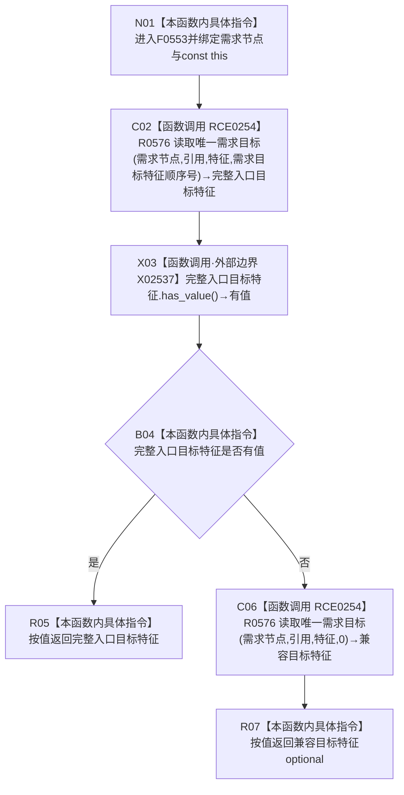

# CF-L5-0218 需求服务读取需求目标特征现状流程图

图类型：现状流程图
代码版本：`14d539ed7ad8af87f35fb0752eed420bbe443316`
源码 blob：`e41b0c665b360232e55ede728f2a4d561c5c9d32`
覆盖文件：`海中鱼巣/领域/需求服务.h:543-549`
唯一根函数：F0553
完整签名：`std::optional<海中鱼巣::节点句柄> 海中鱼巣::需求服务::读取需求目标特征(海中鱼巣::节点句柄 需求节点) const`
参数：`需求节点` 按值传入；隐式 const `this` 为非拥有借用
返回结果：优先返回顺序号 `需求目标特征顺序号` 的唯一特征目标；不存在时退回读取顺序号 0 的唯一特征目标
已登记调用方：F0265 经 RCE0095、F0551 经 E1249、R0579 经 RCE1603
直接项目函数：RCE0254→R0576，调用点为第 544、548 行，绑定四参数无令牌重载
外部边界：X02537 `optional<节点句柄>::has_value()`
未解析项目调用：0
调用图：`流程图/主程序可达调用关系/01_main可达项目调用边表.md`
逐行映射表：`流程图/代码流程图/L5/CF-L5-0218_需求服务读取需求目标特征_逐行代码映射表.md`
偏差清单：无；本文只冻结当前代码事实
依据提交 / 结构化消息：当前提交、F0553、RCE0095、E1249、RCE1603、RCE0254、X02537 与源码 543—549 行交叉复核
结构读取与写入：只读需求目标关系；不写需求、关系或索引
逻辑内返回：两次唯一目标读取都可返回空 optional；首选为空触发兼容顺序号 0 回退
内部错误：本函数没有写后异常分支
生命周期与资源释放：首选 optional 为局部值；返回值按值离开
异常：未捕获；被调读取与 optional 操作异常向上传播
并发 / 幂等：只读；两次读取不构成显式事务快照
验证输出：543—549 行完整映射；3 条项目入边、1 条聚合项目出边、1 个外部边界、0 个未解析调用
不得作为施工许可：是
不得宣称：返回句柄证明该目标持续有效、完整需求已成立或任务可以执行

## 流程图

## 节点合同

| 节点 | 类型 | 输入绑定 | 输出绑定 | 事实读写 | 后继 |
| --- | --- | --- | --- | --- | --- |
| N01 | 本函数内具体指令 | 需求节点、const `this` | 进入读取 | 无 | C02 |
| C02 | 函数调用 | 需求节点、引用、特征、正式顺序号 | 首选 optional | 只读关系 | X03 |
| X03 / B04 | 函数调用 / 本函数内具体指令 | 首选 optional | 有值 bool | 无 | true→R05；false→C06 |
| C06 | 函数调用 | 需求节点、引用、特征、0 | 回退 optional | 只读关系 | R07 |
| R05 / R07 | 本函数内具体指令 | 对应 optional | 按值返回 | 无 | 结束 |

## 当前边界

- RCE0254 的两个调用点均精确绑定 R0576 四参数、无事务令牌重载；没有绑定 `读取唯一需求目标_令牌`。
- 首选为空是显式回退条件，不自动表示内部错误；回退仍为空则原样返回空 optional。
